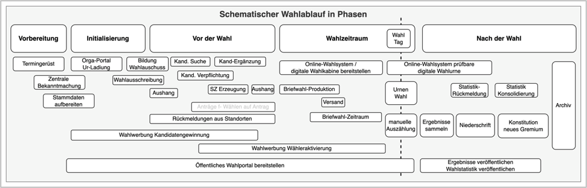

# Einleitung

Dieses Handbuch ist eine gekürzte Fassung des vollständigen **Elektra**-Handbuchs. Es enthält ausschließlich die Inhalte, die für Standortverantwortliche im Wahlprojekt relevant sind: Login und Grundfunktionen, Standort-Einstellungen, Aufgaben-Management, Anträge und Anfragen sowie Helpdesk, Pflege der Stammdaten, Erstellung von Dokumenten aus Vorlagen sowie die Durchführung der Wahlfunktionen (Erstellung von Wahlvorschlägen bis zur Ergebnismeldung und Erfassung der Gremien).

Themen für zentrale Projektleitung, Systemkonfiguration und IT-Betrieb sind nicht Teil dieses Dokuments und in den dafür vorgesehenen Handbüchern beschrieben.

## Ziel des Handbuchs

Dieses Handbuch soll Ihnen als Standortverantwortlichem einen schnellen und verständlichen Einstieg in **Elektra** ermöglichen. Nach der Lektüre sollen Sie:

- Ihre eigene Rolle innerhalb des Wahlprojekts kennen und wissen, was von Ihnen als Standortverantwortlichem erwartet wird.
- das Grundkonzept von **Elektra** verstehen und wie die Zusammenarbeit zwischen zentraler Projektleitung und den Standorten organisiert ist.
- alle Funktionen kennenlernen, die Sie als Standortverantwortlicher für die Durchführung Ihrer Wahl benötigen.
- nachvollziehen können, wie eine Wahl mit **Elektra** Schritt für Schritt durchgeführt wird.

Bitte beachten Sie: **Elektra** kann sehr frei auf die jeweilige Wahl angepasst werden, so dass einige Funktionen und ganze Wahlkanäle gar nicht genutzt werden. Seien Sie daher nicht irritiert, wenn manche Masken bei Ihnen in der Software weniger Inhalte haben oder einige Funktionen gar nicht angeboten werden.

## Konzept und Idee

Die **Elektra** Wahlmanagement Software adressiert die Herausforderungen, die Flächenorganisationen bei der verteilten Abwicklung von Wahlen über mehrere Standorte/Gremien oder Betriebe hinweg haben. In der Regel wird **Elektra** als Intranet-Software eingeführt, um das Zusammenspiel verschiedener Akteure auf einer gemeinsamen Datenbasis zu steuern. **Elektra** ist dabei als Webanwendung konzipiert und wird über einen Webbrowser im Intranet aufgerufen.

- Zentralseitig wird ein Wahlprojekt mit verschiedenen Projektvorgaben konfiguriert. Dies umfasst z.B. Vorgaben zu Regularien, Wahlkanäle (Online, Brief, Hybrid, Urne), Wahlmodi (**Einheitswahl** – ein einziger Stimmzettel für den gesamten Wahlstandort; **Bezirkswahl** – mehrere Stimmbezirke mit jeweils eigenen Stimmzetteln wählen ein gemeinsames Gremium; **unechte Bezirkswahl** – alle Wähler erhalten denselben Stimmzettel, auf dem die Kandidaten nach Stimmbezirken mit jeweils fester Sitzzahl gegliedert sind) sowie Design, Hilfestellungen und Vorgaben für die Produktion von Drucksachen.
- Ein zentrales Aufgabenheft mit Fristen, Hilfsmitteln zum Lösen von Aufgaben (Links, Videos, Formulare, Checklisten) und Feedbacks wird speziell für das Projekt konfiguriert. Das Aufgabenheft umfasst verschiedene Phasen von der Bekanntmachung, über die Suche und Onboarding von Kandidaten, Aushänge, Dokumentationen, die Wahldurchführung, Auszählung sowie die Dokumentation in Protokollen.
- Am Standort pflegen Sie die für Ihre Wahl relevanten Stammdaten: das Wahlteam (Wahlvorstand und Stellvertreter), die Bezirke und Wahlräume sowie die Kandidaten. Die Wahlberechtigten werden in der Regel bereits zentral aus Melderegistern oder Personaldatensystemen importiert und stehen Ihnen im Wählerverzeichnis zur Verfügung.
- Dokumente, Anträge und Protokolle werden entlang eines logischen und plausibilisierten Ablaufs in 10 Wahlfunktionen aus den für das konkrete Wahlprojekt vorbereiteten Vorlagen als WORD oder PDF erzeugt, geprüft und freigegeben.
- Um Schnittstellenrisiken zu vermeiden und manuelle repetitive Prozesse zu reduzieren, werden die am Standort in **Elektra** erfassten Wählerdaten – einschließlich aller Änderungen wie Umzüge, Wunschwähler sowie der Berücksichtigung von Austritten und Sterbefällen – automatisiert aufbereitet und zu einem festgelegten Stichtag an einen Druckdienstleister weitergegeben. Das Gleiche gilt für Kandidatenvorstellungen und Stimmzettel.
- Das Online-Wahlsystem **uniWAHL OWS** ist mit **Elektra** verbunden. Die Standorte können direkt Einsicht in die Ergebnisse der Onlinewahl nehmen.
- Nach der Wahl und der Konstituierung der Gremien wird deren Zusammensetzung ebenfalls in **Elektra** dokumentiert.

## Schematischer Ablauf und Ihre Rolle im System

*Schematischer Wahlablauf*

Die Durchführung von verteilten Wahlen verläuft nach einem klar definierten Rahmen aus mehreren Phasen. Bevor Standorte einbezogen werden, plant die zentrale Projektleitung den Zeitrahmen auf Basis der Wahlstatuten, richtet die technische Umgebung ein und bestückt das System mit den notwendigen Stammdaten, Vorlagen und dem Aufgabenkatalog für die Standorte. Als Standortverantwortlicher kommen Sie ab folgendem Punkt ins Spiel:

**Vor der Wahl**

►Information der Standorte

Die zentrale Wahlleitung informiert Sie über die Durchführung der Gremienwahl und den Einsatz von **Elektra**. Sie erhalten Zugang zu dem System und werden bei Bedarf durch ein Schulungsangebot und Fragestunden unterstützt.

►Rückmeldung zu Wahlverfahren, Struktur und Durchführungsmerkmalen

Zentrales Element der Anwendung ist die von der zentralen Projektleitung vorgegebene Aufgabenliste. In der Regel ist eine Ihrer ersten Aufgaben die Prüfung der Stammdaten Ihres Standortes: Datenabfragen oder Bestätigungen zu Strukturmerkmalen wie Anzahl der Sitze oder Termin der Auszählung.

►Wahlwerbung (Optional)

**Elektra** kann Sie dabei unterstützen, Informationen aufzubereiten und einen Antrags-/Bestellprozess für Werbemittel abzuwickeln, sofern Sie an Ihrem Standort Werbung für die Wahl machen möchten.

►Gewinnung und ggf. Ergänzung von Kandidaten

Eine zentrale Aufgabe ist die Ansprache zum Gewinnen geeigneter Kandidaten. Die Software unterstützt Sie durch eine Datenerfassungsmaske, in der personenbezogene Daten direkt aus dem Wählerverzeichnis übernommen werden können, sowie durch automatisch erzeugte Onboarding-Dokumente (Zustimmungserklärung, Datenschutz etc.).

►Erzeugung und Freigabe von Stimmzetteln/Kandidatenlisten

Sobald entsprechend der Anzahl der Sitze genügend Kandidaten gefunden wurden, erzeugen und prüfen Sie Stimmzettel/Kandidatenliste und Aushänge und geben diese frei. Diese können anschließend selbstständig von dem Standort veröffentlich oder zentral von einem Druckdienstleister produziert werden.

**Wahldurchführung**

►Wahlschreiben, Versand und Onlinewahl

Wähler werden per Aushang, Gemeindebote/Medien oder per Brief/Wahlschein zur Wahl eingeladen. Die industrielle Produktion der Wahlbriefe übernimmt ein Druckdienstleister zentral; **Elektra** bereitet dafür lediglich die Daten auf. Möchte Ihr Standort den Versand stattdessen in Eigenregie organisieren, melden Sie die dafür notwendigen Vorgaben (z.B. Sortierung nach Bezirken) über die Stammdaten oder entsprechende Aufgaben zurück. Bei einer allgemeinen Onlinewahl erhalten die Wähler die Zugangsinformationen zum Online-Wahlsystem direkt auf dem Wahlschein.

**Nach der Wahl**

►Auszählung und Zusammentragen der Ergebnisse

Nach Wahlende wird die digitale Wahlurne elektronisch versiegelt und ausgezählt. Die Ergebnisse werden automatisch in das Portal übertragen; manuelle Anpassungen (z.B. bei Stimmengleichheit) können bei Bedarf in der Software vorgenommen werden. Wurden mehrere Wahlkanäle verwendet, werden ebenfalls die Einzelergebnisse zusammengeführt.

►Wahlniederschrift und Rückmeldung

Der Wahlvorstand verfasst mit Hilfe des Systems eine Wahlniederschrift. Diese wird gedruckt, unterschrieben, gescannt und im System hochgeladen; ferner werden Aushänge erzeugt.

►Veröffentlichung und Gremienverwaltung

Ergebnisse können für die Veröffentlichung (z.B. Wahlportal, Kommunikationsabteilung) bereitgestellt werden. Nach der Konstituierung erfassen Sie die Zusammensetzung des Gremiums in **Elektra** und melden diese damit an die zentrale Stelle.

►Archivierung vor Ort

Nach Abschluss aller Veröffentlichungen und nach Verstreichen der Anfechtungsfristen archivieren Sie die physischen Unterlagen vor Ort; für elektronische Artefakte steht ein Datenexport zur Archivierung bereit. Die Unterlagen sind bis zur Konstitution des nachfolgenden Gremiums aufzubewahren.

**Ihre Rolle im Überblick**

Als Standortverantwortlicher sind Sie insbesondere zuständig für:

- die Verwaltung Ihres Standortes und dessen Stammdaten,
- die Dokumentation der Beschlüsse des Wahlvorstandes innerhalb von **Elektra**,
- die Erfassung der Kandidaten,
- die technische Durchführung von **Standortwechslern/Wunschwählern** (Personen, die ihr Wahlrecht an einem anderen Standort ausüben möchten als dort, wo sie ihren Erstwohnsitz haben),
- die Freigabe des Stimmzettels,
- die Weitergabe des Online-Wahlergebnisses an den Wahlvorstand zur Zusammenführung mit den Ergebnissen der übrigen Wahlkanäle sowie zur formellen Bestätigung, bevor das Gesamtergebnis an die zentrale Wahlleitung gemeldet wird.

Bei fachlichen oder technischen Fragen nutzen Sie die Helpdesk-Funktion in **Elektra** (siehe Kapitel „Anträge & Anfragen, Helpdesk"), um die jeweils zuständigen Fachverantwortlichen zu erreichen. Electric Paper Informationssysteme begleitet als Wahldienstleister und Softwarehersteller den gesamten Wahlprozess technisch und berät bei Bedarf.

<!-- videos:auto -->
## Videos zu diesem Kapitel

### Quick Tour: Elektra kompakt erklärt

<Vimeo id="1085965643" title="Quick Tour: Elektra kompakt erklärt" />

In rund elf Minuten die wichtigsten Grundlagen von Elektra im Überblick.
