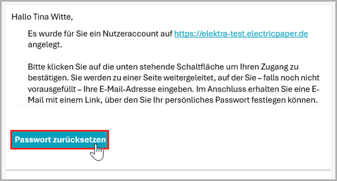
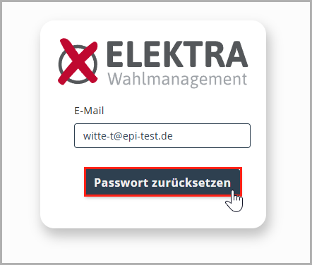
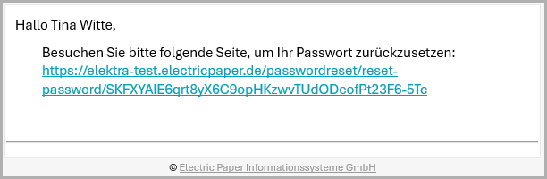
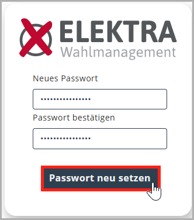
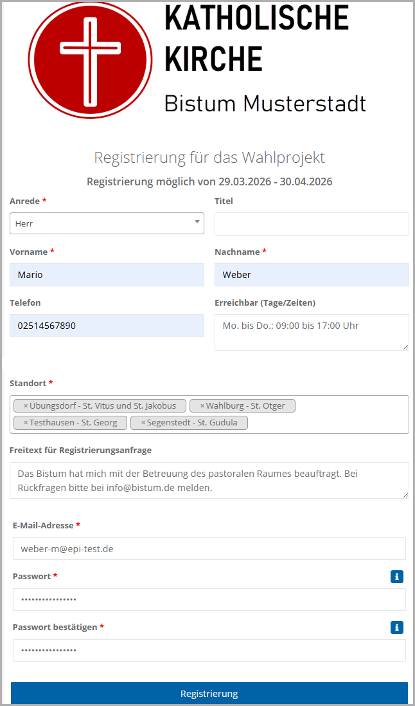
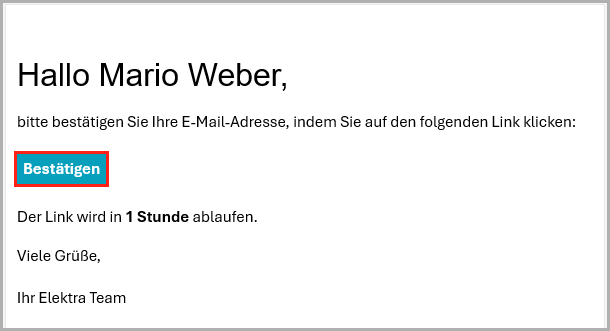
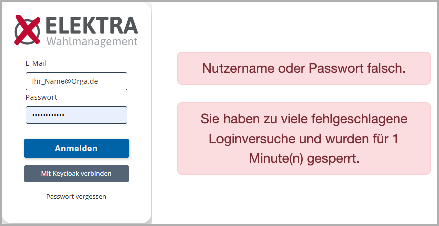
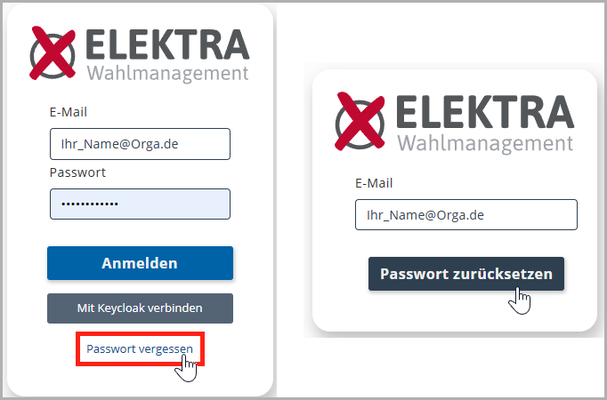
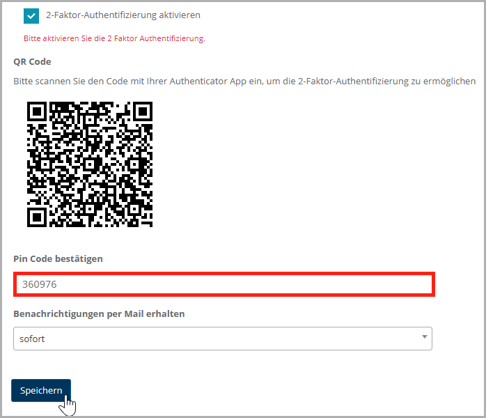
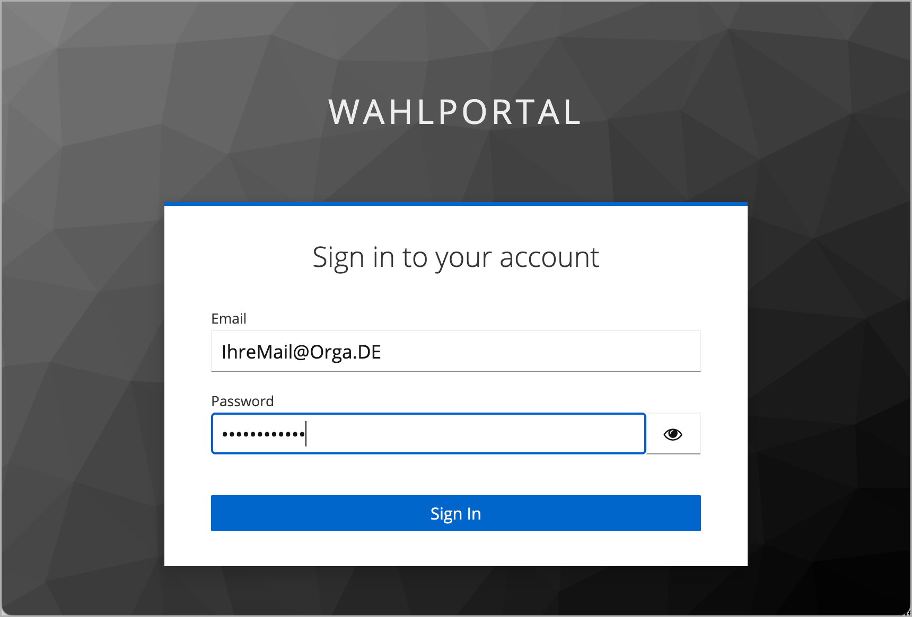

# Systemzugang und Login

**Elektra** wird von Ihrer Organisation in der Regel als Intranet-Anwendung bereitgestellt. **Elektra** ist dabei als Webanwendung konzipiert und wird über einen Webbrowser im Intranet aufgerufen. Sie müssen sich daher einloggen und authentifizieren. Um das zu ermöglichen, verwaltet **Elektra** die Anwender mit User-Logins. Je nach Konfiguration stehen zwei verschiedene Methoden bereit: Die interne Verwaltung der Zugänge und die externe Verwaltung in einem Nutzerkatalog (z.B. **Active Directory** oder **Microsoft Entra ID**). Durch letzteres kann ein sogenanntes Single-Sign-On ermöglicht werden. Das bedeutet, dass Sie sich aus einer bereits authentisierten Umgebung per Klick – ganz ohne erneute Anmeldung – in das System begeben können.

## Erstzugang und Passwortvergabe

*Benachrichtigung über den neu angelegten Zugang*

In der Regel wird Ihr Benutzerkonto durch die Projektleitung angelegt. Sobald dies geschehen ist, erhalten Sie automatisch eine E-Mail an die hinterlegte E-Mail-Adresse.

Diese E-Mail enthält die Schaltfläche „**Passwort zurücksetzen**“. Klicken Sie darauf, um Ihr eigenes Passwort festzulegen.

*Dialog Passwort zurücksetzen*

Anschließend öffnet sich in Ihrem Browser ein Dialog, in dem Ihre E-Mail-Adresse bereits vorausgefüllt ist. Klicken Sie erneut auf „**Passwort zurücksetzen**“.

*E-Mail mit Link zum Festlegen des eigenen Passworts*

Anschließend erhalten Sie eine weitere E-Mail mit einem persönlichen Link. Öffnen Sie diesen Link, indem Sie ihn anklicken oder in die Adresszeile Ihres Browsers kopieren.

*Neues Passwort festlegen*

Es öffnet sich eine Eingabemaske, in der Sie Ihr neues Passwort sowohl im Feld „**Neues Passwort**“ als auch im Feld „**Passwort bestätigen**“ eingeben.

Mit einem Klick auf „**Passwort neu setzen**“ wird das Passwort gespeichert. Anschließend können Sie sich mit Ihrem persönlichen Passwort in **Elektra** anmelden.

## Verwendung des Registrierungsformulars
Alternativ zum oben beschriebenen Erstzugang durch die Projektleitung kann Ihr Zugang zu **Elektra** über ein Registrierungsformular eingerichtet werden. Die Nutzung dieses Formulars muss durch die Projektleitung vorgesehen werden und kommt daher nicht in jedem Wahlprojekt zum Einsatz. Ob dies bei Ihnen der Fall ist, wird Ihnen im Vorfeld mitgeteilt; den Link zum Formular erhalten Sie dann von Ihrer Projektleitung.

*Registrierungsformular*

Am oberen Ende sehen Sie das Logo des Wahlprojektes. Darunter wird der Zeitraum angezeigt, in dem eine Registrierung möglich ist. Es folgt der Bereich zur Eingabe der persönlichen Informationen. Hierzu zählen die Felder Anrede, Titel, Vorname, Nachname, Telefon sowie die Angabe der Erreichbarkeit. Alle Felder, die mit einem roten Sternchen gekennzeichnet sind, sind Pflichtfelder und müssen ausgefüllt werden.

Im weiteren Verlauf wählen Sie über ein Dropdown-Menü die Standorte aus, auf die Sie Zugriff erhalten möchten. Eine Mehrfachauswahl ist möglich und wird entsprechend dargestellt. Optional kann darunter eine Nachricht zur Registrierungsanfrage ergänzt werden.

Abschließend geben Sie Ihre E-Mail-Adresse sowie ein Passwort ein, das Sie künftig für den Login in die Plattform verwenden. Zusätzlich ist das Passwort zur Bestätigung ein zweites Mal einzugeben. Mit Abschluss der Eingaben klicken Sie auf die Schaltfläche „Registrierung", um den Vorgang durchzuführen.

| **Hinweis**  |
| --- |
| Fahren Sie mit Ihrem Cursor über das „i", um die Mindestanforderungen an Ihr Passwort zu sehen. |

*Bestätigungs-E-Mail nach der Registrierung*

Im Anschluss erhalten Sie eine E-Mail an Ihre hinterlegte E-Mail-Adresse. Klicken Sie in dieser E-Mail auf die Schaltfläche „**Bestätigen**“, um die Registrierung abzuschließen. Sobald Ihr Account durch eine Administratorin oder einen Administrator freigegeben wurde, können Sie **Elektra** nutzen und werden darüber per E-Mail informiert.

## Der interne Login-Dialog

*Interner Login-Dialog mit möglichen Fehlermeldungen*

Unabhängig davon, auf welchem der beiden beschriebenen Wege Ihr Zugang eingerichtet wurde, melden Sie sich für die laufende Nutzung über die interne Login-Maske am System an. Verwenden Sie hierzu die E-Mail-Adresse, an die Sie zuvor die Benachrichtigung über die Einrichtung Ihres Benutzerkontos erhalten haben.

Geben Sie anschließend Ihr persönliches Passwort in das entsprechende Eingabefeld ein und klicken Sie auf die Schaltfläche „**Anmelden**“, um sich im System anzumelden.

Wenn Sie sich mehrfach vergeblich eingeloggt haben, wird Ihnen der Zugang zeitweise gesperrt. Dies ist ein Sicherheitsmechanismus, der sogenannte Brute-Force-Angriffe und DDOS-Attacken abwehrt.

### Passwort vergessen

*Passwort vergessen und zurücksetzen*

Nutzen Sie die Schaltfläche Passwort vergessen, um das Passwort Ihres Nutzerkontos zurückzusetzen.

Anschließend öffnet sich ein Dialog, indem Sie Ihre E-Mail-Adresse eingeben, die mit Ihrem **Elektra**-Konto verknüpft ist. Klicken Sie auf Passwort zurücksetzen.

Anschließend erhalten Sie eine E-Mail mit einem enthaltenen Link. Öffnen Sie diesen, indem Sie ihn anklicken oder in die Adresszeile Ihres Browsers kopieren. (siehe folgende Abbildung)

Anschließend öffnet sich eine Maske. Geben Sie hier Ihr neues Passwort ein (sowohl in das Feld Neues Passwort als auch Passwort bestätigen). (siehe folgende Abbildung)

Klicken Sie anschließend auf Passwort neu setzen. Danach können Sie sich mit Ihrem neuen Passwort anmelden.

### Einrichtung der Zwei-Faktor-Authentifizierung

Zusätzlich zum bisher beschriebenen Login kann der Zugang zu **Elektra** durch eine Zwei-Faktor-Authentifizierung (2FA) abgesichert sein: Neben dem Passwort wird dabei ein zweiter Bestätigungsfaktor verlangt, etwa ein Einmalcode, biometrische Daten oder ein physisches Gerät. Das erhöht die Sicherheit erheblich, da unbefugter Zugriff dadurch deutlich erschwert wird. Ist 2FA aktiviert, werden Sie nach Ihrer ersten Anmeldung automatisch zur Einrichtung weitergeleitet.

Für die Einrichtung benötigen Sie ein zweites Gerät, in der Regel ein Smartphone oder Tablet. Auf diesem Gerät muss eine Authentifizierungs-App installiert sein, zum Beispiel **Microsoft Authenticator** oder **Google Authenticator**.

*Einrichtung der Zwei-Faktor-Authentifizierung*

Die App erzeugt anschließend einen **Code**, der regelmäßig erneuert wird. Geben Sie diesen Code in das Feld **„****Pin-Code** **bestätigen“** ein und klicken Sie auf **„Speichern“**, um die Einrichtung abzuschließen.

Nach erfolgreicher Einrichtung können Sie **Elektra** verwenden. Bei zukünftigen Anmeldungen wird zusätzlich zum Passwort der jeweils aktuelle Code aus der Authentifizierungs-App abgefragt.

## Login über Single Sign-On (Keycloak / Microsoft Entra ID)
Alternativ zum internen Login kann Ihre Organisation die Anmeldung über einen externen Single-Sign-On-Dienst konfiguriert haben. In diesem Fall melden Sie sich nicht direkt in **Elektra** an, sondern über einen der folgenden Dienste:

**Keycloak** ist ein zentraler Anmeldedienst (Single Sign-On), über den Sie sich einmalig anmelden und automatisch Zugriff auf mehrere verbundene Systeme erhalten, ohne sich erneut authentifizieren zu müssen.

*Anmeldung über Keycloak*

- Mit dem Klick auf “Mit **Keycloak** verbinden” springt **Elektra** zur externen Login-Maske.
- **Einloggen bei Keycloak**
- Sie loggen sich gegen **Keycloak** ein. **Keycloak** seinerseits prüft ihre Authentisierung und gibt Ihnen entsprechenden Zugang.
- In diesem Zusammenhang kann es sein, dass die externen Identity Provider oder das interne **Keycloak**-System von Ihnen weitere Informationen im Rahmen der bereits beschriebenen Zwei-Faktor-Authentifizierung (2FA) abverlangen.
- Ist stattdessen **Microsoft Entra ID** als Anmeldeverfahren konfiguriert, läuft die Anmeldung analog ab: Klicken Sie auf die entsprechend benannte Schaltfläche, um zur externen Login-Maske zu gelangen.
- **Rollen in Elektra**
- Mit dem erfolgreichen Login gelangen Sie in das System und erhalten Zugriff entsprechend der gesetzten Rollen und den damit verbundenen Privilegien. **Elektra** kann diesbezüglich frei konfiguriert werden, hat aber von Haus aus mehrere Rollen sinnvoll vorbesetzt. Als Standortverantwortlicher betrifft Sie insbesondere die folgende Rolle:
- **Standortverantwortliche(r) (Ihre Rolle):** Hauptnutzerrolle in **Elektra**. Standortverantwortliche sind für die operative Umsetzung der Wahl an ihrem Standort zuständig. Sie bearbeiten die im Aufgabenheft definierten Aufgaben, verwalten die standortbezogenen Stammdaten (z. B. Gemeindedaten, Pflege des Wählerverzeichnisses und Erfassung von Kandidaten) und erstellen wahlrelevante Dokumente. Darüber hinaus sind sie für die digitale Dokumentation der Stimmauszählung verantwortlich.

Der Vollständigkeit halber sind nachfolgend auch die übrigen Rollen kurz aufgeführt, die es abseits Ihrer eigenen in **Elektra** geben kann:

- **Master-Admin:** Zentrale Administratorrolle mit umfassenden Rechten für Systemeinstellungen, Benutzer, Rollen und Projekte.
- **Meldewesen:** Pflege und Bereitstellung melderechtlicher Daten als Grundlage für Wahlberechtigung und Wählerverzeichnisse.
- **Mitglied Wahlausschuss:** Unterstützt Vorbereitung und Durchführung der Wahl an einem Standort mit Zugriff auf wahlrelevante Daten und Auswertungen.
- **Pfarrsekretariat:** Unterstützende Rolle auf Standortebene, u. a. bei Briefwahlanträgen sowie Anfragen von Wählerinnen und Wählern.
- **Wahlamt Leitung:** Leitende Rolle im Wahlamt mit übergeordneter Verantwortung für Planung, Steuerung und Überwachung des gesamten Wahlprozesses.
- **Wahlamt Mittelebene:** Koordinierende Rolle zwischen Leitung und operativer Ebene, unterstützt bei der Steuerung mehrerer Standorte oder Wahlbereiche (bspw. in einem pastoralen Raum).
- **Wahlamt Sachbearbeitung Anträge:** Bearbeitet und prüft Anträge, die von Standorten über **Elektra** an die zentrale Wahlleitung gestellt werden, z. B. zur Änderung der Anzahl der zu besetzenden Sitze.
- **Wahlhelfer/in:** Unterstützt die praktische Durchführung der Wahl, insbesondere am Wahltag, z. B. bei Stimmabgabe, Wählerprüfung oder Auszählung, mit stark eingeschränkten Systemrechten.
