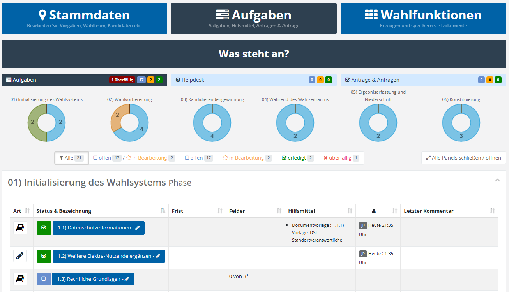

# Triptychon: Aufgaben

Die folgende Übersicht zeigt den Aufgabenbereich des Triptychons:

*Aufgabenübersicht*

Als handlungsleitende Steuerung gelangen Sie nach dem Login in die obige **Aufgabenübersicht**. Die Phasen des Aufgabenhefts werden mit dem entsprechenden Erfüllungsgrad als Kreisdiagramme angezeigt.  Die Aufgabenphasen werden als klappbare Panels angeboten. Absprünge in andere Arbeitsbereiche (Anträge, Helpdesk) sind möglich.

Interessant sind in diesem Zusammenhang folgende Verweise:

- Aufgabenheft

- Aufgaben bearbeiten

- Helpdesk

- Anträge
