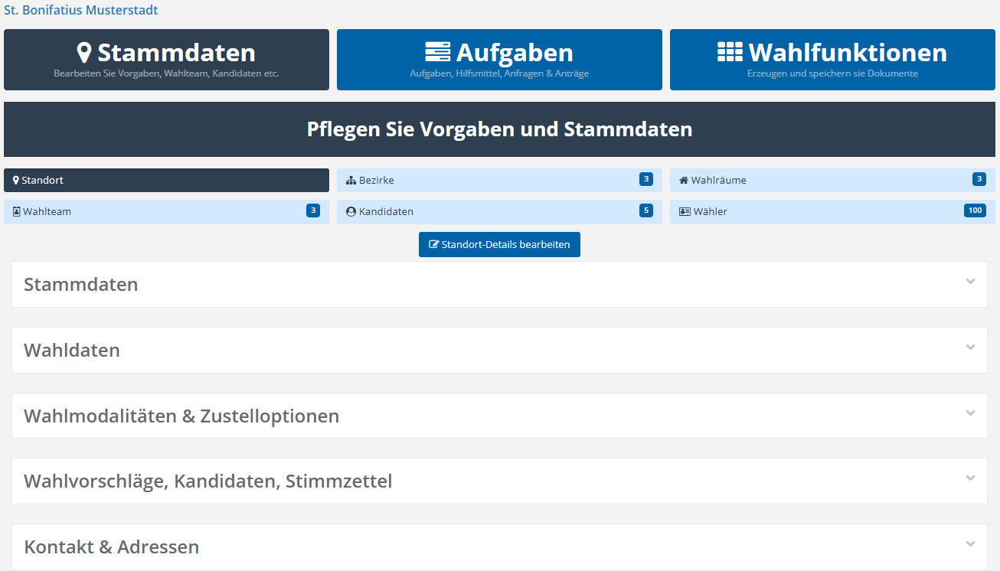

# Triptychon:  Stammdaten

Die folgende Übersicht zeigt den Stammdatenbereich des Triptychons:

*Stammdaten*

Der Stammdatenbereich bietet Einsicht und Zugriff auf die Standort-Details und erlaubt die Verwaltung von Bezirken und Wahlräumen sowie die Bearbeitung des Wahlteams, der Kandidaten und – falls erlaubt – der Wähler. Die blau unterlegte Ziffer zeigt jeweils die Anzahl der vorhandenen Datensätze im entsprechenden Bereich.

Interessant sind in diesem Zusammenhang folgende Verweise:

- Standortvorgaben

- Wahlbezirke anlegen

- Wahlräume anlegen

- Wahl-Team festlegen

- Kandidaten verwalten
