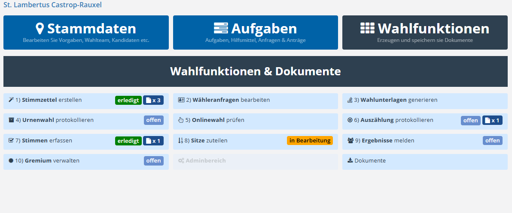

# Triptychon: Wahlfunktionen

Die folgende Übersicht zeigt den Bereich Wahlfunktionen des Triptychons:

*Wahlfunktionen*

Die Wahlfunktionen sind im Arbeitsbereich in mehreren Reihen von links nach rechts angeordnet und durch eine vorangestellte Nummer logisch sortiert. Dadurch ergibt sich eine klare Reihenfolge, die sich am typischen Ablauf der Wahl orientiert.

Für jede Wahlfunktion wird – analog zum Aufgabenmanagement – ein Status angezeigt. Dieser gibt Auskunft darüber, ob die jeweilige Funktion noch offen, aktuell in Bearbeitung oder bereits abgeschlossen ist. Der Status wird über entsprechende Felder dargestellt und ermöglicht eine schnelle Orientierung über den Bearbeitungsstand.

Zusätzlich wird angezeigt, wie viele Dokumente innerhalb der jeweiligen Wahlfunktion bereits hinterlegt wurden. Dadurch erhalten Sie einen Überblick darüber, ob und in welchem Umfang zugehörige Unterlagen vorhanden sind.

Interessant sind in diesem Zusammenhang folgende Verweise:

- [1) Stimmzettel erstellen](/wahlfunktionen/wfu1-wahlvorschlaege-u-stimmzettel-erstellen)
- [2) Wähleranfragen bearbeiten / Wählerservice](/wahlfunktionen/wfu2-waehleranfragen-bearbeiten/)
- [3) Wahlunterlagen generieren (Antragsbasierter Wählerservice)](/wahlfunktionen/wfu3-wahlunterlagen-generieren)
- [4) Urnenwahl protokollieren](/wahlfunktionen/wfu4-urnenwahl-protokollieren)
- [5) Onlinewahl prüfen](/wahlfunktionen/wfu5-onlinewahl-pruefen)
- [6) Auszählung protokollieren](/wahlfunktionen/wfu6-auszaehlung-protokollieren)
- [7) Stimmen erfassen](/wahlfunktionen/wfu7-stimmen-erfassen)
- [8) Sitze zuteilen](/wahlfunktionen/wfu8-sitze-zuteilen)
- [9) Ergebnisse melden](/wahlfunktionen/wfu9-ergebnisse-melden)
- [10) Gremium verwalten](/wahlfunktionen/wfu10-gremium-verwalten)
- [Dokumente verwalten](/wahlfunktionen/dokumente)
