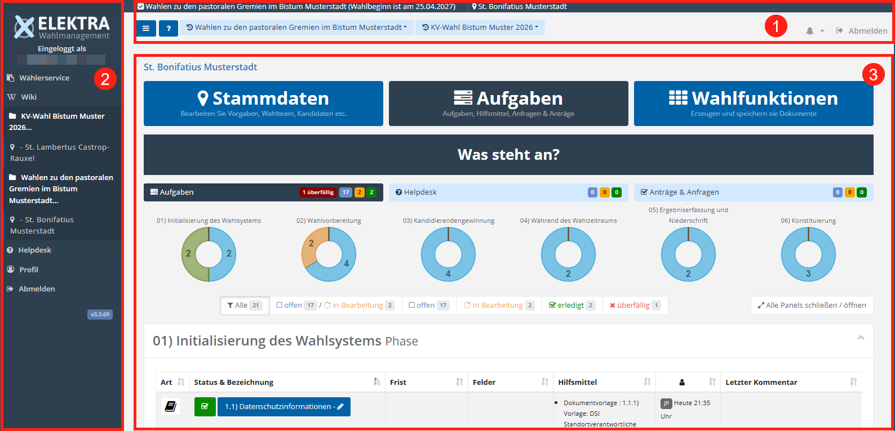
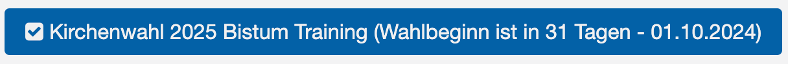
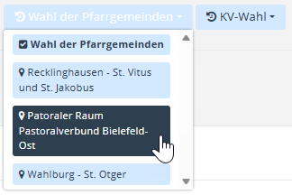
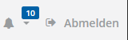
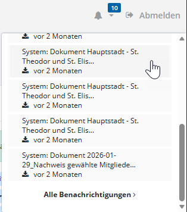
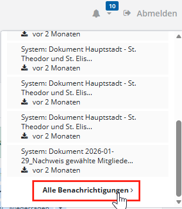
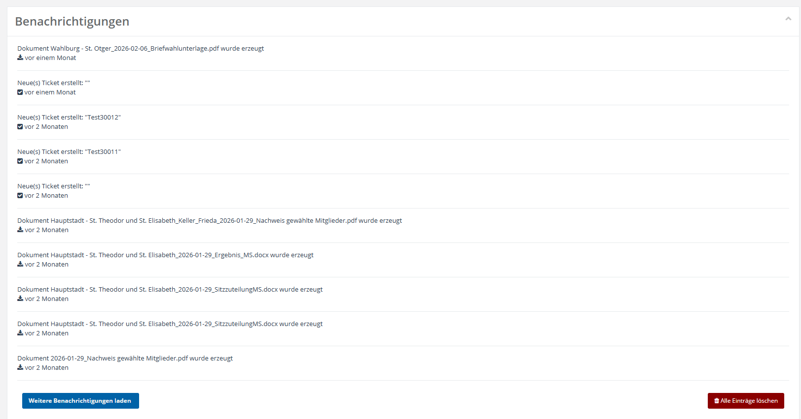
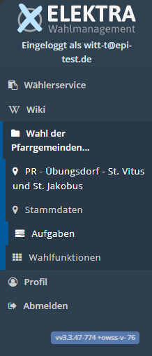
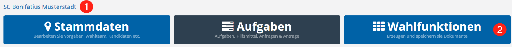
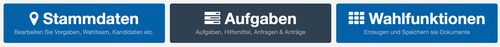

# Erste Orientierung im System

Nach dem erfolgreichen Login gelangen Sie als Standortverantwortliche Person oder als Wahlvorstand in das Hauptmenü für den Standort.

Im Wesentlichen lässt sich die Benutzeroberfläche von **Elektra** in drei Abschnitte unterteilen:

1. Kopfbereich
2. Seitenmenü
3. Arbeitsbereich

*Benutzeroberfläche*

In den folgenden Abschnitten werden die wesentlichen interaktiven Elemente der einzelnen Bereiche vorgestellt.

**Kopfbereich**

|  *Hamburger-Menü* | **Hamburger-Menü**: klappt den linken Menübereich zusammen und reduziert die Menüpunkte auf ein ICON. Das schafft Platz z.B. zur Anzeige breiterer Tabellen.                                                                                                                                                                                                                                                                                                                                                                                                                     |
| --------------------------------------------------------- | -------------------------------------------------------------------------------------------------------------------------------------------------------------------------------------------------------------------------------------------------------------------------------------------------------------------------------------------------------------------------------------------------------------------------------------------------------------------------------------------------------------------------------------------------------------------------------- |
|  *Onlinehilfe* | Mit dem **Fragezeichen-Symbol** gelangen Sie zu der **Elektra**-Onlinehilfe: [www.elektra.software](http://www.elektra.software)                                                                                                                                                                                                                                                                                                                                                                                                                                                 |
|  *Aktuelles Wahlprojekt* | Eine Anzeige zeigt, in welchem Wahlprojekt Sie eingeloggt sind und wann der Wahlbeginn ist.                                                                                                                                                                                                                                                                                                                                                                                                                                                                                      |
|  *Schnellwechselmenü* | **Schnellwechsel zwischen Standorten**: Hier werden Ihnen bis zu zwei Projekte angezeigt, auf die Sie Zugriff haben. Haben Sie Zugriff auf mehr als zwei Projekte, werden die zuletzt aufgerufenen angezeigt. Wählen Sie eines der angezeigten Projekte aus, um ein Dropdown-Menü mit den zuletzt besuchten Standorten innerhalb des Projekts zu öffnen. Klicken Sie auf einen Standort, um diesen aufzurufen.                                                                                                                                                                   |
|  *Benachrichtigungsfunktion / Abmelden* | Die **Benachrichtigungsfunktion** wird über ein Glockensymbol dargestellt. Neben der Glocke wird eine Zahl angezeigt, die angibt, wie viele Benachrichtigungen aktuell vorliegen. Benachrichtigungen werden beispielsweise angezeigt, wenn Aufgaben in Kürze fällig sind, auf einer Ihrer Anfragen geantwortet wurde oder ein Hintergrundprozess wie die Generierung von Dokumenten abgeschlossen wurde. Rechts daneben befindet sich die Schaltfläche **Abmelden**. Über diese Schaltfläche beenden Sie Ihre aktuelle Sitzung in **Elektra** und melden sich aus dem System ab. |

**Benachrichtigungsfunktion**

Die Benachrichtigungsfunktion (Glockensymbol) ermöglicht Ihnen den Zugriff auf alle systemseitigen Hinweise und Ereignisse, die für Ihre Arbeit im Wahlprojekt relevant sind. Sie dient dazu, Sie über aktuelle Entwicklungen zu informieren und einen direkten Zugriff auf zugehörige Inhalte bereitzustellen.

|  *Übersicht Benachrichtigungen* | Klicken Sie auf das **Glockensymbol**, um eine Übersicht der zuletzt eingegangenen Benachrichtigungen zu öffnen. Diese werden in einer Liste dargestellt und enthalten jeweils eine kurze Beschreibung sowie eine zeitliche Einordnung. Innerhalb dieser Liste können Sie beispielsweise generierte Dokumente direkt aufrufen oder zu Aufgaben springen, die in Kürze fällig sind. |
| --- | --- |
|  *Alle Benachrichtigungen anzeigen* | Am unteren Ende der Liste befindet sich die Schaltfläche „Alle Benachrichtigungen". Über diese gelangen Sie in eine separate Ansicht, in der sämtliche Benachrichtigungen vollständig dargestellt werden. In dieser Ansicht werden die Einträge in einer fortlaufenden Liste angezeigt. |

Unterhalb der Liste stehen Ihnen weitere Funktionen zur Verfügung. Mit der Schaltfläche „Weitere Benachrichtigungen laden" können zusätzliche, ältere Einträge nachgeladen werden. Über die Schaltfläche **Alle Einträge löschen** haben Sie die Möglichkeit, die vorhandenen Benachrichtigungen vollständig zu entfernen.

*Übersicht alle Benachrichtigungen*

**Seitenmenü**

Der dunkelblaue Bereich links enthält den Menübaum sowie folgende zusätzliche Merkmale:

|  *Seitenmenü* | **Elektra Logo**: Ein Klick auf das Logo bringt Sie zurück zu der Ansicht, die Sie direkt nach dem Login sehen. Für Standort-Benutzer ist das in der Regel die Aufgaben-Übersicht. **Eingeloggt als**: Zeigt den Namen des aktuellen Nutzers an. **Wählerservice**: Bietet eine Übersicht über die Wahlräume, auf die Sie gemäß Ihrer Berechtigungen Zugriff haben. **Wiki**: Enthält von der Projektleitung bereitgestellte Artikel, z. B. zur Nutzung von **Elektra** oder zum Ablauf des Wahltages. **Wahlprojekt-Menübaum**: Abhängig von der zugewiesenen Rolle stellt der Menübaum unterschiedliche Funktionsbereiche zur Verfügung, die direkt aufgerufen werden können. Haben Sie Zugriff auf eine begrenzte Anzahl von Standorten, werden diese hier angezeigt und können direkt ausgewählt werden. **Profil**: Zeigt Ihnen die personenbezogenen Daten Ihres Profils an sowie Einstellungsmöglichkeiten, wie regelmäßig Benachrichtigungen zugestellt werden sollen. **Abmelden**: Beendet die aktuelle Sitzung. **Versionsnummer:** Zeigt die aktuelle Programmversion |
| --- | --- |

**Arbeitsbereich**

Der Arbeitsbereich ist der zentrale Bereich von **Elektra**, in dem alle für die Durchführung der Wahl relevanten Inhalte angezeigt werden. Hier arbeiten Sie mit den Daten Ihres Standorts, erfassen und pflegen Informationen, rufen Übersichten auf und führen die Ihnen zugewiesenen Aufgaben aus. Der dargestellte Inhalt passt sich dabei dem aktuell ausgewählten Kontext sowie Ihrer Rolle und Ihren Berechtigungen an. Da die im Arbeitsbereich dargestellten Inhalte sehr vielfältig sind, wird an dieser Stelle zunächst ausschließlich der Standort-Kopf beschrieben.

**Standort-Kopf nach dem Einloggen**

*Standortkopf*

- Im **Standort-Kopf** wird zunächst angezeigt, welcher Standort aktuell ausgewählt ist. Dies ist insbesondere dann relevant, wenn Sie für mehrere Standorte tätig sind oder wenn übergeordnete Rollen, wie die Wahlleitung, Einblick in verschiedene Standorte nehmen. Verwenden Sie das Stift-Symbol, um direkt den Stammdaten-Dialog des Standortes aufzurufen.
- Innerhalb eines Standortes bildet das sogenannte **Triptychon**, bestehend aus **Stammdaten**, **Aufgaben** und **Wahlfunktionen**, den zentralen Einstieg in die verschiedenen Funktionsbereiche des jeweiligen Standortes.

Innerhalb eines Standortes bildet das sogenannte **Triptychon**, bestehend aus Stammdaten, Aufgaben und Wahlfunktionen, den zentralen Einstieg in die verschiedenen Funktionsbereiche des jeweiligen Standortes:

*Triptychon*

Klicken Sie auf eine der drei Kacheln, um das darunter angezeigte Funktionsangebot zu wechseln. Im Folgenden werden die Grundfunktionen der drei Bereiche vorgestellt; weiterführende Informationen finden Sie über den Verweis am Ende des jeweiligen Abschnitts.

<!-- doccards:auto -->
## In diesem Kapitel

<DocCardList />
