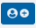
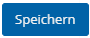
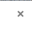
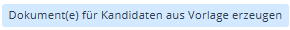
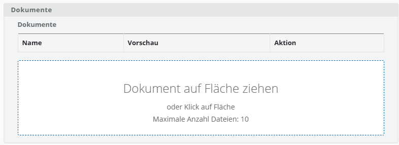
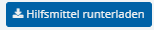

# Grundlegende Interaktionen

Die folgende Übersicht zeigt die wichtigsten Schaltflächen und Symbole, die Ihnen innerhalb der Tabellenansichten für die Arbeit mit den dargestellten Datensätzen zur Verfügung stehen.

| Symbol | Funktion |
| --- | --- |
|   | **Neues Objekt anlegen:** Dunkel blaue Schaltfläche mit einem **+-Symbol**. Erstellt einen neuen Datensatz. |
|  | **Bearbeiten (Stiftsymbol):** Öffnet die Eingabemaske zur Bearbeitung eines bestehenden Datensatzes. |
|  | **Löschen (Papierkorbsymbol):** Entfernt einen Datensatz. |
|  | **Speichern:** Übernimmt die vorgenommenen Änderungen und schließt die Maske. |
|  | **Abbrechen / Schließen („X“):** Schließt die Maske ohne Speicherung der Änderungen. |
|  | **Dokument generieren:** Erstellt Dokumente auf Basis hinterlegter Vorlagen. |
|  | **Dokument hochladen:** Ermöglicht das Hinterlegen von Dateien zu einem Datensatz. Sobald Sie auf die Fläche klicken, öffnet sich Ihr lokaler Dateiexplorer. Alternativ können Sie ein Dokument mittels „**Drag-and-Drop**“ auf die Fläche ziehen, um es hochzuladen. |
|  | **Dokument herunterladen:** Der nach unten gerichtet Pfeil weist daraufhin, dass Sie hier ein Dokument lokal speichern können. |
|  | **Dokument anzeigen (Augen-symbol):** Öffnet ein bereits hinterlegtes Dokument zur Ansicht oder zum erneuten Download. |

