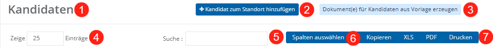
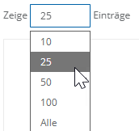
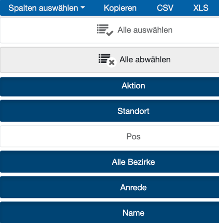
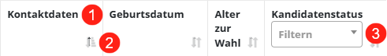
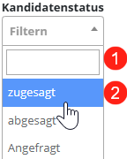
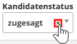
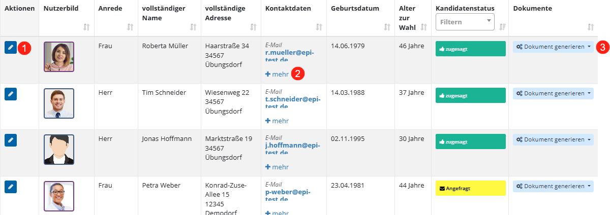
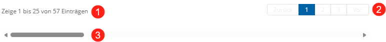

# Tabellen-Funktionalitäten

Tabellen sind ein zentrales Element der Benutzeroberfläche und dienen der strukturierten Darstellung und Bearbeitung von Daten. Sie ermöglichen es, Datensätze zu durchsuchen, zu filtern, zu sortieren und in verschiedenen Formaten weiterzuverwenden.

**Tabellenkopf (Steuerungsbereich)**

Im oberen Bereich der Tabelle (Tabellenkopf) befinden sich grundlegende Steuerungselemente. Hier können Sie festlegen, wie viele Einträge gleichzeitig angezeigt werden, sowie über ein Suchfeld eine Volltextsuche über die angezeigten Inhalte durchführen. Zusätzlich stehen Funktionen zur Auswahl der angezeigten Spalten sowie zum Export der Daten zur Verfügung.

*Tabellenkopf*

- **Überschrift der Tabelle:** Im oberen Bereich der Tabelle wird die Bezeichnung angezeigt. Sie dient der Orientierung und zeigt an, in welchem Kontext Sie sich befinden.

- **Datensatz zur Tabelle hinzufügen:** Über die entsprechende Schaltfläche können neue Datensätze angelegt werden. Nach dem Aufruf öffnet sich eine Eingabemaske, in der die erforderlichen Informationen erfasst werden.

- **Dokumente aus Vorlage erzeugen:** Über die entsprechende Schaltfläche öffnet sich eine Maske, in der Sie Dokumente auf Basis hinterlegter Vorlagen erstellen können. Als Standardauswahl wird die Vorlage für alle aktuell angezeigten Datensätze generiert; alternativ können Sie auch einzelne Datensätze gezielt auswählen. Die erzeugten Dokumente stehen anschließend zur weiteren Verwendung zur Verfügung.

**Anzahl der Einträge pro Seite:** Sie können festlegen, wie viele Datensätze auf einer Seite der Tabelle angezeigt werden.    Hinweis: Beachten Sie, dass eine höhere Anzahl an Einträgen die Ladezeit der Tabelle erhöhen kann.

- **Volltextsuche:** Über das Suchfeld können Sie die angezeigten Inhalte durchsuchen. Dabei wird die Suche über mehrere Spalten und Zeilen hinweg durchgeführt, sodass relevante Datensätze schnell gefunden werden können.

- **Spalten auswählen:** Über die Funktion „**Spalten auswählen**“ können Sie festlegen, welche Spalten in der Tabelle angezeigt werden. Nicht benötigte Spalten können ausgeblendet und bei Bedarf wieder eingeblendet werden.

- **Export-Möglichkeiten**: Die Inhalte der Tabelle können in verschiedenen Formaten exportiert werden. Dazu zählen CSV-, XLSX- und PDF-Dateien sowie die Möglichkeit, die Daten in die Zwischenablage zu kopieren.

**Spaltenkopf**

Der Spaltenkopf ist der obere Bereich der Tabelle, in dem die einzelnen Spalten benannt sowie Funktionen zur Sortierung und Filterung der angezeigten Daten bereitgestellt werden.

*Spaltenkopf der Tabelle*

- **Spaltenbezeichnung:** Die Spaltenbezeichnung gibt an, welche Art von Informationen in der jeweiligen Spalte dargestellt wird, beispielsweise Kontaktdaten, Status oder Datumsangaben.

- **Sortierung**: Über das Sortiersymbol kann die Tabelle nach den Inhalten der jeweiligen Spalte geordnet werden. Ein einmaliges Anklicken sortiert die Einträge in aufsteigender Reihenfolge, ein erneutes Anklicken in absteigender Reihenfolge. Die Sortierung erfolgt alphanumerisch.

- **Filter:** Bei ausgewählten Spalten steht ein Dropdown-Feld zur Verfügung, über das die angezeigten Datensätze gefiltert werden können. Diese Funktion wird insbesondere bei Spalten angeboten, deren Inhalte aus vordefinierten Auswahlwerten stammen, beispielsweise Status- oder Bezirksangaben.

Nach Öffnen des Filters wird ein Auswahlfeld mit möglichen Werten angezeigt (2). Diese entsprechen den vordefinierten Optionen der jeweiligen Spalte, beispielsweise verschiedenen Statuswerten. Über ein Eingabefeld im oberen Bereich können Sie die Auswahl zusätzlich eingrenzen, indem Sie einen Begriff eingeben (1). Durch Anklicken eines Eintrags wird der Filter angewendet und die Tabelle entsprechend eingeschränkt.

Zum Entfernen eines gesetzten Filters klicken Sie auf das „**x**“ neben dem entsprechenden Eintrag.

**Tabelleninhalt**

Der Tabelleninhalt stellt die einzelnen Datensätze dar, die in der Tabelle enthalten sind. Jede Zeile entspricht dabei einem Datensatz und enthält neben den angezeigten Informationen auch verschiedene Interaktionsmöglichkeiten.

*Tabelleninhalt (Kandidatentabelle)*

- **Interaktion mit dem Datensatz**: In der ersten Spalte stehen Schaltflächen zur Bearbeitung des jeweiligen Datensatzes zur Verfügung, in der Regel dargestellt durch ein Stift-Symbol. Durch Anklicken wird ein Absprung in einen anderen Kontext ausgelöst, beispielsweise in eine Bearbeitungsmaske oder eine Detailansicht.

- **Erweiterte Anzeige von Inhalten**: In Spalten mit umfangreicheren Informationen kann der angezeigte Inhalt bei Bedarf erweitert werden. Über die Schaltfläche „**+ mehr**“ lassen sich zusätzliche Details einblenden, ohne die Tabellenansicht zu verlassen.

- **Dokumente aus Datensatz erzeugen**: In einigen Tabellen besteht die Möglichkeit, direkt aus einem Datensatz heraus Dokumente zu erzeugen. Über die entsprechende Schaltfläche können beispielsweise Dokumente auf Basis hinterlegter Vorlagen erstellt werden, etwa zur Erstellung eines Schreibens für eine einzelne Person.

**Fußbereich der Tabelle**

Der Fußbereich der Tabelle enthält Informationen zur aktuellen Anzeige sowie Funktionen zur Navigation innerhalb der Datensätze.

*Fußbereich der Tabelle*

- **Anzeige der Einträge:** Im linken Bereich wird angezeigt, wie viele Datensätze insgesamt in der Tabelle vorhanden sind und welcher Ausschnitt aktuell dargestellt wird.

- **Seitennavigation:** Über die Seitennavigation können Sie zwischen den einzelnen Seiten der Tabelle wechseln. Dadurch lassen sich auch größere Datenmengen schrittweise durchblättern.

- **Horizontale** **Scrollleiste****:** Im unteren Bereich befindet sich eine horizontale Scrollleiste. Diese ermöglicht es, die Tabelle in der Breite zu verschieben, wenn nicht alle Spalten gleichzeitig auf dem Bildschirm dargestellt werden können.
