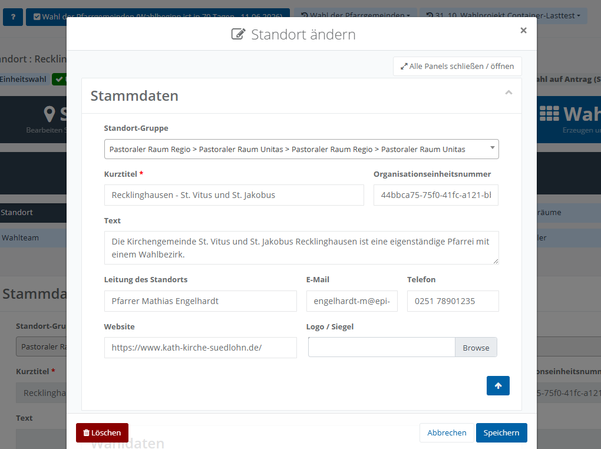
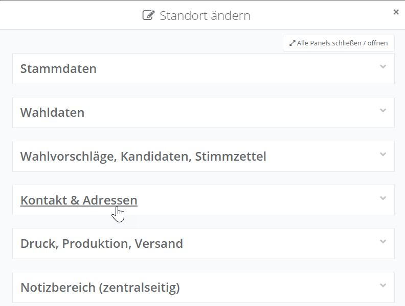
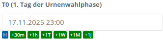
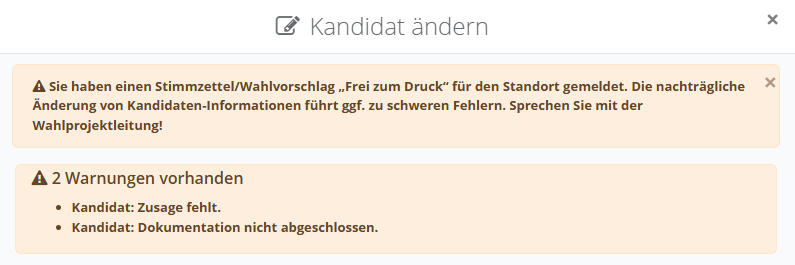
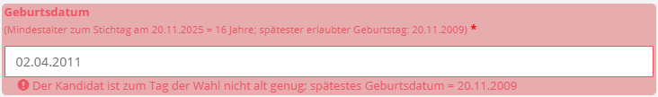

# Dialogboxen

Dialogboxen (auch Modaldialoge genannt) dienen in **Elektra** der Bearbeitung oder Erfassung von Inhalten innerhalb eines Datensatzes. Sie werden in der Regel über das Stift-Symbol aus einer Tabelle heraus aufgerufen. Obwohl sich die konkreten Inhalte je nach Funktion unterscheiden, folgt der Aufbau stets einem einheitlichen Grundprinzip.

Beim Öffnen einer Dialogbox wird der Hintergrund der Anwendung abgedunkelt, sodass der Fokus auf dem Dialog im Vordergrund liegt. Die Dialogbox ist fest positioniert und kann nicht verschoben werden. Ein Schließen ist jederzeit über das „**x**“ in der oberen rechten Ecke. In diesem Fall werden keine Änderungen gespeichert. Alternativ kann ebenfalls die Schaltfläche **Abbrechen** verwendet werden.

Wählen Sie **Speichern** aus, um die Änderungen zu übernehmen.

*Modaldialog (Standort-Details)*

Dialogboxen können in mehrere Bereiche (Panels) unterteilt sein, insbesondere wenn viele Felder oder umfangreiche Informationen dargestellt werden (bspw. innerhalb des Dialogs zur Bearbeitung der Standort-Details). Jedes Panel kann über ein Pfeilsymbol in der oberen rechten Ecke ein- oder ausgeklappt werden. Zusätzlich steht zu Beginn eines solchen Dialogs die Funktion „**Alle Panels schließen / öffnen**“ zur Verfügung, mit der alle Panels gleichzeitig geöffnet oder geschlossen werden können.

| **Hinweis**  |
| --- |
| Um schnell zu einem bestimmten Panel zu gelangen, empfiehlt es sich, zunächst alle Panels einzuklappen und anschließend gezielt den gewünschten Bereich zu öffnen. |

*Modaldialog mit zugeklappten Panels*

**Eingabefelder in den Dialogboxen**

Innerhalb der **Panels** finden Sie Felder, in denen Sie Daten erfassen können. Hierbei stehen unterschiedliche Eingabetypen zur Verfügung:

- **Dropdown-Felder** zur Auswahl vordefinierter Werte.
- Auswahlfelder (**Ankreuzfelder**) für eine einfache Auswahl (z. B. Anrede).

Datums- und Zeitfelder, bei denen  ein mehrstufiger Kalender eingeblendet wird. So wird die Auswahl von Uhrzeit, Tag, Monat und Jahr ermöglicht (sofern für das Feld verfügbar). Alternativ können Werte auch direkt über die Tastatur eingegeben werden. Zusätzlich können vorhandene Auswahlfelder genutzt werden, um Werte schnell anzupassen.

- Durch Anklicken dieser Felder wird der angezeigte Wert in definierten Schritten verändert (z. B. um 30 Minuten, 1 Stunde, 1 Tag, 1 Woche oder 1 Monat). Die Kennzeichnung „**H**“ steht dabei für den heutigen Tag.
- Freitextfelder zur Eingabe individueller Inhalte.

| **Hinweis**  |
| --- |
| Die Navigation zwischen den Eingabefeldern kann über die Tabulatortaste (TAB) erfolgen. Alternativ kann ein Eingabefeld mittels des Mauscursors ausgewählt werden. |

Felder, die mit einem roten Sternchen gekennzeichnet sind, sind Pflichtfelder (bspw. der Kurztitel des Standortes). Der Dialog kann erst gespeichert werden, sobald ein Wert in das Eingabefeld eingetragen wurde.

**Plausibilitätsprüfungen**

Im oberen Bereich des Dialogs können Plausibilitätsmeldungen angezeigt werden. Diese weisen auf fehlende oder fehlerhafte Eingaben hin und unterstützen bei der vollständigen und korrekten Erfassung der Daten. Diese Meldungen beziehen sich nicht zwingend auf ein einzelnes Eingabefeld, sondern können auch übergreifende Sachverhalte betreffen.

*Plausibilitätsmeldungen im Dialog*

Zusätzlich werden Eingabefelder rot hervorgehoben, wenn durch die Eingabe eine Plausibilitätsverletzung in diesem Feld vorliegt, beispielsweise wenn ein erforderliches Mindestalter nicht eingehalten wird.

*Rot markiertes Pflichtfeld bei Plausibilitätsverletzung*
