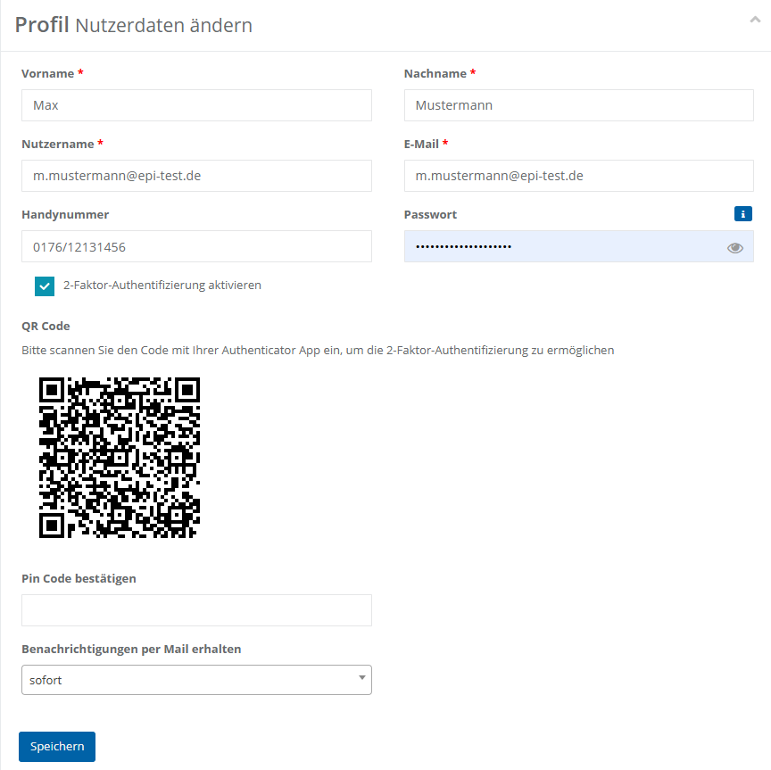

# Profil

Über die Seite **Profil** verwalten Sie Ihre persönlichen Nutzerdaten in **Elektra**. Hier ändern Sie Ihren Namen und Ihre Kontaktangaben, vergeben ein neues Passwort, aktivieren die Zwei-Faktor-Authentifizierung und legen fest, wie häufig Sie Benachrichtigungen per E-Mail erhalten möchten.

## Profil öffnen

Sie erreichen Ihr Profil jederzeit über das Menü am oberen rechten Rand. Klicken Sie dort auf **Profil** (neben **Helpdesk** und **Abmelden**). Es öffnet sich das Panel **Profil** mit dem Abschnitt **Nutzerdaten ändern**.

*Profil – Nutzerdaten ändern*

## Nutzerdaten ändern

Die mit einem roten Sternchen gekennzeichneten Felder sind Pflichtfelder und müssen ausgefüllt sein.

| Feld | Bedeutung |
| --- | --- |
| Vorname | Ihr Vorname (Pflichtfeld). |
| Nachname | Ihr Nachname (Pflichtfeld). |
| Nutzername | Ihr Anmeldename für das System (Pflichtfeld). |
| E-Mail | Ihre E-Mail-Adresse. An diese Adresse werden Systembenachrichtigungen versendet (Pflichtfeld). |
| Handynummer | Mobilnummer für den SMS-Versand (optional). |
| Passwort | Vergabe eines neuen Passworts. Das Feld bleibt leer, solange Sie Ihr bestehendes Passwort nicht ändern möchten. Über das Augensymbol können Sie die Eingabe ein- und ausblenden. |
| 2-Faktor-Authentifizierung aktivieren | Schaltet die zusätzliche Absicherung Ihres Zugangs per Einmalcode ein. |
| Benachrichtigungen per Mail erhalten | Legt fest, in welchem Intervall Sie Benachrichtigungen per E-Mail erhalten. |

| **Hinweis** |
| --- |
| Fahren Sie mit dem Cursor über das „i“ neben dem Feld **Passwort**, um diese Anforderungen anzuzeigen. |

## Zwei-Faktor-Authentifizierung

Setzen Sie den Haken bei **2-Faktor-Authentifizierung aktivieren**, um Ihren Zugang zusätzlich abzusichern. Anschließend werden ein **QR-Code** sowie ein Feld zur Bestätigung per **PIN-Code** eingeblendet. Scannen Sie den QR-Code mit einer Authentifizierungs-App (z. B. **Microsoft Authenticator** oder **Google Authenticator**) und geben Sie den erzeugten Code zur Bestätigung ein.

Der Ablauf entspricht der Ersteinrichtung beim Login; eine ausführliche Beschreibung finden Sie unter [Systemzugang und Login](./systemzugang-und-login).

## Benachrichtigungen

Über das Dropdown **Benachrichtigungen per Mail erhalten** steuern Sie, wie oft **Elektra** Sie per E-Mail informiert. Zur Auswahl stehen: *sofort*, *stündlich*, *täglich*, *wöchentlich*, *14-tägig*, *monatlich* und *nie*.

## Änderungen speichern

Klicken Sie abschließend auf **Speichern**, um Ihre Änderungen zu übernehmen.
