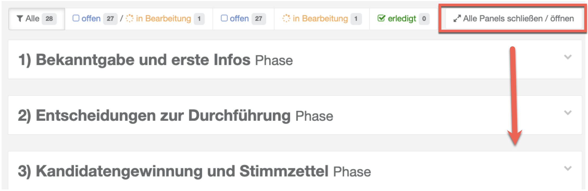
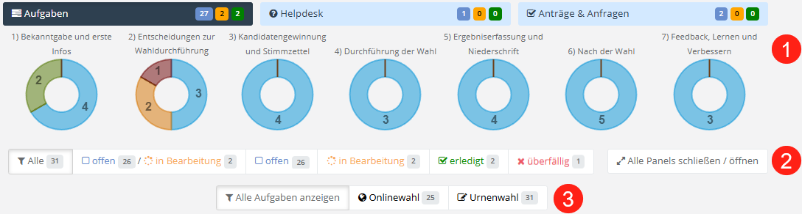

# Grundkonzepte des Aufgabenhefts

Bevor Sie mit dem Aufgabenheft arbeiten, lohnt sich ein Blick auf drei Grundkonzepte: das Verständnis von Aufgaben als „**Gemeingut**“, die Gliederung in **Phasen** sowie das **Statusnetz** zur Verfolgung des Bearbeitungsfortschritts.

## Aufgaben sind „Gemeingut“

Ein wichtiges Grundprinzip. **Elektra** teilt Informationen in bestimmte Personenkreis oder Nutzerprofile ein. Dabei wird aber bewusst NICHT auf die Zuweisung von Aufgaben an Einzelpersonen abgestellt. Aufgaben sind in **Elektra** Gemeingut der beteiligten Akteure am Standort. Das bedeutet, dass die Aufgaben durch alle am Standort mit einem Nutzerzugriff berechtigten Mitglieder eingesehen und bearbeitet werden können.

- Über die Spalte „Bearbeitet von" ist zwar erkennbar, wer eine Aufgabe zuletzt bearbeitet hat – nicht jedoch, welche konkrete Änderung (z. B. am Status) diese Person vorgenommen hat
- Namentliche Notizen können aber über die Kommentar-Funktion gesetzt werden.
- Aber: Wichtige Protokolle sind in Form von Formularen, Dokumenten, Checklisten auszudrucken und schriftlich zu Nachweiszwecken zu dokumentieren. Insbesondere bei den Wahlfunktionen wird darauf abgestellt, eine vollständige (digitale) Wahlakte entstehen zu lassen.

## Phasen

*Phasen-Konzept der Aufgaben*

Jede Aufgabe muss zu einer Phase gehören. Phasen werden über ein Kürzel sortiert, so dass sich eine logische Reihenfolge ergibt. Phasen werden in der Aufgabenliste als Panel dargestellt. Die Panels können auf- und zugeklappt werden.

## Statusnetz & Aufgabenübersicht

Jede Aufgabe unterliegt einem Statusnetz:

- Nicht begonnen
- Offen
- In Bearbeitung
- Fertig

Technisch gibt es zusätzlich den Status **überfällig**, der automatisch vergeben wird, wenn die Frist einer Aufgabe verstrichen ist, ohne dass diese auf **Fertig** gesetzt wurde.

- Der **Aufgabenbereich** Ihres Standortes beginnt mit der Übersicht des Bearbeitungsstatus. Darüber hinaus werden Ihnen verschiedene Filterfunktionalitäten angeboten, über welche Sie das **Aufgabenheft** einschränken können.

*Aufgabenübersicht mit Phasen und Status*

- Die Stati werden je Phase in den Kreisdiagrammen dargestellt.
- Schaltflächen erlauben Ihnen die Aufgaben-Anzeige zu filtern:
- Zeige alle Aufgaben. Nutzen Sie diese Schaltfläche, um zum Ausgangszustand zurückzukehren.
- Zeige Aufgaben, die „**nicht begonnen, offen oder in Bearbeitung sind**“
- Zeige Aufgaben, die „**offen sind**“
- Zeige Aufgaben, die „**in Bearbeitung**“ sind
- Zeige Aufgaben, die erledigt  sind
- Aufgaben können ebenfalls mit Schlagwörtern, so genannten Tags, versehen sein. Diese sind durch die Projektleitung frei definierbar. Beispielsweise könnte es Aufgaben geben, die nur im Falle einer Online- oder Urnenwahl relevant sind. Über ein eigenes Filterfeld können Sie gezielt nach diesen Tags filtern.
