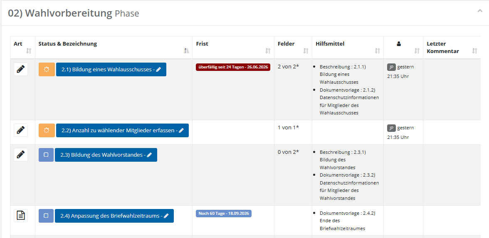
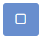
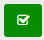
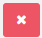
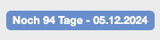
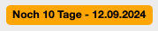
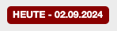
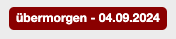
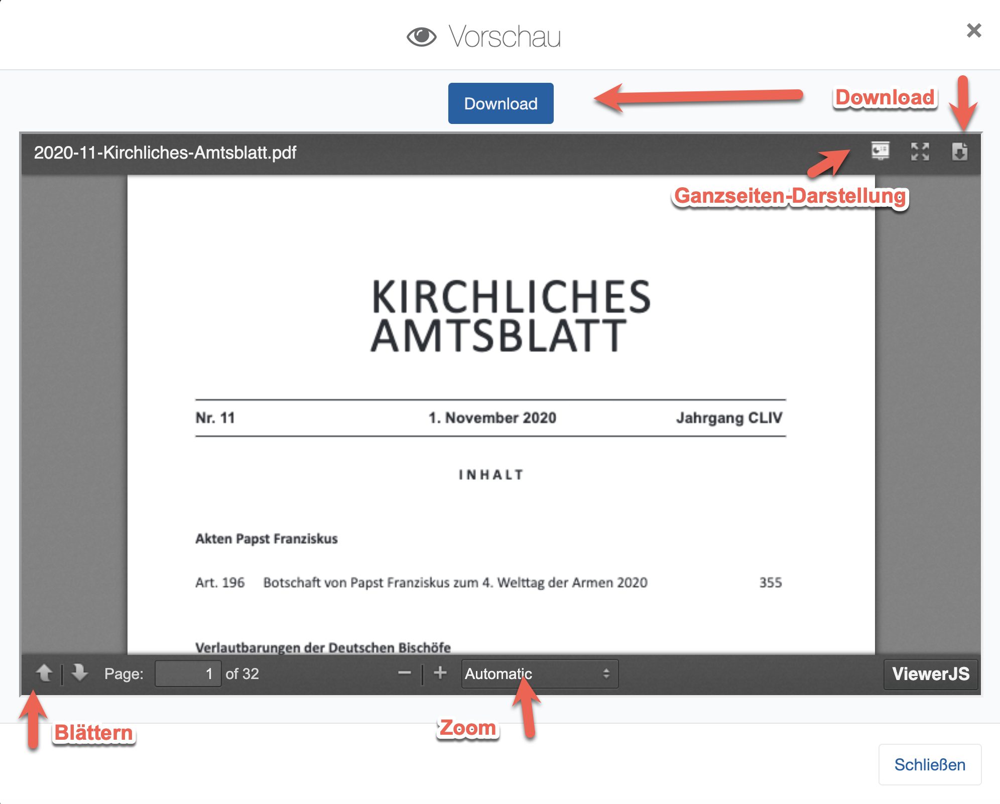

# Aufbau der Aufgabentabelle

Innerhalb einer Aufgabenphase sind eine oder mehrere Aufgaben enthalten. Diese werden tabellarisch dargestellt:

*Übersicht Aufgabenphase*

## Art
Hier wird dargestellt, zu welcher **Aufgabenkategorie** die Aufgabe gehört. Dies bieten einen schnellen Überblick, was in etwa bei der Aufgabe zu tun ist. Folgende Aufgabenkategorien sind standardmäßig in **Elektra** vorhanden:

|  | Aushang |
| --- | --- |
|  | Meeting |
|  | Ankündigung/Bekanntgabe |
|  | Lesen & Lernen |
|  | Daten erfassen |
|  | Datenabfrage |
|  | Dokumente hochladen |
|  | Video ansehen |
|  | Dokumentieren |
|  | Feedback |
|  | Wählerverzeichnis |
|  | Entscheidung |

Bitte beachten Sie, dass Icons und deren Hintergrundfarbe seitens der Projektleitung frei definierbar sind und weitere Aufgabenkategorien ergänzt werden können.

## Status & Bezeichnung 
Zeigt den aktuellen **Bearbeitungsstatus** als farbiges Symbol sowie die Bezeichnung der Aufgabe. Über einen Klick auf die Bezeichnung öffnen Sie die Aufgabe zur Bearbeitung. Die folgenden Status sind möglich:

| Symbol | Status | Bedeutung |
| --- | --- | --- |
|  | **Nicht begonnen** (offen) | Die Aufgabe wurde noch nicht bearbeitet. |
|  | **In Bearbeitung** | Die Aufgabe wird gerade bearbeitet. |
|  | **Fertig** | Die Aufgabe ist abgeschlossen. |
|  | **Überfällig** | Die Frist ist verstrichen, ohne dass die Aufgabe auf **Fertig** gesetzt wurde. |

## Frist
Aufgaben in **Elektra** sind immer mit einem Zieldatum versehen, zu welchem die Aufgabe erledigt sein muss. Die Fristenanzeige ändert hierbei ihre Darstellung, je nachdem wie weit die Frist in der Zukunft liegt:

|  | Aufgabe weit in der Zukunft - blau |
| --- | --- |
|  | Aufgabe nahend - gelb |
|   | Aufgabe diese Woche - rot |

## Felder
Zeigt, sofern die Aufgabe mit einer Datenabfrage (**Feedback**) hinterlegt ist, den Bearbeitungsstand der Fragen im Format „X von Y*" – also wie viele der vorgesehenen Fragen bereits beantwortet sind.

## Hilfsmittel
Listet die zur Aufgabe hinterlegten Hilfsmittel auf, jeweils mit Typ und Titel. Wurde kein Hilfsmittel hinterlegt, bleibt die Spalte leer. Wurde ein PDF-Dokument hinterlegt, können Sie es über die Schaltfläche „Vorschau" direkt einsehen.

*PDF-Vorschau eines Hilfsmittels*

- **Letzte Bearbeitung:** Zeigt an, welcher **Nutzer** zu welchem Zeitpunkt die Aufgabe zuletzt bearbeitet hat.
- **Letzter Kommentar:** Zeigt, sofern vorhanden, den zuletzt zur Aufgabe erfassten Kommentar. Ist noch kein Kommentar hinterlegt, bleibt die Spalte leer.
