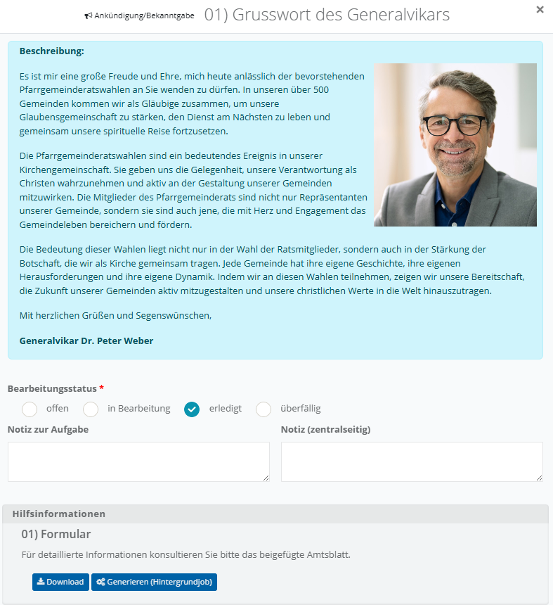
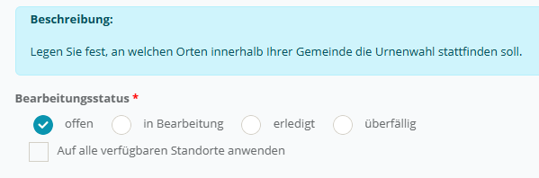
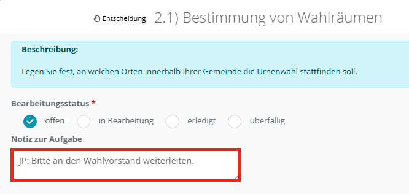
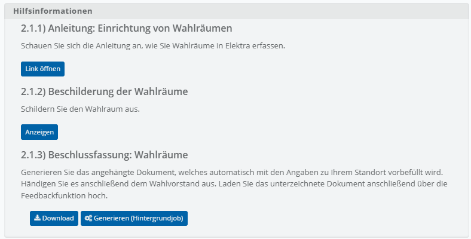
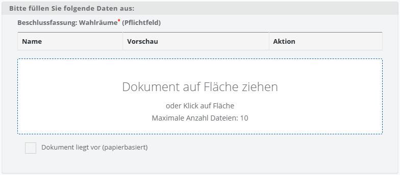
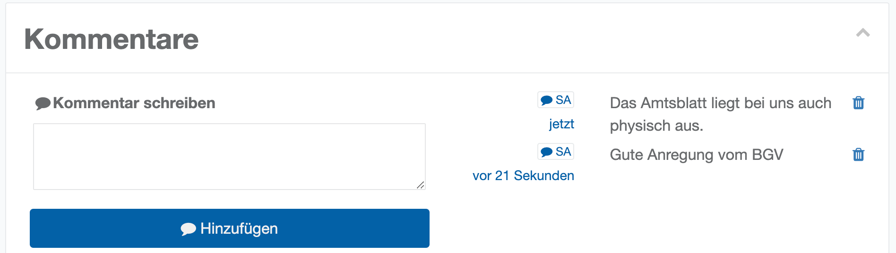

# Bearbeitungsdialog einer Aufgabe

Im Folgenden wird Ihnen im Detail gezeigt, wie der Bearbeitungsdialog einer Aufgabe aufgebaut ist. Sie erreichen ihn, indem Sie in der Aufgabentabelle auf die **Bezeichnung** der Aufgabe klicken.

- **Aufgabenbeschreibung**: Ganz oben im Dialog steht die Aufgabenbeschreibung als hellblau hinterlegter Text. Sie ist ein HTML-Text, der seitens der Projektleitung vorgegeben ist und am Standort nicht bearbeitet werden kann. Inhalte darin können Grafiken, Tabellen und Links sein.

*Aufgabenbeschreibung*

- **Bearbeitungsstatus:** Wählen Sie den aktuellen Bearbeitungsstatus der Aufgabe aus: offen, in Bearbeitung, erledigt oder überfällig. Darüber hinaus kann für die Aufgabe ebenfalls die Option **Auf alle verfügbaren Standorte anwenden** zur Verfügung stehen. Diese Funktion wird in der Regel für Aufgaben freigeschaltet, die einen rein informatorischen Charakter haben. Wenn Sie diese Option auswählen, wird der Status der Aufgabe, der hier gesetzt wird, auf alle Standorte des Wahlprojektes übertragen, auf die Sie zugreifen können.

*Bearbeitungsstatus*

- **Notiz zur Aufgabe**: Ein Freitextfeld für Ihre Notiz zur Aufgabe. Es steht allen am Standort mit Nutzerzugriff berechtigten Mitgliedern zur Verfügung; da Aufgaben als Gemeingut verstanden werden, ist nicht ohne Weiteres nachvollziehbar, wer die Notiz erfasst hat.

*Notiz zur Aufgabe*

| **Hinweis**  |
| --- |
| Wenn Sie Notizfelder mit mehreren Team-Mitgliedern nutzen, schreiben Sie jeweils Ihr Namenskürzel dazu. Alternativ verwenden Sie die Kommentarfunktion. |

- **Hilfsinformationen**: Sofern zur Aufgabe Hilfsmittel hinterlegt sind, werden diese in einer eigenen Sektion mit Titel und Beschreibung aufgelistet. Je nach Art des Hilfsmittels steht eine passende Schaltfläche zur Verfügung: „Link öffnen“ für externe Links, „Anzeigen“ für eine PDF-Vorschau, oder „Download“ zusammen mit „Generieren (Hintergrundjob)“ für Dokumentvorlagen, die mit Ihren Standortdaten vorbefüllt erzeugt werden.

*Hilfsinformationen*

- **Feedback:** Sofern zur Aufgabe eine Datenabfrage (Feedback) hinterlegt ist, erscheinen hier die einzelnen Fragen. Die Fragen können unterschiedliche Typen haben (z. B. Checkbox, Text, Datum, Dokumenten-Upload) und werden von der Projektleitung als optional oder als Pflichtfeld markiert.
- Folgende Frage-Typen sind in **Elektra** verfügbar:

| Checkbox | Ankreuzfeld ohne weitere Validierungen |
| --- | --- |
| Checkbox: Single Choice | Liste von Optionen mit einer möglichen Auswahl |
| Checkbox: Multiple Choice | Liste von Optionen mit mehreren Auswahlen |
| Text einzeilig | Text mit einer bestimmten Länge ohne Umbruch |
| Text mehrzeilig | Mehrzeiliger Text mit Umbruch |
| Datum | Es erscheint ein Kalender zur Auswahl |
| Fließkommazahl | Nur Ziffern, die Zahl der Nachkommastellen kann definiert werden |
| Ganzzahl | Nur Ziffern ohne Nachkommastellen |
| Uhrzeit | Es erscheint ein Auswahldialog mit Eingabemöglichkeit |

Pflichtfragen sind mit einem roten Sternchen und dem Zusatz **(Pflichtfeld)** gekennzeichnet. Bei Fragen vom Typ **Dokumenten-Upload** steht eine Übersichtstabelle (Name/Vorschau/Aktion) der bereits hochgeladenen Dokumente sowie eine Drop-Zone für weitere Uploads zur Verfügung. Sofern diese Option von der Projektleitung freigeschaltet wurde, können Sie mit dem Kontrollkästchen **Dokument liegt vor (papierbasiert)** ein bereits vorliegendes Papierdokument vermerken. Wird diese Funktion ausgewählt, kann die Aufgabe auch ohne den Dokumenten-Upload als **erledigt** gekennzeichnet werden.

*Feedback: Dokumenten-Upload*

**Kommentare:** Kommentare sind eine Tabelle von Notizen, die mit Zeitstempel und User-Name erfasst werden.

*Kommentarbereich*
