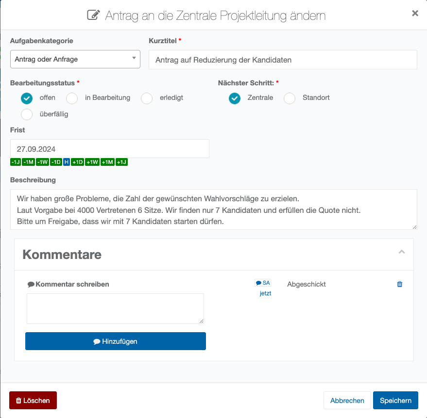

# Anträge an die Zentrale Projektleitung

*Abb. 46 – Antrag an die zentrale Projektleitung stellen*

Die Felder sind soweit selbsterklärend. Anfragen sind technisch gesehen Aufgaben und damit Allgemeingut das als Information zwischen den Beteiligten Akteuren liegt.

Es kann über da Feld Nächster Schritt festgelegt werden, wer „**am Zug ist**“.

| **Hinweis**  |
| --- |
| Ein Personenbezug besteht nicht. Auch ein rechtlicher Nachweis über Absendung und Empfang besteht nicht. Für nachweissichere formale Anträge wählen Sie die entsprechende Funktion und erzeugen zu signierende Dokumente. Archivieren Sie zudem die Dokumente in der Wahlakte. |
