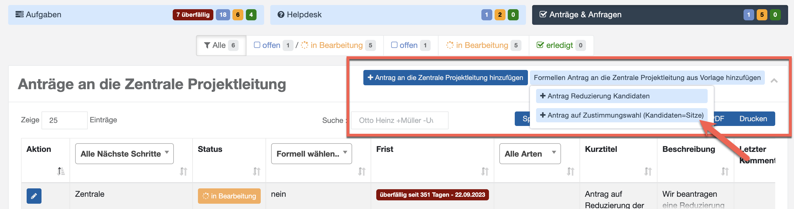
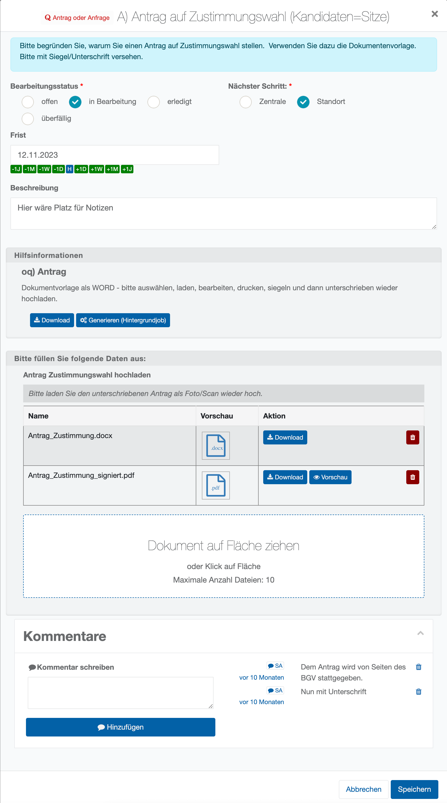

# Formale Anträge

Wenn die Projektleitung formelle Anträge für das Wahlprojekt vorgesehen hat, gibt es ein entsprechendes Dropdown-Menü mit der Auswahl der vorbereiteten Anträge:

*Auswahl formaler Anträge (Dropdown)*

Es öffnet sich der Dialog zur Bearbeitung des Antrags

Es handelt sich dabei um eine Feedback-Aufgabe mit Hilfsmitteln und Antwortfeldern, wie Sie es aus der Aufgabenbearbeitung kennen. Dieser kann dann sowohl das formale Dokument als Musterdatei anbieten und einen Upload-Dialog, in dem das unterschrieben und gescannte Dokument hochgeladen werden kann.

*Formaler Antrag als Feedback-Aufgabe*

**Anfragen an den Standort**

Zentralseitige Anfragen an den Standort werden in der Übersicht ebenfalls angezeigt. Diese werden gleichartig bedient wie Anfragen an die Zentrale (s.o.) – nur eben mit anderem Startpunkt.
