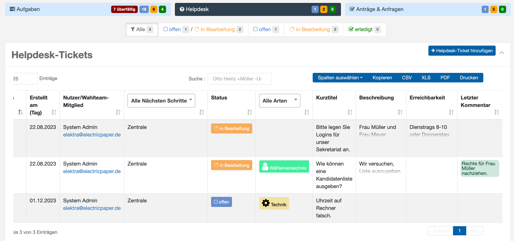

# Helpdesk

Wenn von Ihrer Wahlleitung freigeschaltet, gibt es die Möglichkeit, Helpdeskanfragen abzusetzen, um sich gezielt zu verschiedenen Themengebieten (Spalte: Arten) auszutauschen. Welche Themengebiete angeboten werden und welche Mitarbeiter in der tatsächlichen Bearbeitung zu geordnet sind, entscheidet Ihre Projektleitung. Typische Angebote sind jedoch:

- **Elektra**-Anwendung
- Fragen zur Wahlabwicklung / Rechtliches
- IT-Technik
- Druck,- Produktion und Versand

*Helpdesk-Ticketübersicht*

Helpdesk-Tickets werden wie die übrigen [Anträge und Anfragen](./antraege-und-anfragen) bearbeitet – hier zwischen dem Standort und den jeweils zuständigen Fachverantwortlichen.
