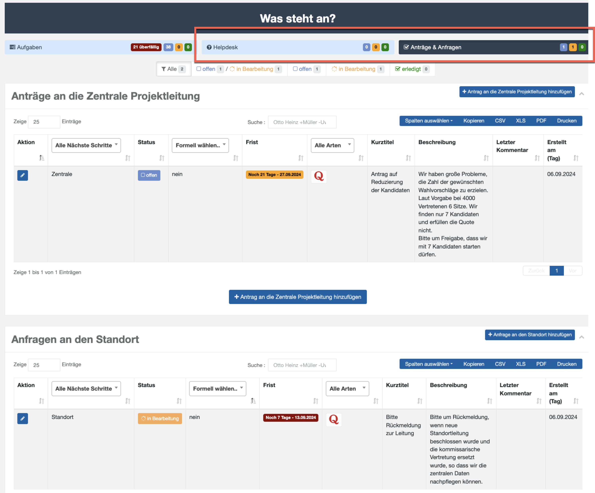

# Anträge & Anfragen, Helpdesk

Die folgende Übersicht zeigt den Bereich Anträge und Anfragen:

*Abb.  – Anträge und Anfragen (Übersicht)*

Neben dem projektbezogenen über Phasen im Aufgabenheft gibt es weitere, aufgabenorientierte Arbeitsbereiche in **Elektra**, die für die Benutzung freigeschaltet werden können. Das besondere dieser Aufgaben ist, dass diese Aufgaben zwischen Zentrale und Standort „**hin- und her fließen**“. Sie sind keiner Projektphase zugeordnet, sondern sind ein organisatorisches Hilfsmittel, um die E-Mail-basierte Kommunikation zu reduzieren. Ziel ist, dass auch eine Dokumentation Dialogs entsteht und dass die Verantwortlichkeit für den jeweils nächsten Schritt klar definiert ist.
