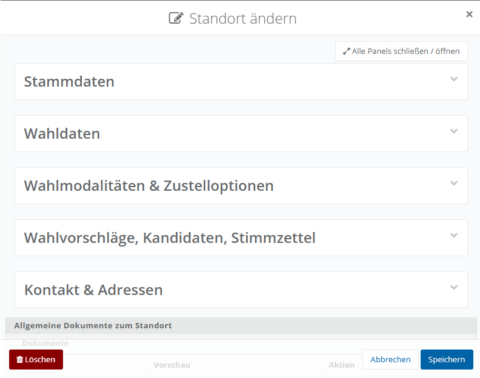
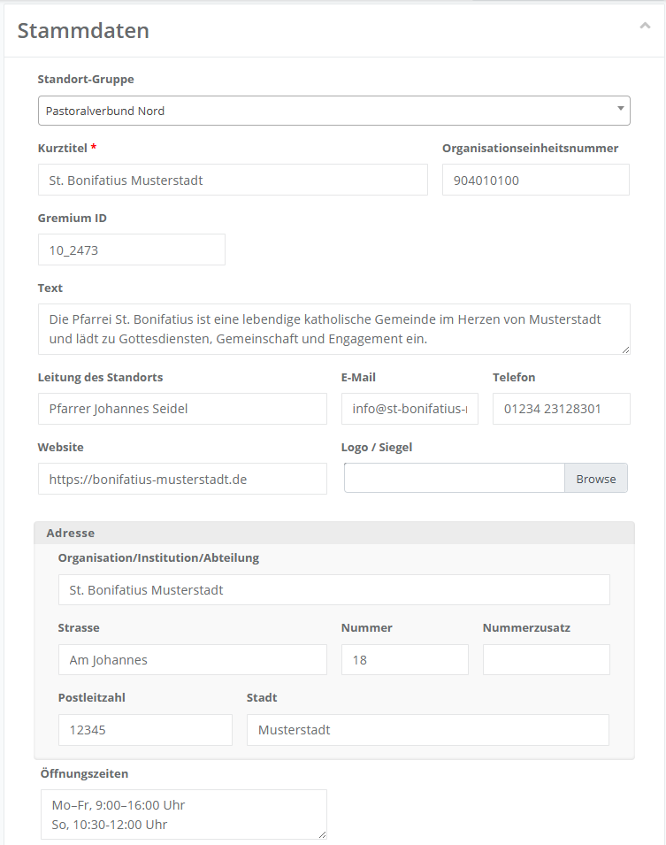
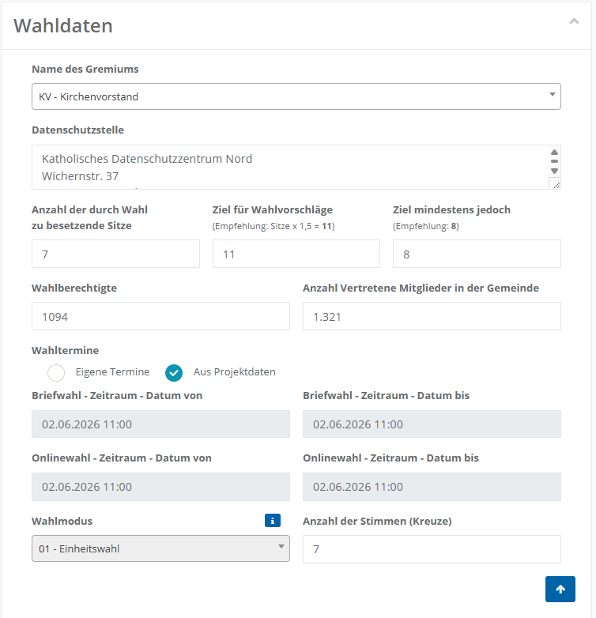
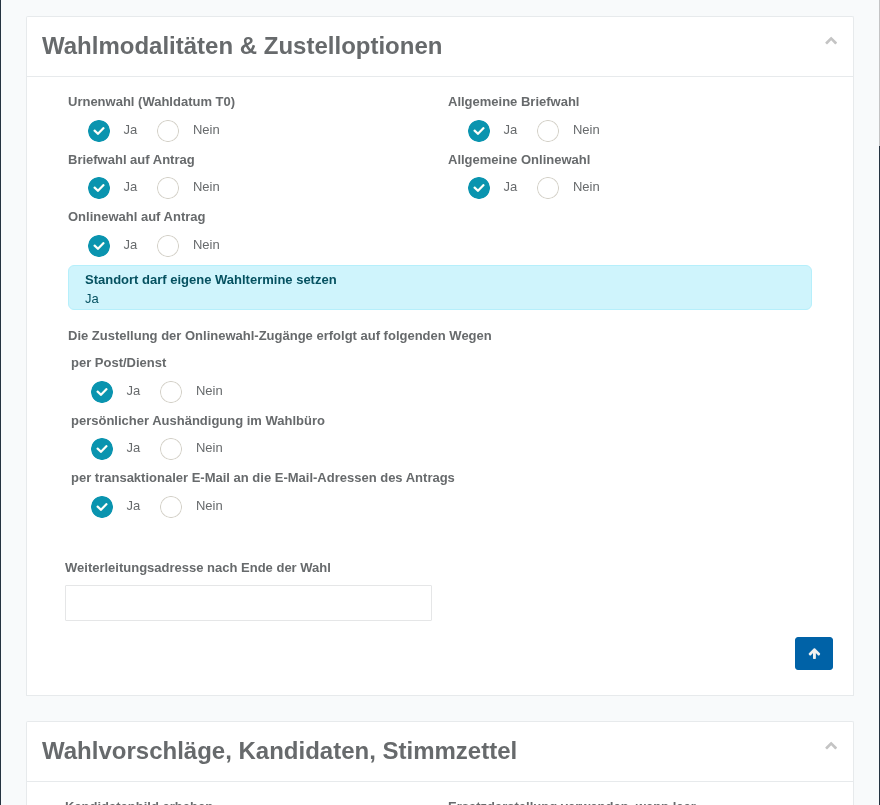
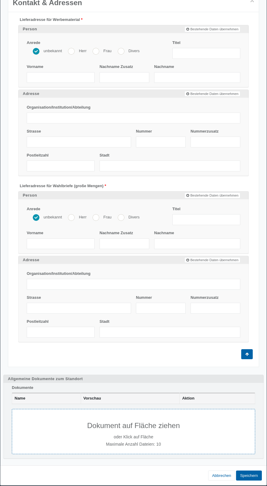

# Standort-Einstellungen

Beim ersten Aufruf werden die Standort-Einstellungen in einer reinen Anzeigeansicht (Read-Only) dargestellt. Eine direkte Bearbeitung ist in diesem Zustand nicht möglich.

Die Inhalte sind in mehrere klappbare Panels gegliedert. Jedes Panel fasst thematisch zusammengehörige Informationen zusammen (z. B. allgemeine Angaben, Wahldaten oder Kontaktdaten).

Die dargestellten Informationen dienen zunächst der Überprüfung der vorhandenen Daten.

Um die Angaben zu editieren, klicken Sie auf **Standort-Details bearbeiten**.

*Standort-Übersicht mit Bearbeiten-Funktion*

Der Bearbeitungsdialog besteht aktuell aus **fünf** Panels, die im Folgenden der Reihe nach beschrieben werden.

| **Hinweis**  |
| --- |
| Es werden nur die Panels angezeigt, die für Ihren Standort relevant sind bzw. für die Ihr Standort Bearbeitungsrechte besitzt. Je nach Wahlprojekt kann Ihnen daher nur ein Teil der Panels angezeigt werden – unter Umständen beispielsweise nur **Stammdaten** und **Wahldaten**. |

## Stammdaten

Das Panel Stammdaten enthält die zentralen Grunddaten des Standorts – von der organisatorischen Zuordnung über die Kontaktangaben bis zur Anschrift und der Ansprechperson für die Wahl. Die hier dargestellten Informationen kommen in der Regel aus zentralen Importen.

*Bearbeitungsdialog Standort Stammdaten*

### Grunddaten

| Feld | Bedeutung |
| --- | --- |
| Standort-Gruppe | Zuordnung zu einer organisatorischen Mittel-Ebene in der Territorialstruktur (Dropdown). Die Auswahlwerte pflegt die zentrale Projektleitung bzw. das Meldewesen - *in der Regel nicht bearbeitbar*. |
| Kurztitel | Zentraler, einzeiliger Titel – bei Kirchenwahlen in der Regel die Bezeichnung der Gemeinde (Patrozinium + Ort) - *in der Regel nicht bearbeitbar*. |
| Organisationseinheitsnummer | Technisches Merkmal aus dem Datenimport – *in der Regel nicht bearbeitbar*. |
| Gremium ID | Interne Kennung des am Standort zu wählenden Gremiums (aus dem Import) – *in der Regel nicht bearbeitbar*. |
| Text | Mehrzeiliges Freitext-Eingabefeld. |
| Leitung des Standorts | Für den Standort/Betrieb hauptverantwortliche Person, so wie sie der Projektleitung für die zentrale Vorbefüllung bekannt ist. |
| E-Mail | E-Mail-Adresse, über die der Standort bzw. die Standortleitung erreichbar ist. |
| Telefon | Telefonnummer, über die der Standort bzw. die Standortleitung erreichbar ist. |
| Website | Website des Standorts. |
| Logo / Siegel | Upload eines Bildes zur Personalisierung von Schriftstücken. |
| Adresse | Organisation/Institution/Abteilung, Straße, Nummer, Nummernzusatz, Postleitzahl, Stadt. Die hier angegebene Adresse wird in der Regel als Rücksendeadresse für Wahlunterlagen angedruckt. |
| Öffnungszeiten | Mehrzeiliges Freitextfeld. |

### Ansprechperson für die Wahl

Im unteren Bereich des Panels folgt der Abschnitt **Ansprechperson für die Wahl**. Diese Person dient als zentraler Kontakt für Wahlangelegenheiten am Standort.

*Ansprechperson für die Wahl*

| Feld | Bedeutung |
| --- | --- |
| Person | Anrede (unbekannt/Herr/Frau/Divers), Titel, Vorname, Nachname-Zusatz, Nachname sowie eine **interne Notiz** (rein internes Freitextfeld, erscheint nicht in Dokumentvorlagen). |
| Kontakt | E-Mail, Telefon, Fax, Mobil, Mobil (privat), Erreichbar (Tage/Zeiten). |

## Wahldaten

Das Panel Wahldaten enthält die zentralen Parameter der Wahl an Ihrem Standort – vom zu wählenden Gremium über die Anzahl der zu besetzenden Sitze bis zu den Wahlterminen und dem Wahlmodus.

*Wahldaten*

| Feld | Bedeutung |
| --- | --- |
| Name des Gremiums | Wählen Sie über das Dropdown-Menü aus, welches Gremium an Ihrem Standort gewählt wird. Steht innerhalb des Wahlprojekts nur ein einzelnes Gremium zur Auswahl, ist dieses bereits vorausgewählt und die Auswahl kann nicht geändert werden. |
| Datenschutzstelle | Zeigt die im Wahlprojekt hinterlegte Datenschutzstelle an. Sofern für Ihren Standort eine abweichende Datenschutzstelle zuständig ist, kann diese Angabe überschrieben werden. |
| Anzahl der durch Wahl zu besetzenden Sitze | Legt fest, wie viele Sitze im zu wählenden Gremium zu besetzen sind. Die Anzahl bildet die Grundlage für die weitere Planung und bestimmt, wie viele Kandidatinnen und Kandidaten gewählt werden können. Ist die Größe des Gremiums von Ihrer Wahlordnung fest vorgeschrieben, kann das Feld nicht bearbeitet werden. |
| Ziel für Wahlvorschläge | Definiert, wie viele Wahlvorschläge bzw. Kandidaturen angestrebt werden. Das System bietet eine Empfehlung an, die auf den vorgesehenen Sitzen und einem von der Projektleitung festgelegten Faktor beruht (in der Regel 1,5). |
| Ziel mindestens jedoch | Mindestanzahl an erforderlichen Wahlvorschlägen – wie viele Kandidaturen mindestens vorliegen müssen, damit die Wahl ordnungsgemäß durchgeführt werden kann. |
| Wahlberechtigte | Wird häufig vom Meldewesen vorgegeben und bezieht sich ausschließlich auf die Anzahl wahlberechtigter Gemeindemitglieder. Wird zu statistischen Zwecken mitgeführt (z. B. zur automatischen Berechnung der Wahlbeteiligung). |
| Anzahl Vertretene Mitglieder in der Gemeinde | Wird häufig vom Meldewesen vorgegeben und zu statistischen Zwecken mitgeführt. |
| Wahltermine | Legt fest, ob die Wahltermine **Aus Projektdaten** übernommen werden (dann werden T0/T1 sowie – sofern zentral vorgesehen – der Briefwahl- und der Onlinewahlzeitraum schreibgeschützt angezeigt) oder ob der Standort **Eigene Termine** hinterlegen darf. |
| Wahlmodus | Wenn auf Projektebene das Abweichen von der Einheitswahl erlaubt ist, können Sie auf Bezirkswahl oder unechte Bezirkswahl stellen. Bei der echten Bezirkswahl gibt die Zahl der Sitze die Zahl der Kreuze auf dem Stimmzettel vor. |

| **Hinweis**  |
| --- |
| Erst nach Auswahl eines Bezirks-basierten Wahlmodus blendet die Software weitere Felder ein, u. a. die Zuteilung von Sitzen je Bezirk. **WICHTIG:** Die Summe der Sitze je Bezirk muss der Gesamtzahl **der durch Wahl** **zu besetzenden Sitze** entsprechen. |

## Wahlmodalitäten & Zustelloptionen

*Wahlmodalitäten & Zustelloptionen*

Das Panel Wahlmodalitäten & Zustelloptionen legt fest, welche Wahlkanäle an Ihrem Standort angeboten werden und auf welchen Wegen die Zugänge zur Onlinewahl zugestellt werden.

| Feld | Bedeutung |
| --- | --- |
| Vorgesehene Wahlkanäle | Wenn die Wahlkanäle nicht auf Zentralebene fest vorgegeben wurden, kann auf Standortebene für **Urnenwahl (Wahldatum T0)**, **Allgemeine Briefwahl**, **Briefwahl auf Antrag**, **Allgemeine Onlinewahl** und **Onlinewahl auf Antrag** jeweils separat mit Ja/Nein entschieden werden. Eine logische Prüfung der Kombinationen findet nicht statt. |
| Standort darf eigene Wahltermine setzen | Wird als schreibgeschützter Informationskasten angezeigt (Ja/Nein). Die Vorgabe stammt aus dem Wahlprojekt und kann am Standort nicht verändert werden. |
| Zustellung der Onlinewahl-Zugänge | Für **per Post/Dienst**, **persönliche Aushändigung im Wahlbüro** und **per transaktionaler E-Mail an die E-Mail-Adressen des Antrags** wird je Ja/Nein festgelegt, welcher Zustellweg zulässig ist. |
| Weiterleitungsadresse nach Ende der Wahl | Nur relevant und ausfüllbar, wenn im Wahlprojekt für die Weiterleitungsadresse nach Ende der Onlinewahl **Standort optional** oder **Standort pflicht** vorgesehen wurde – der Standort kann (bzw. muss) dann eine eigene Ziel-URL hinterlegen. |

## Wahlvorschläge, Kandidaten, Stimmzettel

*Wahlvorschläge, Kandidaten, Stimmzettel*

Das Panel Wahlvorschläge, Kandidaten, Stimmzettel steuert, welche Angaben zu Kandidatinnen und Kandidaten erhoben und wie diese auf Stimmzetteln und Aushängen dargestellt werden.

Alle Felder dieses Panels werden mit Ja/Nein (bzw. bei einigen Feldern zusätzlich „Optional“) beantwortet. Ist eine Vorgabe bereits zentral auf Projektebene fest hinterlegt, erscheint das jeweilige Feld hellblau hinterlegt und ist am Standort nicht mehr veränderbar.

| Feld | Bedeutung |
| --- | --- |
| Kandidatenbild erheben | Wenn ja, besteht die Möglichkeit zum Bild-Upload. Es erscheinen Warnungen, wenn Kandidatenbilder fehlen. |
| Beruf erheben | Soll eine Berufsangabe eingefordert werden? |
| Ersatzdarstellung verwenden, wenn leer | In Aushängen/Stimmzetteln kann das Bild leer gelassen oder – wenn kein Bild vorhanden ist – die Ersatzdarstellung verwendet werden. |
| Anschrift „Keine Angabe" zulassen | Können Kandidaten ohne Adressinformation vollständig dokumentiert werden? |
| Anschrift veröffentlichen | Sollen die Anschriften von Kandidaten mit ausgegeben werden? |
| Motivation (HTML) erheben | Legt fest, ob zusätzlich zur einfachen Motivationsangabe eine formatierbare (HTML-)Variante der Kandidaten-Motivation erhoben werden soll. |

| **Hinweis**  |
| --- |
| Auf Ebene des Kandidaten-Datensatzes gibt es dazu ebenfalls Steuerungsmöglichkeiten! |

## Kontakt & Adressen

Das Panel Kontakt & Adressen enthält die Lieferadressen für Werbematerial und Wahlbriefe sowie einen allgemeinen Dokumenten-Upload.

*Kontakt & Adressen*

| Feld | Bedeutung |
| --- | --- |
| Lieferadresse für Werbematerial | Person- und Adressdaten für die Zustellung von allgemeinem Werbematerial/Drucksachen. |
| Lieferadresse für Wahlbriefe (große Mengen) | Person- und Adressdaten für die Zustellung größerer Mengen an Wahlbriefen. |
| Allgemeine Dokumente zum Standort | Upload beliebiger Dokumente per Drag-and-drop oder Dateiauswahl direkt am Standort (maximal 10 Dateien), inklusive einer Übersichtstabelle (Name/Vorschau/Aktion) der bereits abgelegten Dokumente. |

Bei beiden Lieferadressen kann die **Ansprechperson für die Wahl** aus dem Panel Stammdaten über die Schaltfläche **Bestehende Daten übernehmen** heruntergespiegelt werden, so dass die Erfassung einfach und effizient bleibt.
