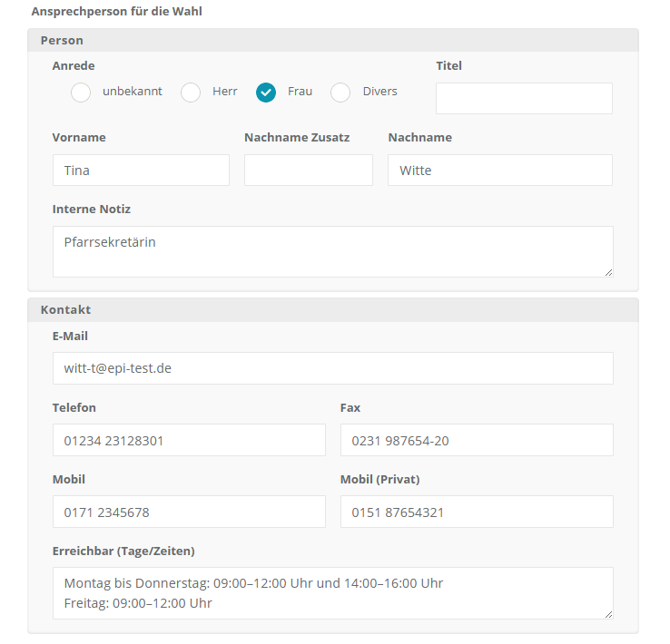

# Stammdaten

Das Panel Stammdaten enthält die zentralen Grunddaten des Standorts – von der organisatorischen Zuordnung über die Kontaktangaben bis zur Anschrift und der Ansprechperson für die Wahl. Die hier dargestellten Informationen kommen in der Regel aus zentralen Importen.

*Bearbeitungsdialog Standort Stammdaten*

**Standort-Gruppe**: Zuordnung zu einer organisatorischen Mittel-Ebene in der Territorialstruktur. Auswahl als Dropdown. Die Pflege der Auswahlwerte erfolgt durch die zentrale Projektleitung bzw. das Meldewesen.

**Kurztitel**: Dies ist der zentrale, einzeilige Titel. Im Kontext von Kirchenwahlen ist dies in der Regel die Bezeichnung der Gemeinde (Patrozinium + Ort).

**Organisationseinheitsnummer**: Technisches Merkmal aus dem Datenimport. Diese Angabe kann in der Regel nicht bearbeitet werden.

**Gremium ID**: Ebenfalls ein technisches Merkmal aus dem Datenimport – die interne Kennung des am Standort zu wählenden Gremiums.

**Text**: Mehrzeiliges Freitext-Eingabefeld.

**Leitung des Standorts**: Dies ist die für den Standort oder Betrieb hauptverantwortliche Person, so wie Sie der Projektleitung für die zentrale Vorbefüllung des Systems bekannt ist.

**E-Mail**: E-Mailadresse, über die der Standort / die Leitung des Standortes erreicht werden kann.

**Telefon**: Telefonnummer, über die der Standort / die Leitung des Standortes erreicht werden kann.

**Website**: Website des Standorts.

**Logo / Siegel**: Uploadmöglichkeit für ein Bild, das zur Personalisierung von Schriftstücken verwendet werden könnte.

Im unteren Bereich des Panels Stammdaten folgen zwei weitere Abschnitte: die vollständige **Anschrift** des Standorts sowie eine **Ansprechperson für die Wahl**.

*Ansprechperson für die Wahl*

**Adresse**: Organisation/Institution/Abteilung, Strasse, Nummer, Nummerzusatz, Postleitzahl, Stadt sowie **Öffnungszeiten** als mehrzeiliges Freitextfeld.

**Ansprechperson für die Wahl**: Diese Person dient als zentraler Kontakt für Wahlangelegenheiten am Standort.

**Person**: Anrede (unbekannt/Herr/Frau/Divers), Titel, Vorname, Nachname Zusatz, Nachname, Interne Notiz (rein internes Freitextfeld, erscheint nicht in Dokumentvorlagen).

**Kontakt**: E-Mail, Telefon, Fax, Mobil, Mobil (Privat), Erreichbar (Tage/Zeiten).
