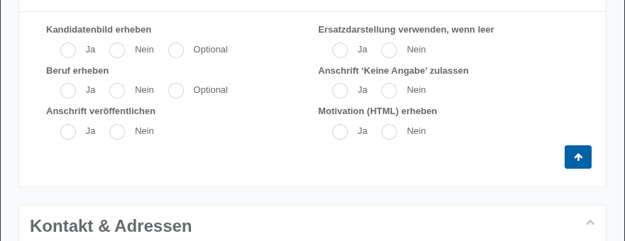

# Wahlvorschläge, Kandidaten, Stimmzettel

Das Panel Wahlvorschläge, Kandidaten, Stimmzettel steuert, welche Angaben zu Kandidatinnen und Kandidaten erhoben und wie diese auf Stimmzetteln und Aushängen dargestellt werden.

Alle Felder dieses Panels werden mit Ja/Nein (bzw. bei einigen Feldern zusätzlich „Optional“) beantwortet. Ist eine Vorgabe bereits zentral auf Projektebene fest hinterlegt, erscheint das jeweilige Feld hellblau hinterlegt und ist am Standort nicht mehr veränderbar.

**Kandidatenbild erheben**: Wenn ja, dann gibt es die Möglichkeit zum Bild-Upload. Es erscheinen Warnungen, wenn Kandidatenbilder fehlen.

**Beruf erheben**: Soll eine Berufsangabe eingefordert werden?

**Ersatzdarstellung verwenden, wenn leer**: In Aushängen/Stimmzetteln kann das Bild leer gelassen oder die Ersatzdarstellung verwendet werden, wenn kein Bild vorhanden ist.

**Anschrift ‚Keine Angabe‘ zulassen**: Können Kandidaten ohne Adressinformation vollständig dokumentiert werden?

**Anschrift veröffentlichen**: Sollen die Anschriften von Kandidaten mit ausgegeben werden?

| **Hinweis**  |
| --- |
| Hinweis: Auf Ebene des Kandidaten-Datensatzes gibt es dazu ebenfalls Steuerungsmöglichkeiten! |

**Motivation (HTML) erheben**: Legt fest, ob zusätzlich zur einfachen Motivationsangabe eine formatierbare (HTML-)Variante der Kandidaten-Motivation erhoben werden soll.
