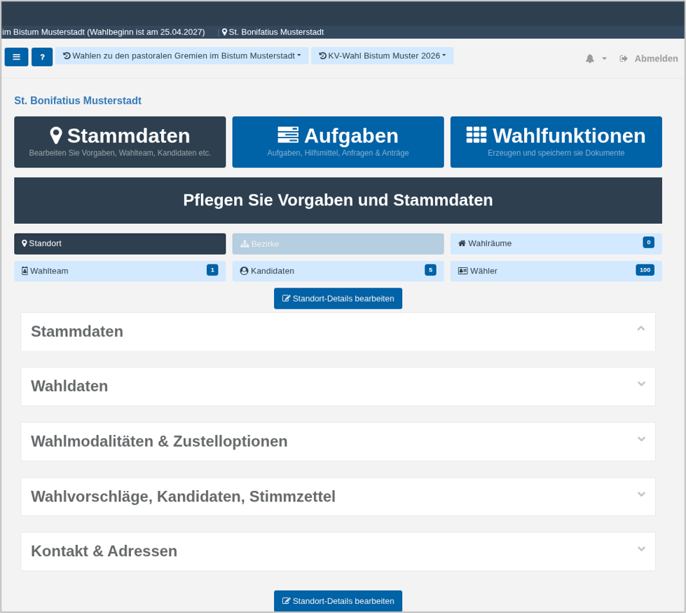

# Standort-Einstellungen

Beim ersten Aufruf werden die Standort-Einstellungen in einer reinen Anzeigeansicht (Read-Only) dargestellt. Eine direkte Bearbeitung ist in diesem Zustand nicht möglich.

Die Inhalte sind in mehrere klappbare Panels gegliedert. Jedes Panel fasst thematisch zusammengehörige Informationen zusammen (z. B. allgemeine Angaben, Wahldaten oder Kontaktdaten).

Die dargestellten Informationen dienen zunächst der Überprüfung der vorhandenen Daten.

Um die Angaben zu editieren, klicken Sie auf **Standort-Details bearbeiten**.

*Abb.  – Standort-Übersicht mit Bearbeiten-Funktion*

Schauen wir die einzelnen Panels im Bearbeitungsmodus einmal an. Der Bearbeitungsdialog besteht aktuell aus **fünf** Unterabschnitten. Bitte beachten Sie, dass an Ihrem Standort ggf. nur zwei Panels angezeigt werden. In diesem Fall werden die übrigen Panels aufgrund der Gegebenheiten des Wahlprojektes nicht benötigt.

<!-- doccards:auto -->
## In diesem Kapitel

<DocCardList />
