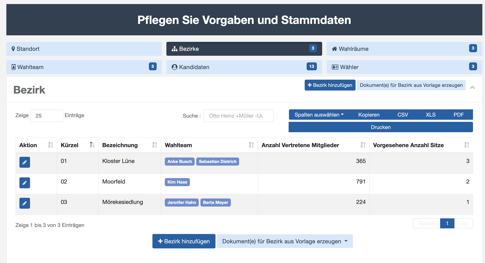
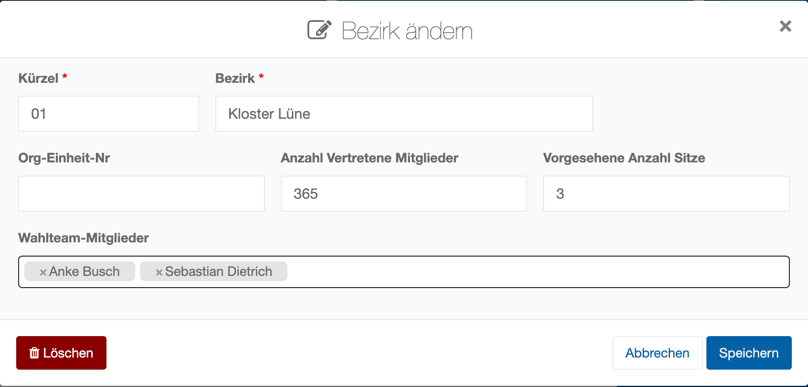

# Bezirke

Wahlbezirke sind geografische oder sachlogische Einheiten, die bei Wahlen genutzt werden, um die Wahlorganisation zu erleichtern und eine gerechte Stimmverteilung sicherzustellen. Sie ermöglichen es, die Wählerstimmen in kleineren, verwaltbaren Bereichen zu erfassen und deren Repräsentation im Gremium zu sichern. Sie sorgen sie dafür, dass jede Stimme in einem repräsentativen Verhältnis zur Anzahl vertretener Mitglieder  des jeweiligen Bezirks steht, was für die faire Repräsentation in den Gremien wichtig ist.

| **Hinweis**  |
| --- |
| Wahlbezirke können nur angelegt werden, wenn für den Standort „**Bezirkswahl**“ oder „**unechte Bezirkswahl**“ als Wahlmodus hinterlegt wurde (siehe Standortvorgaben). Ist hingegen Einheitswahl hinterlegt, ist der Bereich „**Bezirke**“ ausgegraut. |

*Wahlbezirke verwalten*

Sofern die Bearbeitung bzw. das Anlegen von Stimmbezirken freigegeben wurde, können Sie diese mit Hilfe der Maske „**Bezirk ändern**“ editieren:

*Maske Bezirk ändern*

**Kürzel**: Alphanumerisches Kennzeichen zur Sortierung der Bezirke

**Bezirk**: Kurztext, der den Bezirk beschreibt. In der Regel wird dieser Text in Druckausgaben ergänzt um den Kurztext des Standorts.

**Org****-Einheit-****Nr**: Information aus dem Stammdatenpool / Meldewesen

**Anzahl Vertretene Mitglieder**: Wie viele Mitglieder werden durch den Bezirk repräsentiert.

**Vorgesehene Anzahl Sitze**: Wie viele Sitze im Gremium sind für diesen Bezirk vorgesehen.

**Wahlteam-Mitglieder**: Aus der Liste der Wahlteam-Mitglieder können hier diejenigen ausgewählt werden, die für diesen Bezirk zuständig sind. Dieses macht u.a. Sinn bei der Besetzung von Wahlräumen in den Bezirken.

Weitere Beziehungen: Neben den für den Standort verantwortlichen Wahlteam-Mitgliedern können zahlreiche weitere Entitäten (Kandidaten, Stimmzettel etc.) mit den hinterlegten Bezirken verbunden werden. Zahlreiche Plausibilitätsprüfungen entlang des Wahlablaufs weisen Sie darauf hin, wenn diese Beziehungen in der Stammdatenbearbeitung nicht ordentlich befüllt wurden (Darstellung von Warnungen und Fehlern in den Wahlfunktionen).
