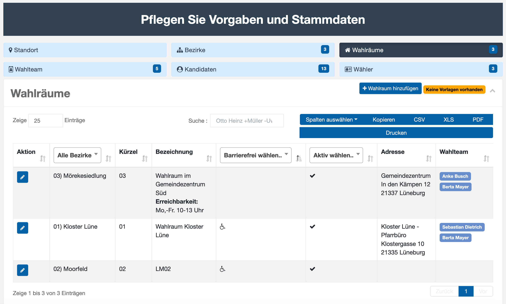
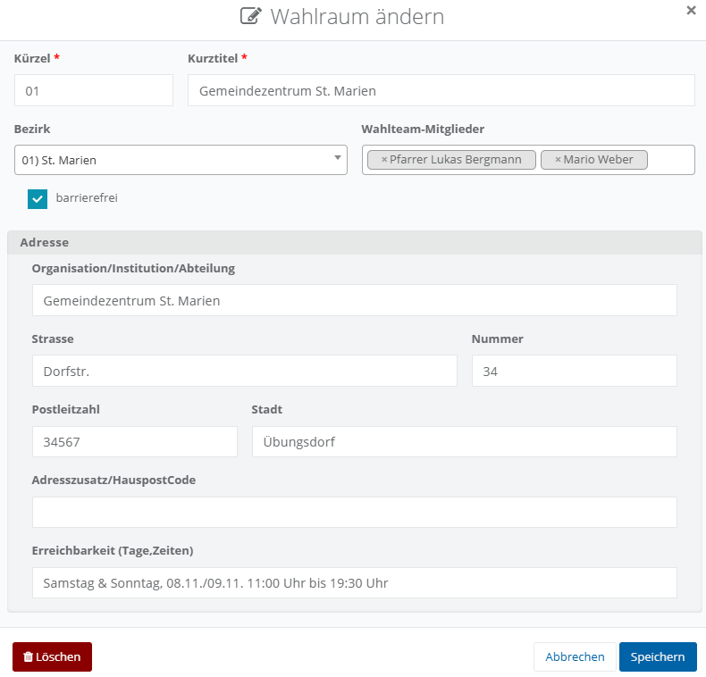

# Wahlräume

Sofern an Ihrem Standort eine Urnenwahl oder eine Briefwahl an Ort und Stelle durchgeführt wird, sind Wahlräume notwendig, um Wählern einen physischen Ort zur Stimmabgabe zu bieten. Sie ermöglichen es, die Wahl ordnungsgemäß durchzuführen, Stimmen sicher zu erfassen und eine zugängliche, barrierefreie Wahlteilnahme für der Wahlberechtigten zu gewährleisten. Ebenso lässt sich hier eine Unterstützung für die Onlinewahl anbieten, etwa in Form eines Wahlraums mit Internetzugang für Wählerinnen und Wähler ohne eigenes Endgerät. Die hinterlegten Angaben zu den Wahlräumen können außerdem auf der Wahlbenachrichtigung mit abgedruckt werden.

*Wahlräume verwalten*

Im Bearbeitungsdialog können die folgenden Daten zum Wahlraum gepflegt werden:

*Wahlraum bearbeiten*

**Kürzel**: Ein Textfeld zur Eingabe eines kurzen Codes oder einer Nummer zur Identifizierung des Wahlraums.

**Kurztitel**: Ein Textfeld für die Eingabe des Namens oder der Bezeichnung des Wahlraums.

**Bezirk**: Ein Dropdown-Menü, in dem der Wahlbezirk ausgewählt wird, dem der Wahlraum zugeordnet ist.

**Wahlteam-Mitglieder**: Ein Feld, in dem die Mitglieder des Wahlteams hinzugefügt oder ausgewählt werden können.

**Barrierefrei**: Ein Kontrollkästchen, das markiert wird, wenn der Wahlraum barrierefrei ist.

**Adresse**: Verschiedene Felder zur Eingabe der Adresse des Wahlraums, einschließlich

Organisation/Institution/Abteilung, Straße, Hausnummer, Postleitzahl, Stadt, und einem optionalen Adresszusatz.

**Erreichbarkeit (Tage, Zeiten)**: Ein Textfeld zur Angabe der Öffnungszeiten oder der Erreichbarkeit des Wahlraums.

Diese Felder bieten eine detaillierte Möglichkeit, relevante Informationen zu einem Wahlraum zu erfassen und zu verwalten.
