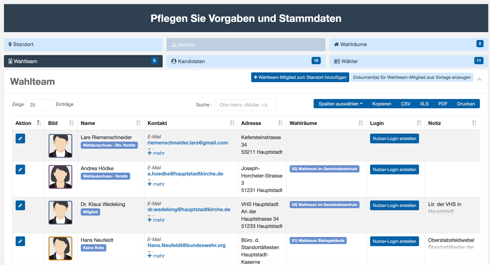
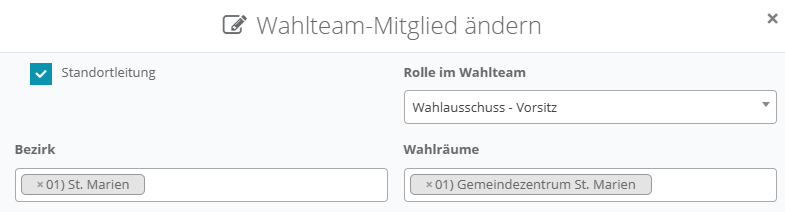
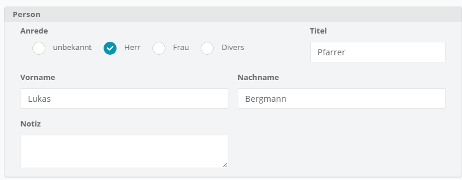
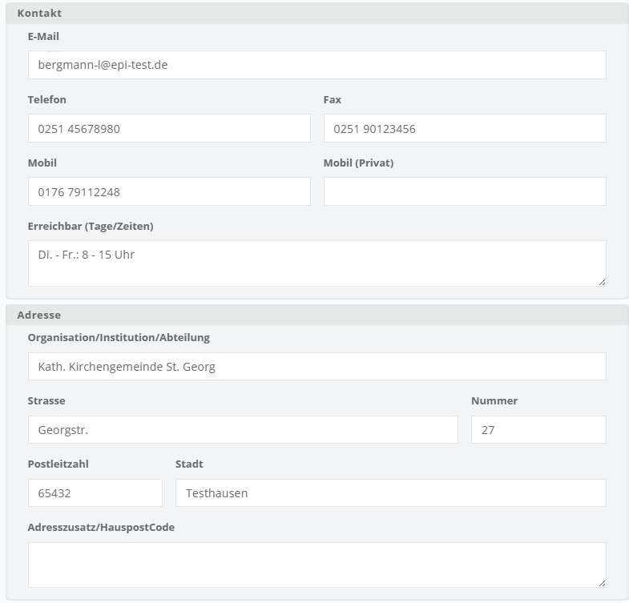
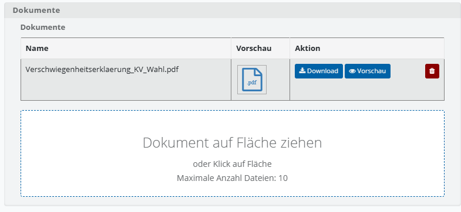

# Wahlteam

Im Wahlteam werden die Adressdaten und Kontaktdaten von Mitarbeitenden und Ehrenamtlichen erfasst, die am Gelingen der Wahl aktiv mitwirken. Die hier erfassten Informationen werden in den Wahlfunktionen im Rahmen von Protokollen und Vordrucken verwendet.

*Wahlteam-Übersicht*

- Die Liste sollte neben einem Standortverantwortlichen auch die Mitglieder des Wahlvorstands umfassen. Auch Wahlhelfer werden hier erfasst

Dieser Dialog dient der Bearbeitung der Details eines Mitglieds des Wahlteams. Er ist in verschiedene Abschnitte unterteilt, um unterschiedliche Arten von Informationen zu erfassen:

|  *Wahlteam-Mitglied bearbeiten: Zuordnung* | **Standortleitung:** Ein Kontrollkästchen, das markiert wird, wenn das Mitglied Teil der Standortleitung ist. Die Person muss nicht zwangsweise eine Rolle im Wahlteam haben. **Rolle im Wahlteam:** Ein Dropdown-Menü, in dem die spezifische Rolle des Mitglieds innerhalb des Wahlteams ausgewählt wird. Die Wahlleitung legt die sprachliche Ausformulierung  für die Rollen im Team fest.  Beispielsweise: Wahlvorstand Stv. Wahlvorstand Wahlbeauftragte/r Wahlhelfer … Die Rollen für die Leitung des Wahlteams und sein Vertreter werden in Protokolldokumenten wieder herangezogen. **Bezirk:** Zuordnung zu einem oder mehreren Stimmbezirken **Wahlräume:** Ein Feld, das die Zuordnung des Mitglieds zu bestimmten Wahlräumen ermöglicht. |
| --- | --- |
|  *Wahlteam-Mitglied: Abschnitt Person* | **Person:** Dieser Abschnitt enthält Felder zur Eingabe persönlicher Daten wie Anrede, Vorname, Nachname, Titel und eine Notizoption. |
|  *Wahlteam-Mitglied: Abschnitt Kontakt* | **Kontakt:** Hier können Kontaktdaten wie E-Mail-Adresse, Telefon-, Mobil- und Faxnummern eingegeben werden. Zusätzlich gibt es ein Feld für die Erreichbarkeit des Mitglieds an bestimmten Tagen und Zeiten. **Adresse:** In diesem Abschnitt können die Adresse des Mitglieds, einschließlich Organisation/Institution/Abteilung, Straße, Hausnummer, Postleitzahl, Stadt und Adresszusatz, eingegeben werden. |
|  *Wahlteam-Mitglied: Adresse und Dokumente* | **Dokumente:** In diesem Bereich können Sie in persönliche Dokumente des Mitglieds hinterlegen. Dazu zählen beispielsweise **Datenschutz- und Verschwiegenheitserklärungen**. |
