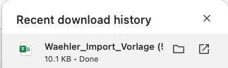
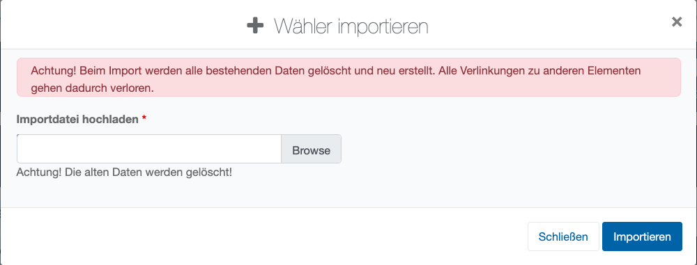
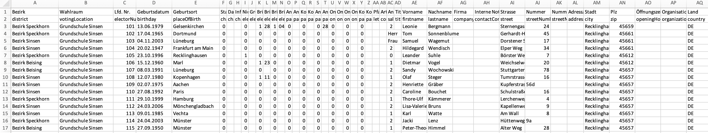
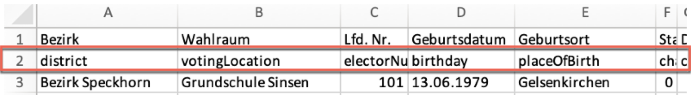

# Sondersituation für MAV-Wahlen – Import / Export von Wählerdaten

Wie zuvor erwähnt, kann in den **Projektvorgaben** bzw. **Privilegien** festgelegt werden, dass Ihnen die Funktionalitäten **Download/Upload Wahlberechtigte** zur Verfügung stehen:

*Import- und Export-Funktionen für Wählerdaten*

Die Idee ist, dass in diesem Falle die Pflege des Wählerverzeichnisses nicht durch zentrale Meldedaten unterfüttert ist, sondern vielmehr in Eigenregie am **Standort** organisiert werden muss. Dies ist z.B. bei MAV-Wahlen der Fall. Um die Funktion zu nutzen, laden Sie zunächst eine Musterdatei mit **Download Wahlberechtigte** herunter.  Sie erhalten eine Excel-Datei mit sämtlichen Angaben und Feldern gemäß Vorgabe.

*Wählerdaten hoch- und herunterladen*

Öffnen Sie die Vorlage mit Excel.

*Wähler-Importvorlage in Excel öffnen*

Der Aufbau der Wähler-Importvorlage sieht wie folgt aus:

*Aufbau der Wähler-Importvorlage*

| **Hinweis**  |
| --- |
| Der Upload von neuen Wählerdaten wird vom System unterbunden bzw. gar nicht angeboten, wenn bereits eine Onlinewahl angelegt wurde. Nach Beginn der Wahl ist das Hinzufügen und Löschen von Wählern in der Regel nicht mehr erlaubt! |

- Die erste Zeile in der Excel-Datei enthält den Namen der Spalte.
- Die zweite Zeile enthält das den technischen Feldnamen in der **Elektra**-Datenbank, die den Inhalt aufnehmen soll.
- Es können Spalten aus der Liste herausgelöscht werden.
- Auch die Reihenfolge kann geändert werden, ohne dass Einschränkungen entstehen.

*Spaltenreihenfolge der Importvorlage*

Eine detaillierte Erläuterung zu der Bedeutung der einzelnen Spalten der Importdatei finden Sie im Anhang.

**Automatisch angewendete Logiken:**

Die zahlreichen Flags im Wählerverzeichnis unterliegen einer Logik, die von der Software automatisch angewendet wird. Deutlich wird Sie durch die eingeblendeten Plausibilität-Felder hinter den Wahlflags beispielsweise im Wählerservice.

- Es werden nur die Wahlkanäle angeboten, die im Projekt bzw. auf Standortebene verfügbar gemacht wurden.
- Es kann nur ein Kanal bis zur erfolgreichen Teilnahme geführt werden, auch wenn mehrere Anträge und Wahlmöglichkeiten vorliegen.
- Die Ausgabe von Unterlagen wird unterbunden, wenn schon Wahlkanäle genutzt wurden.
- Es gibt Warnungen, wenn Aufgaben wiederholt durchgeführt werden.

**Historie/Audit-Log**

Beim Import von Wählerdaten wird das bestehende Wählerverzeichnis komplett gelöscht. Es gibt aber entsprechende Audit-Records über die Löschungen.
