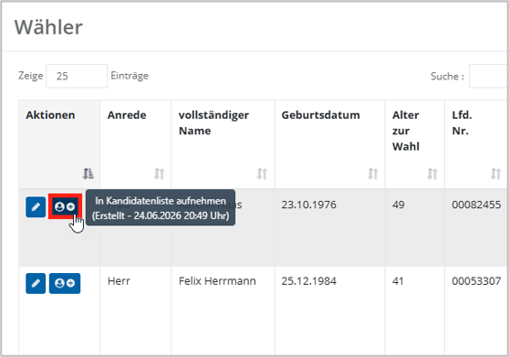

# Wähler in Kandidaten umwandeln

**Elektra** ist standardmäßig so konfiguriert, dass sich das passive Wahlrecht sich nicht zwingend aus dem aktiven ergeben muss. . Es ist die Aufgabe des Wahlvorstandes die Wählbarkeit des Kandidaten zu verifizieren!

Dennach ist es möglich, Personen aus dem Wählerverzeichnis in Kandidaten umzuwandeln. Wählen Sie hierfür die Schaltfläche **In Kandidatenlist aufnehmen** aus.

*Abb.  – Wähler zu Kandidat wandeln*

Die Maske zur Anlage des Kandidaten ist vorbefüllt mit den Daten des Wählers. Erfassen Sie im Anschluss weitere Daten, die für die Kandidatur notwendig sind. Der Aufbau der entsprechenden Maske wird innerhalb des nächsten Kapitels behandelt.
