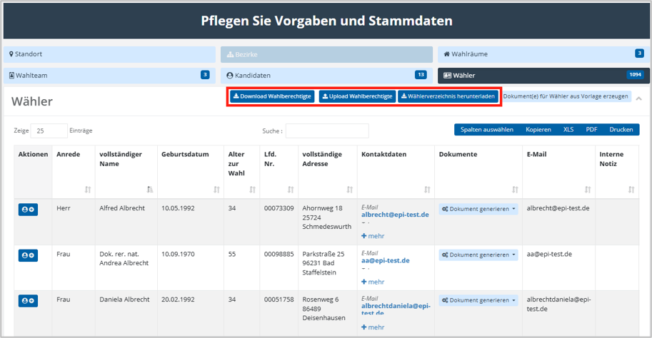
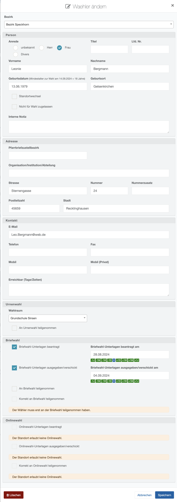

# Wahlberechtigte / Wähler

Aktiv Wahlberechtigte werden in das System in der Regel aus Quellsystemen (Meldewesen) importiert und zentral bereitgestellt. Lediglich weitere Merkmale, wie die Ausgabe von Briefwahlunterlagen oder die Durchführung von **Standortwechseln** (Wunschwähler) etc. werden während der Wahlvorbereitung in der Software ergänzt. Die Bearbeitung von Wählerstammdaten ist in der Regel nicht vorgesehen. Das Anlegen oder Löschen von Wählern ist meist über Privilegien von der Projektleitung deaktiviert und nur zentralseitig möglich.

Für die Interaktion steht wie für alle Entitäten eine Tabellenanzeige mit Suchmöglichkeit und eine Bearbeitungsmaske bereit.

*Wähler verwalten (Tabelle)*

Ober- und Unterhalb der Tabelle finden Sie ggf. mehrere Interaktionsmöglichkeiten:

- **Download Wahlberechtigte:** Ermöglicht den Download des Wählerverzeichnisses des ausgewählten Standorts. Die Exportdatei enthält neben den Wählerdaten auch die erforderlichen technischen Header. Sie dient dazu, Änderungen am Wählerverzeichnis vorzunehmen und dieses anschließend wieder hochzuladen. Ist für den Standort noch kein Wählerverzeichnis vorhanden, wird stattdessen eine Musterdatei erstellt. In diese können Sie Ihr Wählerverzeichnis einfügen und anschließend hochladen. Diese Funktion wird in der Regel nur bei MAV-Wahlen verwendet.
- **Upload Wahlberechtigte:** Sofern das Wählerverzeichnis nicht zentral bereitgestellt wird, kann es über diese Funktion hochgeladen werden. Die hochzuladende Datei muss dem Format der zuvor über **Download Wahlberechtigte** erzeugten Export- bzw. Musterdatei entsprechen. Diese Funktion wird ebenfalls in der Regel nur bei MAV-Wahlen verwendet.
- **Wählerverzeichnis herunterladen:** Sollte beispielsweise das Wählerverzeichnis am Wahltag in gedruckter Form vorliegen müssen, kann es über diese Funktion heruntergeladen werden. Der Export kann sowohl als CSV als auch als XLSX gespeichert werden. Aufgrund der sensiblen Daten, die in dieser Datei vorhanden sind, ist diese mit einem Passwort geschützt, welches Ihnen von der Projektleitung mitgeteilt wird.

Haben Sie das Privileg zur Bearbeitung von vorhandenen Wählern, können Sie die Bearbeitungsmaske eines Wählers über das **Stift-Symbol** aufrufen.

|  *Wähler bearbeiten (Detailmaske)* | Wähler können einem Wahlbezirk zugeordnet werden, wenn der Standort auf den **Wahlmodus Bezirkswahl** eingestellt ist. Die Angaben im Personenbereich umfassen Anrede, Titel, Vor- und Nachname, Geburtsdatum und Geburtsort. Für das Geburtsdatum findet eine Plausibilisierung der Daten durch die Vorgaben auf Projektebene statt. Flags, die mit weiteren Bedingungen oder Aktivitäten verbunden sind: **Standortwechsel****:** Dieses Flag kann genutzt werden, um Wahlberechtigte zu vermerken, die durch einen dokumentierten Standortwechsel im Wählerverzeichnis hinzugefügt oder gesperrt werden. Diese Einstellung wird automatisch gesetzt, sobald ein Standortwechsel über die **Wahlfunktion 2** durchgeführt wurde. **Nicht zur Wahl zugelassen:** Dieses Flag sieht vor, dass der Wähler am Standort nicht wählen darf. Die Gründe sind in der Internen Notiz zu hinterlegen. **Interne Notiz:** Feld für Bemerkungen zur Sachbearbeitung. Der Adressbereich umfasst die üblichen Felder. Der Kontaktbereich ebenfalls. **Informationen zur Wahlteilnahme** **(URNE,BRIEF,ONLINE)** **Urnenwahl** Wahlberechtigte können im Vorwege Wahlräumen zugeordnet werden. Andererseits: Wenn Sie an einer Urnenwahl teilnehmen und die Teilnahme über den Wählerservice gebucht wird, wird der entsprechende Wahlraum festgehalten. **Briefwahl** Für die Briefwahl gibt es 4 Stati, die alle mit einem Datum für die entsprechende Tätigkeit dokumentiert werden. Antragsstellung Unterlagen-Ausgabe Briefwahl-Rücklauf/Teilnahme Korrekte Teilnahme (Wahlbrief in Urne abgelegt). **Onlinewahl** Für die Onlinewahl gibt es 3 Stati, die vorgehalten werden. Auch sie werden mit Datum protokolliert. Antragstellung Unterlagen-Ausgab e Korrekte Teilnahme (Verbucht über das Online-Wahlsystem). Die Funktion zum Löschen von Kandidaten ist durch Privilegien geschützt und wird in der Regel nicht für Standorte freigegeben. |
| --- | --- |

| **Hinweis**  |
| --- |
| Sollten Sie keinen Zugriff auf die Bearbeitung von Wählern haben, können Sie trotzdem über die **Wahlfunktionen 2 Wahlanfragen bearbeiten** und **3 Wahlunterlagen generieren** mit diesen interagieren. Alle Aktivitäten in Wählerstammdaten werden vom System in einem Audit-Trail zu Nachweiszwecken vermerkt. |

<!-- doccards:auto -->
## In diesem Kapitel

<DocCardList />
