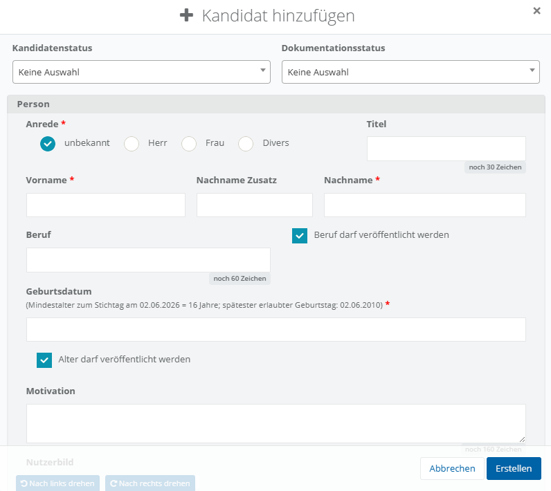
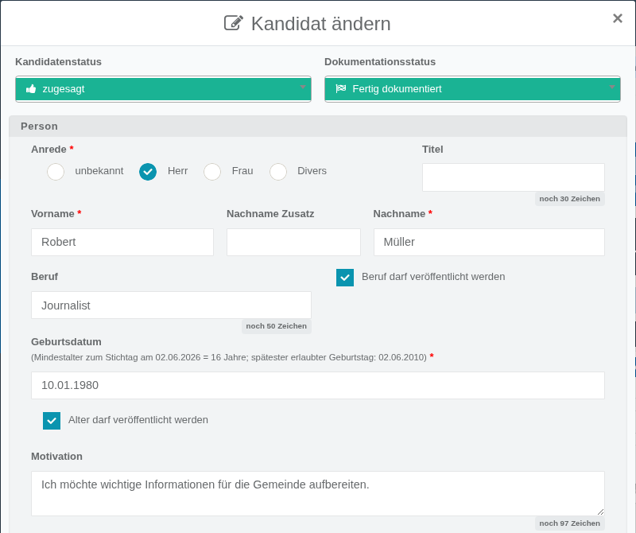
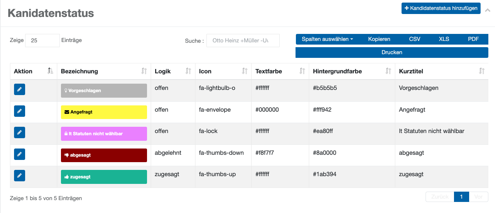
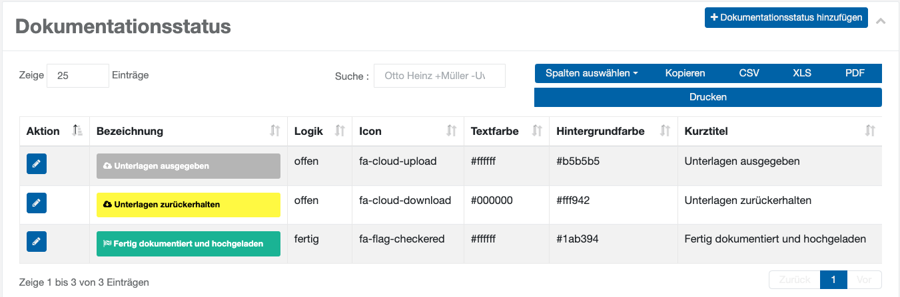
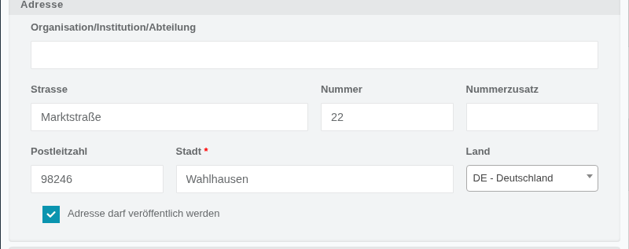
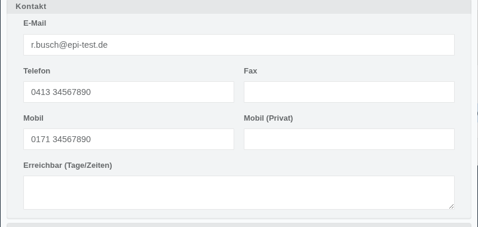
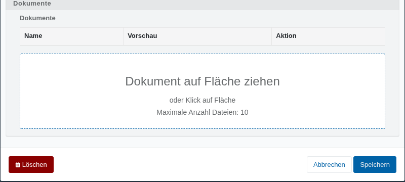

# Onboarding von Kandidaten

In **Elektra** stehen zwei Möglichkeiten zur Verfügung, um Kandidaten an einem Standort hinzuzufügen. Sie können entweder die Funktion **In Kandidatenliste aufnehmen** (zu finden in der Ansicht **Wähler**) verwenden, um auf Basis eines Wahlberechtigten einen Kandidaten zu erstellen, oder über **Kandidat** **zum Standort hinzufügen** (direkt in der **Kandidaten**ansicht) einen Kandidaten ohne Vorlage manuell anlegen.

In beiden Fällen öffnet sich der Dialog **Kandidat hinzufügen**, welcher im Folgenden beschrieben wird:

*Abb.  – Kandidat hinzufügen (Ansicht ohne Eingaben)*

*Abb.  – Kandidat ändern: Status, Person und Motivation*

**Kandidatenstatus**: Ein Dropdown-Menü zur Kennzeichnung des aktuellen Standes der Kandidatur. Zur Auswahl stehen: Vorgeschlagen, Angefragt, lt. Statuten nicht wählbar, abgesagt und zugesagt.

Der Status **zugesagt** ist mit einer Systemlogik hinterlegt, so dass nur Kandidaten, die diesen Status haben auf Stimmzetteln und Aushängen auftauchen. Jede Option wird zur besseren Übersicht farblich mit einem Symbol hinterlegt.

*Abb.  – Verwaltung der Kandidatenstatus-Werte*

Welche Status-Werte zur Auswahl stehen und wie sie farblich dargestellt werden, wird projektweit von der Projektleitung festgelegt und ist an dieser Stelle nicht durch Standortverantwortliche änderbar.

**Dokumentationsstatus**: Ein Dropdown-Menü, das den Bearbeitungsstand der Kandidatur-Unterlagen festhält: Unterlagen ausgegeben, Unterlagen zurückerhalten, Fertig dokumentiert sowie Fertig dokumentiert und hochgeladen.

*Abb.  – Verwaltung der Dokumentationsstatus-Werte*

| **Hinweis**  |
| --- |
| **So erzeugen Sie eine schlüssige Kandidaten-Dokumentation**: (Aktion aus der Liste aufrufen) Kandidaten mit seinen Stammdaten anlegen. Dokumentvorlage aufrufen, Dokument ausdrucken. Dokument unterschreiben lassen Dokument scannen, hochladen und Status setzen |

Auch die Werte für den Dokumentationsstatus werden ebenso projektweit vorgegeben.

**Anrede**: Auswahl über Radiobuttons zwischen unbekannt, Herr, Frau und Divers.

**Titel**: Ein Textfeld zur Eingabe eines akademischen oder sonstigen Titels (bis zu 30 Zeichen).

**Vorname**: Pflichtfeld zur Eingabe des Vornamens.

**Nachname Zusatz**: Textfeld für einen Namenszusatz (z. B. „von“ oder „van“).

**Nachname**: Pflichtfeld zur Eingabe des Nachnamens.

**Beruf**: Textfeld zur Eingabe der Berufsbezeichnung (bis zu 60 Zeichen).

**Beruf darf veröffentlicht werden**: Ein Kontrollkästchen, das festlegt, ob die Berufsangabe in Wahlunterlagen mit ausgegeben werden darf.

**Geburtsdatum**: Pflichtfeld zur Eingabe des Geburtsdatums. Das Feld prüft automatisch das für die Wahl erforderliche Mindestalter zum Wahlstichtag und zeigt den spätesten zulässigen Geburtstag als Hinweis an.

**Alter darf veröffentlicht werden**: Ein Kontrollkästchen, das festlegt, ob das (aus dem Geburtsdatum errechnete) Alter in Wahlunterlagen mit ausgegeben werden darf.

**Motivation**: Ein mehrzeiliges Freitextfeld zur Eingabe einer kurzen Motivation zur Kandidatur (bis zu 160 Zeichen).

*Abb.  – Kandidat ändern: Nutzerbild und interne Notiz*

**Nutzerbild**: Uploadmöglichkeit für ein Kandidatenbild inklusive Zuschneide- und Rotationsfunktion. Unterstützt werden Bilder im JPEG- oder PNG-Format (mit systemseitiger Dateigrößenbeschränkung; alle hochgeladenen Dateien durchlaufen einen Virenscanner). Ein bereits hochgeladenes Bild kann heruntergeladen oder gelöscht werden; wurde kein Bild hochgeladen, zeigt das System stattdessen eine geschlechtsspezifische Ersatzdarstellung (Mann/Frau/Divers/unbekannt) an – diese Bilder bzw. Ersatzbilder werden auch in nachgelagerten Prozessen wie der Erstellung von Stimmzetteln und Wahlvorschlägen verwendet.

**Interne Notiz**: Ein mehrzeiliges, rein internes Freitextfeld, das nicht in Dokumentvorlagen erscheint.

*Abb.  – Kandidat ändern: Adresse*

**Organisation/Institution/Abteilung**: Freitextfeld für eine zusätzliche Adresszeile, sofern der Kandidat einer Organisation, Institution oder Abteilung zugeordnet werden soll.

**Strasse**, **Nummer**, **Nummerzusatz**, **Postleitzahl**, **Stadt**: Felder zur Erfassung der postalischen Anschrift des Kandidaten. Stadt ist ein Pflichtfeld.

**Land**: Ein Dropdown-Menü zur Auswahl des Landes, vorbelegt mit Deutschland.

**Adresse darf veröffentlicht werden**: Ein Kontrollkästchen, das festlegt, ob die Anschrift in Wahlunterlagen mit ausgegeben werden darf.

*Abb.  – Kandidat ändern: Kontakt*

**E-Mail**, **Telefon**, **Fax**, **Mobil**, **Mobil (Privat)**: Felder zur Erfassung der Kontaktdaten des Kandidaten.

**Erreichbar (Tage/Zeiten)**: Ein Freitextfeld zur Angabe, an welchen Tagen und zu welchen Zeiten der Kandidat erreichbar ist.

*Abb.  – Kandidat ändern: Dokumente*

**Dokumente**: Ein Uploadbereich (per Drag-and-drop oder Dateiauswahl) für beliebige Dokumente zum Kandidaten, inklusive einer Übersichtstabelle (Name/Vorschau/Aktion) der bereits abgelegten Dokumente. Es können maximal 10 Dateien hinterlegt werden.

Danach wird der Kandidat in der Übersichtstabelle angezeigt.
