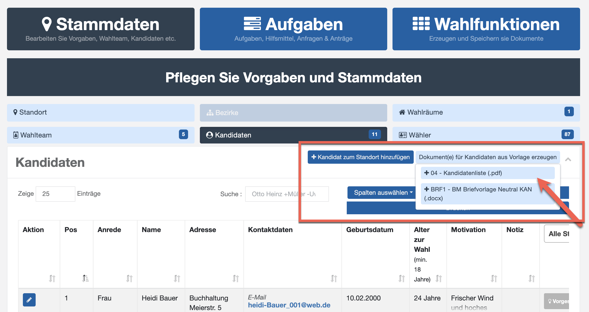
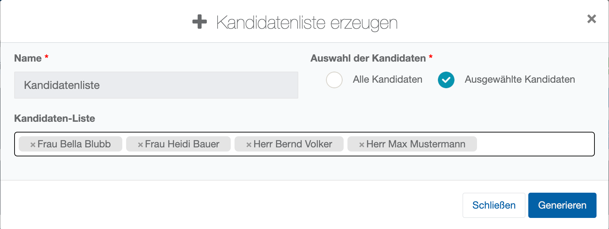
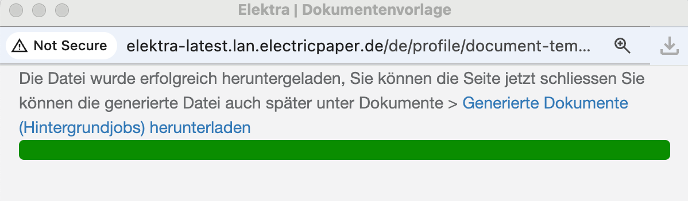
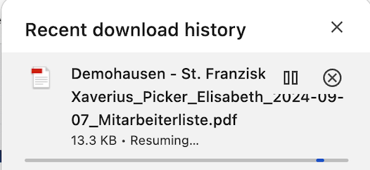
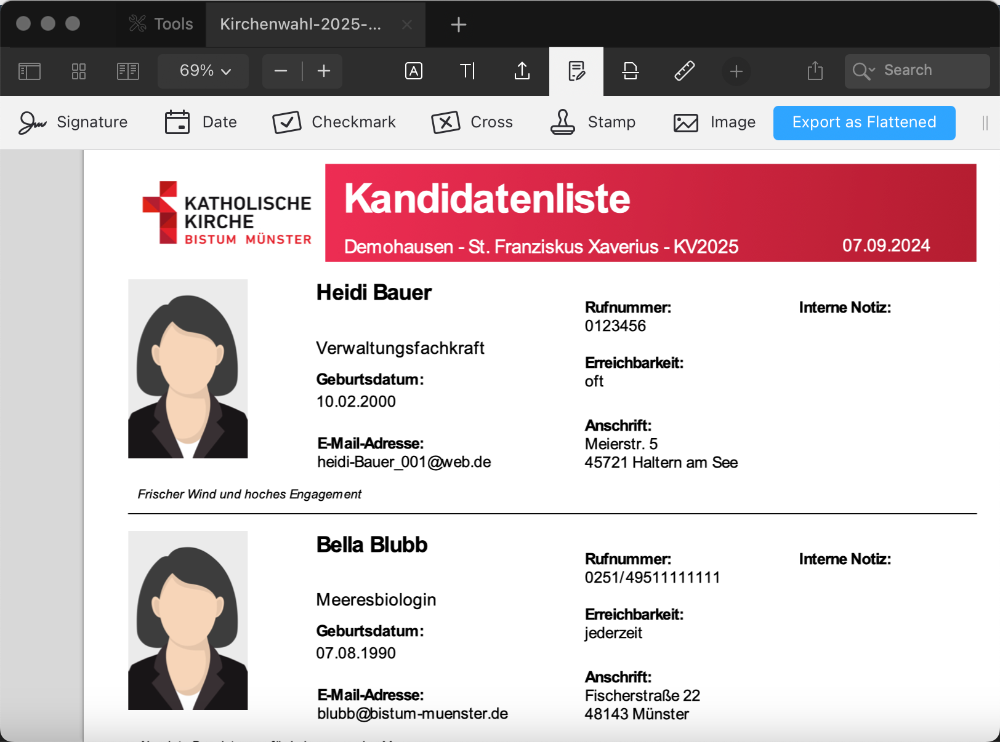
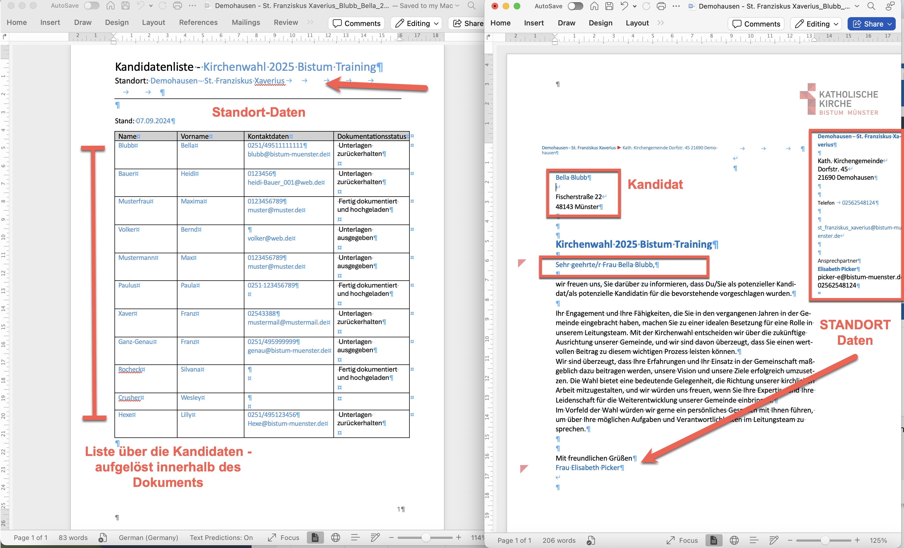
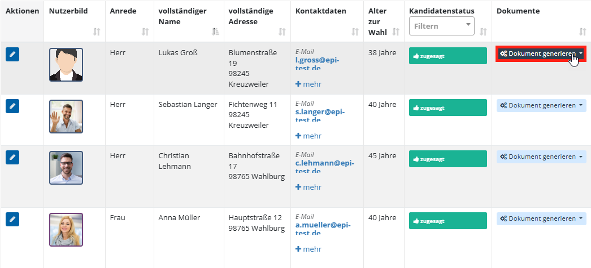

# Dokumente schreiben mit Hilfe von Stammdaten

Alle zentralen Stammdatentabellen sind mit einem Mechanismus ausgestattet, um Dokumentvorlagen in Word- oder PDF-Format abzurufen. Ansonsten finden Sie oben rechts neben dem Knopf zum Anlegen von Daten ein Dropdown-Menü mit der Auswahl der verfügbaren Vorlagen:

*Abb.  – Dokumentvorlage aus Stammdaten abrufen*

Wenn Sie die Vorlage auswählen, folgt ein Dialog, in dem Sie wählen können, ob Sie ein einzelnes Dokument erzeugen wollen oder ob mehrere Dokumente in einer Schleife erzeugt werden sollen. Dazu bietet der Dialog kombiniertes dropdown-Feld mit Einträgen. Es reagiert auf Tastatureingaben, so dass Sie nach bestimmten Datensätzen suchen können. Die ausgewählten Datensätze werden so aufgelistet.

*Abb.  – Dialog Dokumenterzeugung (Einzel/Serie)*

Mit **Generieren** startet der Vorlagenprozess im Hintergrund. Er baut nun entweder PDF-Dateien auf Basis des integrierten Report-Generators oder er erstellt DOCX/ZIP-Dateien mit Word-Dokumenten. Ist dieser asynchron ablaufende Generierprozess abgeschlossen, erscheint ein grüner Balken und Sie können die Datei aus dem Downloadbereich ihres Browsers herunterladen. Bei sehr lang laufenden Generierungen erhalten Sie eine Benachrichtigung.

*Abb.  – Ergebnis der Dokumentgenerierung*

Die erzeugten Dokumente können Sie anschließend wie folgt herunterladen:

*Abb.  – Erzeugte Dokumente herunterladen*

Häufig ist es gewünscht, dass Word-Dokumente erzeugt werden, die weiterbearbeitet werden können, bevor diese dann ausgedruckt und unterschrieben werden.

Der Mechanismus ist soweit identisch jedoch entstehen ggf. mehrere Ausgabedokumente. Diese bietet das System dann als ZIP-Datei an. Sie müssen die Zip-Datei dann öffnen und bekommen So Zugriff auf die einzelnen Dokumente.

Schleifen über die Einträge in der Tabelle können je nach Vorlage aufgelöst werden:

- Innerhalb des Dokuments (hier das Beispiel einer Kandidatenliste mit Kandidaten-Status)

- Außerhalb des Dokuments (hier Einzelne Briefe als Word-Dokument je Kandidat)

- So ist es möglich, beispielsweise Datenschutzdokumentationen oder weitere Dokumente zur Kandidatur automatisiert zu erzeugen.

*Abb.  – Serienbrief-Ergebnis (Word je Kandidat)*

Wollen Sie ein Dokument nur für eine Person generieren, finden Sie ebenfalls in der Spalte **Dokumente** die Schaltfläche **Dokument generieren**.

*Abb. 88 – Dokument für einen Datensatz generieren*
