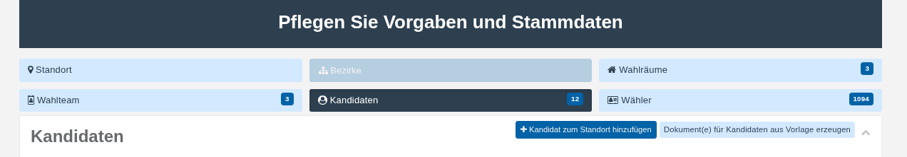
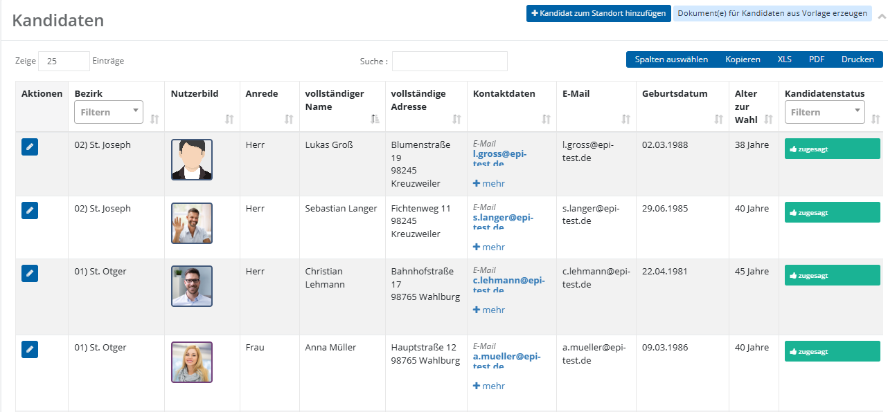

# Kandidaten

Kandidatinnen und Kandidaten sind die Personen, die sich für die Wahl in das jeweilige Gremium zur Wahl stellen. Ihre Stammdaten bilden die Grundlage für die Erstellung der Stimmzettel, Wahlvorschläge und weiterer Wahldokumente und sollten daher sorgfältig und vollständig gepflegt werden.

Je nach den auf Standort- bzw. Projektebene getroffenen Einstellungen können zusätzlich Angaben wie Kandidatenbild, Beruf oder eine Motivation zur Kandidatur erfasst und in den Wahlunterlagen ausgegeben werden. Im Falle einer Bezirkswahl, wird ebenfalls sichergestellt, dass jeder Kandidat einem Bezirk zugeordnet wurde.

Im folgenden Kapitel wird Ihnen Schritt für Schritt erläutert, wie Sie Kandidaten an Ihrem Standort korrekt anlegen und den Onboarding-Prozess sauber durchlaufen.

Die Kandidatenübersicht ist die zentrale Ansicht, über die Sie alle an Ihrem Standort erfassten Kandidatinnen und Kandidaten einsehen und verwalten. Sie erreichen sie über die Kachel **Kandidaten** im Bereich „Pflegen Sie Vorgaben und Stammdaten“.

*Abb.  – Kachel „Kandidaten“ im Überblick*

Die Liste ist als durchsuch- und sortierbare Tabelle aufgebaut. Über **Zeige ... Einträge** legen Sie fest, wie viele Kandidaten pro Seite angezeigt werden, über das Suchfeld können Sie die Liste nach einem beliebigen Begriff filtern. Die Schaltfläche **Spalten auswählen** blendet einzelne Spalten ein- oder aus, über **Kopieren**, **XLS**, **PDF** und **Drucken** lässt sich der aktuelle Tabelleninhalt exportieren. Da die Tabelle mehr Spalten enthält, als gleichzeitig auf den Bildschirm passen, scrollen Sie mit der horizontalen Scrollleiste am unteren Rand der Tabelle (oder per gedrückter mittlerer Maustaste) nach rechts, um weitere Spalten einzusehen.

*Abb.  – Kandidatenübersicht: Stamm- und Kontaktdaten*

**Aktionen**: Über das Stift-Symbol öffnen Sie den Dialog **Kandidat ändern**, der im folgenden Abschnitt beschrieben wird.

**Bezirk**: Zeigt, sofern für Ihren Standort Stimmbezirke eingerichtet sind, den Bezirk, dem der Kandidat zugeordnet ist, und bietet ein Filter-Dropdown zur Eingrenzung der Liste auf einen bestimmten Bezirk.

**Nutzerbild**, **Anrede**, **vollständiger Name**, **vollständige Adresse**, **Kontaktdaten**, **Geburtsdatum**, **Alter zur Wahl**, **Kandidatenstatus**, **Dokumentationsstatus**, **Motivation**, **Motivation (HTML)**, **Beruf** und **Interne Notiz** zeigen die im Abschnitt „Onboarding von Kandidaten“ im Detail beschriebenen Angaben aus dem Kandidaten-Datensatz. In der Kontaktdaten-Spalte wird dabei nur die E-Mailadresse als Link angezeigt; die weiteren Kontaktwege (Telefon, Fax, Mobil) lassen sich über **+ mehr** ausklappen. Motivation (HTML) zeigt denselben Text in einer formatierbaren Fassung. Bei Kandidatenstatus steht zusätzlich ein Filter-Dropdown zur Eingrenzung der Liste auf einen bestimmten Status zur Verfügung.

**Dokumente**: Bietet über die Schaltfläche **Dokument generieren** die Erstellung eines Dokuments aus einer projektbezogenen Vorlage (meist Datenschutzerklärungen o. Ä.) für den jeweiligen Kandidaten – zu unterscheiden vom Dokumente-Upload-Bereich im Dialog **Kandidat ändern**, der im folgenden Abschnitt beschrieben wird.

Darüber hinaus liefern folgende, nur in der Übersicht verfügbare Spalten weitere Auskünfte: Kandidaten-Titel Macro und Kandidateninfo Macro (Vorschau, wie Name bzw. ein Textblock mit Alter, Beruf und Wohnort später auf dem Stimmzettel erscheinen), UUID (technische Kennung des Datensatzes) sowie Erstellt am/Geändert am (Zeitpunkt und bearbeitende Person der letzten Änderung).

Über die Schaltfläche **Kandidat zum Standort** **hinzufügen** legen Sie einen neuen Kandidaten an. Über **Dokument(e) für Kandidaten aus Vorlage erzeugen** erstellen Sie Dokumente aus einer Vorlage gesammelt für mehrere bzw. alle Kandidaten auf einmal, anstatt dies einzeln je Zeile zu tun.

<!-- doccards:auto -->
## In diesem Kapitel

<DocCardList />
