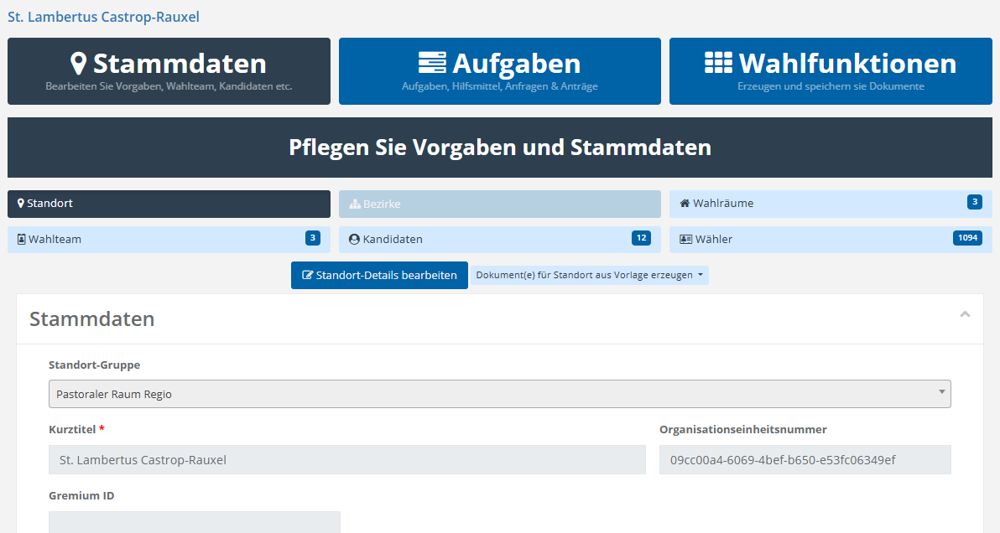

# Stammdaten pflegen

Als Wahlteam-Mitglied oder standortverantwortliche Person ist das Erfassen, prüfe und Pflegen von Stammdaten für ihre lokale Wahl am Standort von zentraler Bedeutung. . Diese stellen die Grundlage für die weitere Arbeit im System dar. Nur wenn diese Angaben korrekt und vollständig gepflegt sind, können nachgelagerte Funktionen – beispielsweise zur Wahldurchführung oder Dokumentenerstellung – zuverlässig genutzt werden.

Um die Stammdaten eines Standortes aufzurufen, wechseln Sie innerhalb des **Triptychons** in den Bereich **Stammdaten**.

Während einige Angaben von der Wahlprojektleitung nach Datenlage vorab im System eingestellt sind, gibt es andere Angaben, wo Ihre Expertise am Standort benötigt wird.

*Abb.  – Stammdatenpflege am Standort*

Wenn Sie im Hauptmenü (**Triptychon**) den Bereich Stammdaten anklicken, zeigt das System eine Übersicht über die hier zu bearbeiteten Entitäten, jeweils mit der Zahl der existierenden Einträge dahinter. Ist ein Bereich ausgegraut, wurde er aus den Standortvorgaben oder den Projektvorgaben abgeschaltet. Hier z.B. der Bereich **Bezirke.**

Die folgenden Abschnitte beschreiben diese Bereiche der Reihe nach – beginnend mit den Standort-Einstellungen als zentraler Grundlage, auf der alle weiteren Angaben aufbauen.

<!-- videos:auto -->
## Videos zu diesem Kapitel

- [Standort, Wahlräume, Bezirke](https://vimeo.com/1080076879) – Anlegen und Verwalten dieser organisatorischen Einheiten und ihrer Verknüpfungen.
- [Wahlteam](https://vimeo.com/1080076986) – Wahlteammitglieder hinzufügen und verwalten.
- [Kandidaten](https://vimeo.com/1080077075) – Kandidaten-Onboarding, Verwaltung und automatische Dokumentenerstellung.
- [Wähler](https://vimeo.com/1080079239) – Wählerverzeichnis verwalten, filtern, bearbeiten und Wähler zu Kandidaten machen.
- [Tutorial: Registrierungsantrag](https://vimeo.com/1099893188) – Registrierungsantrag für Wahlteam-Mitglieder erstellen.
