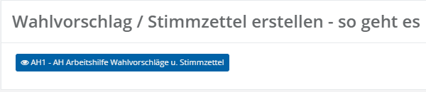
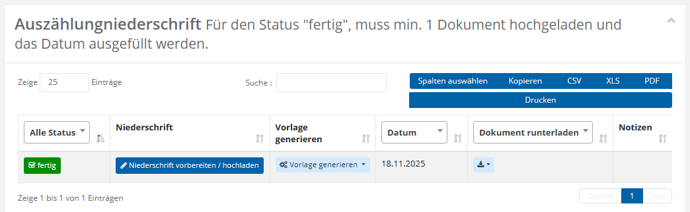
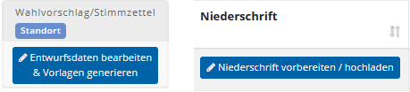
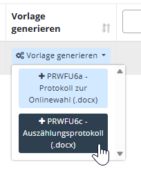
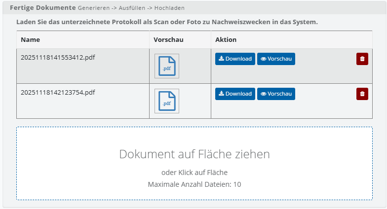
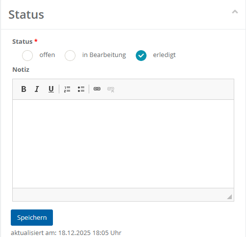
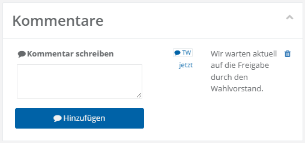

# Grundkonzept für dokumentarische Wahlfunktionen

Die meisten Wahlfunktionen (1, 4, 6, 7, 8, 9) arbeiten nach einem allgemeinen Grundprinzip, das Sie bereits von der Bearbeitung von Aufgaben im Aufgabenheft kennen. Eine dokumentarische Wahlfunktion ist stets gleich aufgebaut; die folgenden Bausteine begegnen Ihnen in dieser Reihenfolge:

1. Arbeitshilfen
2. Plausibilitätsmodul (Fehler & Warnungen)
3. Liste der Protokolle und Dokumente
4. Dialogbox zur Datenerfassung
5. PDF- und Word-Vorlagen
6. Upload gescannter Dokumente
7. Status & Notiz
8. Kommentare

## Arbeitshilfen

Für die Wahlfunktion gibt es eine Erläuterung zum Ausdrucken sowie ggf. Checklisten, damit beim Durchführen der entsprechenden Wahlfunktion keine Fehler entstehen.

*Grundkonzept: Kopfbereich einer Wahlfunktion*

## Plausibilitätsmodul: Fehler & Warnungen

In dieser Sektion listet das Plausibilitätsmodul alle Fehler und Warnungen auf, die es beim Durchlaufen der Prüfroutinen entdeckt:

| Meldung | Farbe | Bedeutung |
| --- | --- | --- |
| Fehler | rot | Verhindert die Nutzung der Wahlfunktion und muss zwingend vorher behoben werden. |
| Warnung | gelb | Blockiert die Nutzung nicht, sollte aber eingehend geprüft werden. Wer trotz Warnungen fortfährt, übernimmt die Verantwortung für mögliche Folgeprobleme; nutzen Sie im Zweifel die Hilfestellungen Ihrer Wahlprojektleitung (Helpdesk, Fragestunde etc.). |

*Grundkonzept: Plausibilitätsmeldungen*

*Grundkonzept: Warnungsliste*

## Liste der Protokolle und Dokumente

In den meisten Wahlfunktionen entstehen Protokolle der durchgeführten Tätigkeit. Die Liste enthält Aktionen zum Aufruf des Dialogs zur Datenerfassung sowie zum Generieren von Dokumentvorlagen (unter Verwendung der Werte, die in der Dialogbox eingetragen werden).

*Grundkonzept: Dokumententabelle der Wahlfunktion*

## Dialogbox zur Datenerfassung

Die Wahlfunktionen **1, 4 sowie 6 bis 9** basieren auf der Erfassung von Daten in einer Dialogbox. Diese Dialogbox wird über die blaue Schaltfläche mit dem Stift-Symbol geöffnet. Die erfassten Daten bilden die Grundlage für die spätere Generierung von Protokollen und Dokumenten. Die konkrete Ausgestaltung und Nutzung der Dialogbox wird in den jeweiligen Abschnitten zu den einzelnen Wahlfunktionen beschrieben.

*Grundkonzept: Aktionsschaltflächen*

## PDF- und Word-Vorlagen

Nach der Eingabe der Daten in der Dialogbox werden die Daten in einer Dokumentvorlage ausgegeben, ggf. in Word bearbeitet, ausgedruckt und unterzeichnet.

*Grundkonzept: Vorlagen innerhalb der Wahlfunktionen*

## Upload gescannter Dokumente

Die unterzeichneten Protokolle sollen für die elektronische Wahlakte gescannt oder fotografiert und hochgeladen werden. Eine Dropzone nimmt die Dateien auf; ein Klick auf die Dropzone öffnet die Dateiauswahl.

*Grundkonzept: Fertige Dokumente hochladen*

## Status & Notiz

Ein Statusnetz bietet folgende Auswahlmöglichkeiten:

- Offen
- In Bearbeitung
- Erledigt

Der Status **Erledigt** sollte nur gesetzt werden, wenn mindestens eine Datei hochgeladen wurde – dies wird systemseitig allerdings nicht erzwungen. Unterhalb der Status-Auswahl befindet sich der Notizbereich, in dem Anmerkungen zum aktuellen Bearbeitungsstatus der Wahlfunktion festgehalten werden können.

*Grundkonzept: Status und Notiz*

## Kommentare

Die Kommentarfunktion hält **Benutzer** und **Datum** eines Kommentars fest.

*Grundkonzept: Kommentare*
