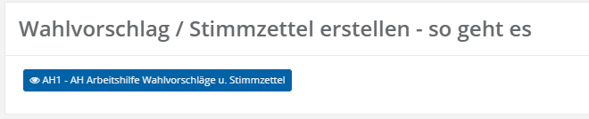
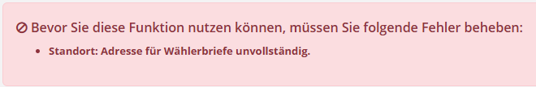
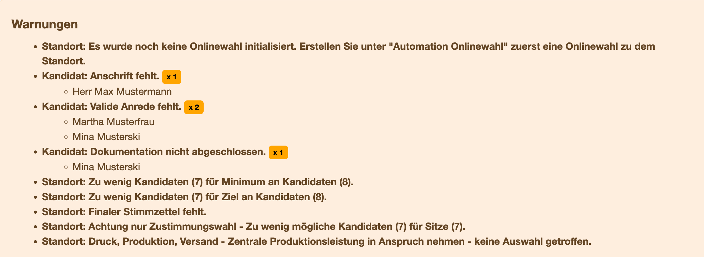
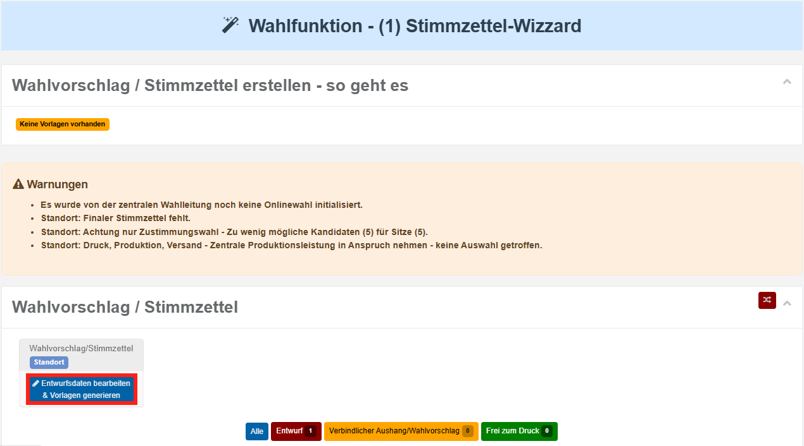
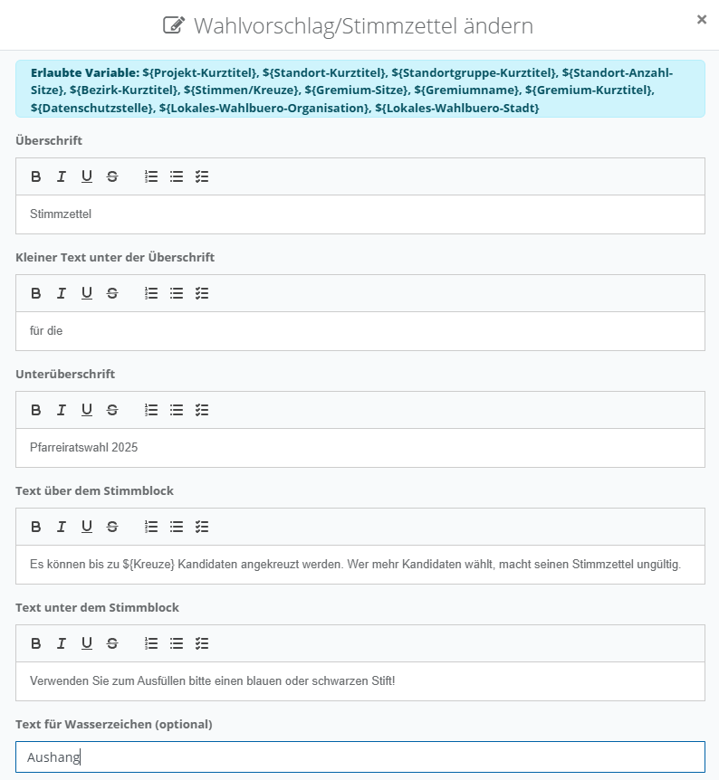
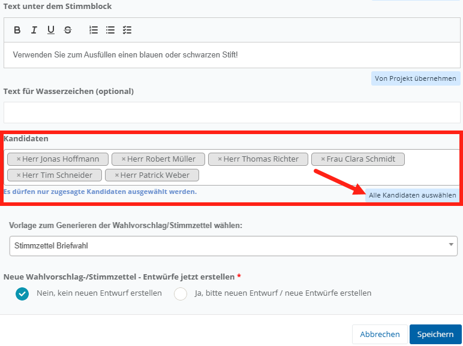
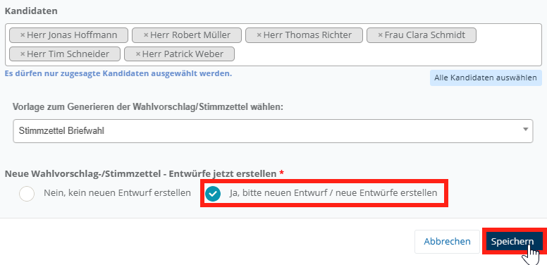
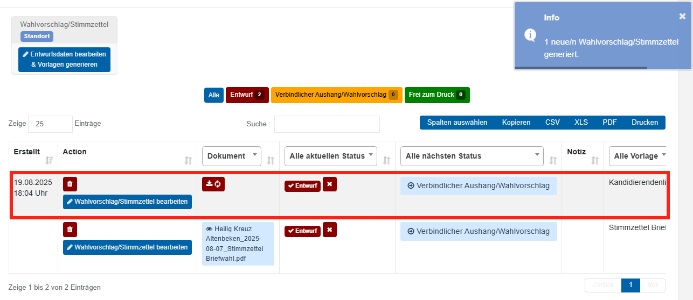
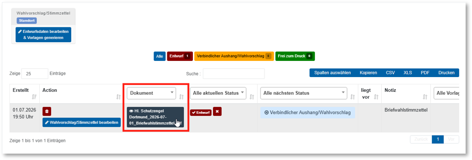
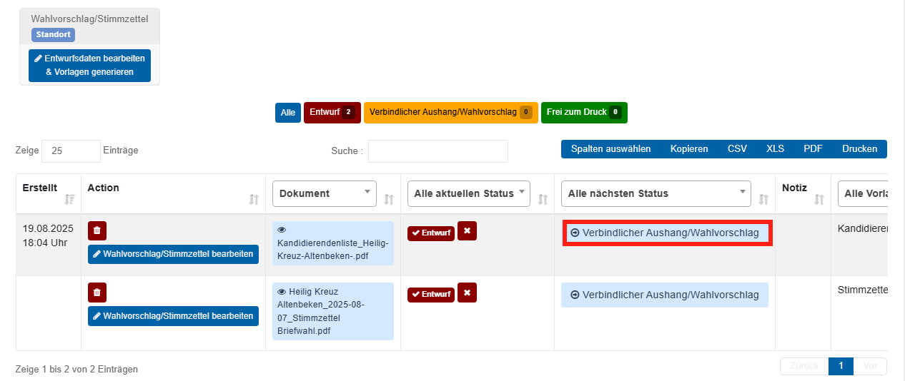

# WFU1 Wahlvorschläge u Stimmzettel erstellen

Mit dieser Wahlfunktion erzeugen Sie unter Verwendung des eingebauten Reportgenerators Aushänge für Wahlvorschläge und Stimmzettel. Die Vorgehensweise umfasst die folgenden Schritte:

Sichten Sie die angebotenen Arbeitshilfen.  *Abb.* *99* *– WFU1: Wahlvorschläge und Stimmzettel erstellen*

Prüfen Sie, ob die gemeldeten Fehler oder Warnungen des Plausibilitätsmoduls beheben können. Fehler werden in roter Farbe dargestellt und verhindern die Nutzung der Wahlfunktion und müssen daher zwingend vorher behoben werden.

*Abb. 100 – Fehler in Wahlfunktion 1*

Warnungen werden in gelber Farbe dargestellt. Diese blockieren zwar nicht die Verwendung der Wahlfunktion, sollten jedoch trotzdem eingehend geprüft werden    *Abb.* *101* *– WFU1: Plausibilitätsprüfung (Fehler und Warnungen)*

Wählen Sie den Bezirk (bei Einheitswahl ist nur ein Eintrag vorhanden), für den Sie einen Aushang erzeugen wollen.

*Abb. 102 – Dialog Stimmzettel erstellen öffnen*

Und befüllen Sie die Dialogbox:

**Überschrift**: Meist steht hier „Stimmzettel“ oder „Wahlvorschlag“. Der Textvorschlag kann aus dem Projekt übernommen werden, darf aber hier konkret für den Zweck auch verändert werden.

**Optionale Unterüberschrift**: Dieser Text wird unterhalb der Hauptüberschrift in fetter Schrift dargestellt.

**Text über dem Stimmblock**: Dieser Text erscheint über dem Stimmblock des Papierstimmzettels. (Dieser Textblock wird bei Online-Wahlen nicht berücksichtigt, sondern stattdessen automatisch aus den Vorgaben hergeleitet.)

**Text unter dem Stimmblock:** Dieser Text wird bei papierenen Stimmzetteln unter dem Stimmblock wiedergegeben. (Dieser Textblock wird nicht in das Onlinewahlsystem übertragen).

**Wasserzeichen**: Ein Wasserzeichen kann in grauer Farbe in großen Lettern hinter den Stimmblock erscheinen. Hier geben Sie den Text ein. **WICHTIG:** Lassen Sie das Feld leer, wenn Sie den endgültigen Stimmzettel für den Massendruck erzeugen!

*Abb. 103 – Textblöcke im Dialog Stimmzettelentwurf*

Im Feld **Kandidaten** wählen Sie nun die zugesagten Kandidaten Ihres Standortes aus, die auf Briefwahlstimmzettel erscheinen sollen.

*Abb. 104 - Kandidatenauswahl*

| **Hinweis**  |
| --- |
| Klicken Sie auf den Knopf **Alle Kandidaten auswählen,** um automatisch sämtliche Kandidaten Ihres Standortes zu übernehmen, die den Status **zugesagt** haben. Um einen Kandidaten zu entfernen, klicken Sie auf das Kreuz neben dessen Namen. |

**Vorlage zum Generieren des Wahlvorschlags/Stimmzettel wählen:** Das Dropdown gibt verschiedene vorbereitete Layouts zur Auswahl. Neben dem Stimmzettel sind hier ebenfalls Vorlagen für Kandidatenvorstellungen oder Aushänge wählbar.

**Neue Wahlvorschlag/Stimmzettel- Entwürfe jetzt erstellen**: Hier entscheiden Sie, ob Sie die Daten nur in der Dialogbox eintragen wollten, oder ob mit Speichern der Daten auch ein neuer Entwurf erzeugt und der Liste hinzugefügt werden soll.

*Abb. 105 – Neuen Entwurf erstellen*

Sie finden den nun frisch erzeugten Entwurf in der Liste wieder. Es kann einen Moment dauern, bis dieser Hintergrundprozess abgeschlossen wurde. Das System zeigt ein Reload-Symbol. Ggf. klicken Sie den Reload-Button.

*Abb.  – WFU1: Liste der Wahlvorschlags- und Stimmzettelentwürfe*

- Sichten Sie den Inhalt, indem Sie die Vorschau aufrufen oder einen Download anfertigen und die Datei mit Ihren Wahlteam-Mitgliedern sorgfältig prüfen.

*Abb. 107 – Vorschau aufrufen*

*Abb.  – WFU1: Stimmzettel-Vorschau*

- Wenn Sie Fehler feststellen, korrigieren Sie die entsprechenden Angaben. Kandidatenangaben korrigieren Sie in den Stammdaten für Kandidaten. Überschriften und Texte korrigieren Sie in der Dialogbox (Schritt 3).

- Einige Dinge, die Sie unbedingt prüfen sollten:

- Sind alle Kandidaten vorhanden? Sind alle Kandidaten wählbar – also sind Sie aktiv wahlberechtigt? Sind sie alt genug?

- Stimmen Geschlecht, Bilder, Motivationszitat, Alter?

- Haben Kandidaten eventuell Einwände bezüglich des Datenschutzes formuliert? Nutzen Kandidaten die Funktion „Anschrift unterdrücken“ und spiegelt der Stimmzettel bzw. Aushang das wider?

- Stellen Sie sicher, dass der Stimmzettel nur exakt **1 Seite** umfasst! Prüfen Sie, dass die Stimmzettel-Datei wegen eines Seitenumbruchs nicht etwa eine leere Seite angehängt hat.

- Wenn Sie Fehler festgestellt haben, können Sie den als „Entwurf“ stehen lassen. Alternativ kann der Entwurf über das **Mülleimer-Symbol** gelöscht werden.

Die Listeneinträge sind in einem Status-Netz den folgenden Stati zugeordnet:

*Abb.  – WFU1: Statusleiste der Entwürfe*

  - Nach der Erzeugung haben die PDF-Dateien den Status ‚Entwurf‘.

  - In der Spalte „**Alle Nächster Status**“ gibt es die Schaltfläche zum Aktivieren des nächsten Status.

  - Wählen Sie ‚Frei zum Druck‘ erst dann, wenn sämtliche Aushänge und Rückmeldemöglichkeiten erschöpft sind. Dann erzeugen Sie den endgültigen Stimmzettel und setzen diesen Status!

- Sind Sie mit ihrem Dokument zufrieden, so dass es als Aushang verwendet werden kann, setzen Sie den Status von Entwurf auf „**Verbindlicher Aushang/Wahlvorschlag**“. Dazu klicken Sie in die Spalte ‚Alle nächsten Status‘ auf die Schaltfläche.

*Abb. 110 – Status setzen*

- Wiederholen Sie diesen Schritte 3-7 nach Ende der Rückmeldefristen. **Erst dann** gilt es den endgültigen Stimmzettel zu erzeugen und im Statusnetz auf „**Frei zum Druck**“ zu stellen!

- Nun erst können Sie den Status für die Wahlfunktion WFU1 auf FERTIG stellen.
