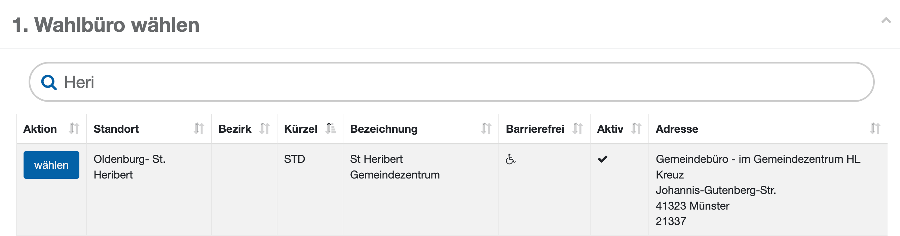
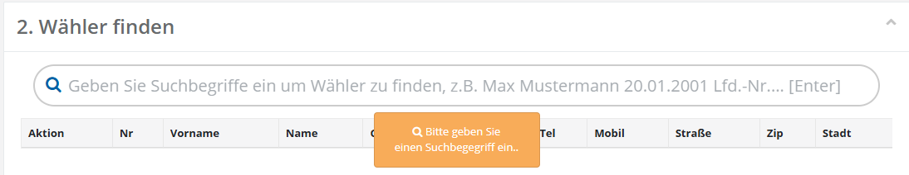
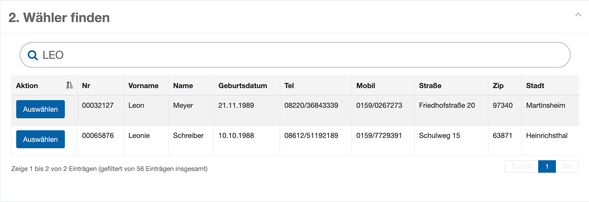
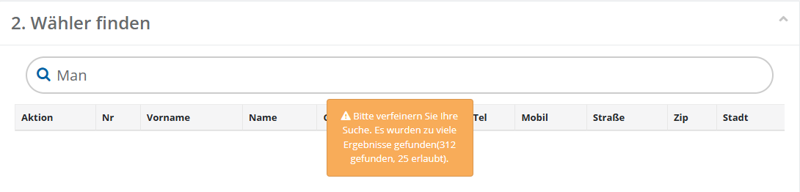

# Verwendung der Wählersuche

- Die Bedienung der Wahlfunktion „**2) Wähleranfragen bearbeiten**“  folgt hierbei immer demselben Muster:

*WFU2: Bedienschema Wähleranfragen*

Zu Beginn wählen Sie das **Wahlbüro**, für das die Wähleranfrage bearbeitet werden soll. Sie dient dazu,

- die Suche einzuschränken,
- die Zugriffsberechtigungen des Benutzers zu prüfen,

| **Hinweis**  |
| --- |
| Ist keiner der Wähler des Standortes einem Wahlbüro zugeordnet, entfällt diese Auswahl. |

*WFU2: Wählersuche starten*

Geben Sie eine Suchbegrifflichkeit ein und suchen Sie den Wähler.

- Um die Suche zu starten, geben Sie **mindestens drei Zeichen** in das Suchfeld ein und bestätigen Sie die Eingabe mit der **Enter-Taste**. Zur Identifikation der gesuchten Person zeigt die Tabelle weitere Merkmale an: die **laufende Nummer (Nr.)**, den **vollständigen Namen**, das **Geburtsdatum** und die **Adresse**.

*WFU2: Wählersuche*

- Aus **Datenschutzgründen** ist die Trefferliste auf eine begrenzte Anzahl von Einträgen reduziert. Führen die eingegebenen Suchkriterien zu zu vielen Treffern, wird eine entsprechende **Hinweismeldung** angezeigt.

*WFU2: Begrenzte Trefferliste*

- In diesem Fall verfeinern Sie die Suche durch zusätzliche Merkmale.

| **Hinweis**  |
| --- |
| Da Namen häufig mehrfach vorkommen und vergleichsweise fehleranfällig bei der Eingabe sind, empfiehlt es sich, alternativ nach dem Geburtsdatum zu suchen, um die Ergebnisliste gezielt einzugrenzen. |
