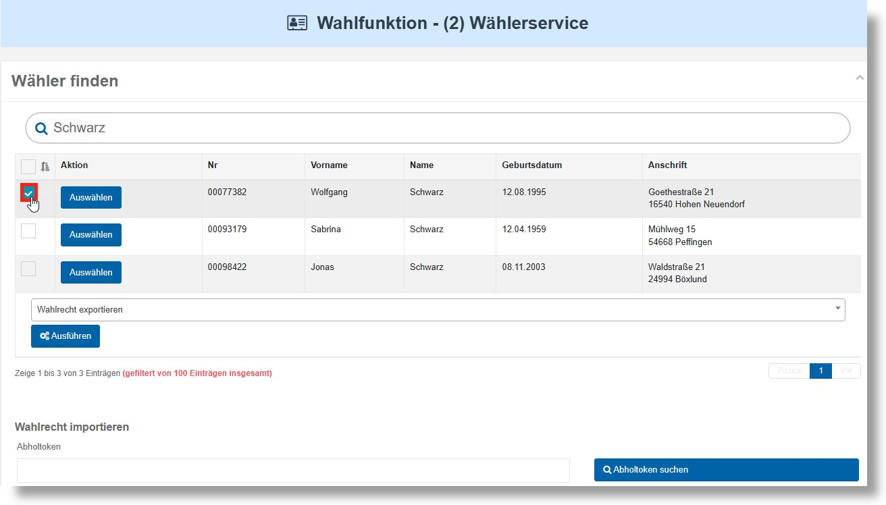
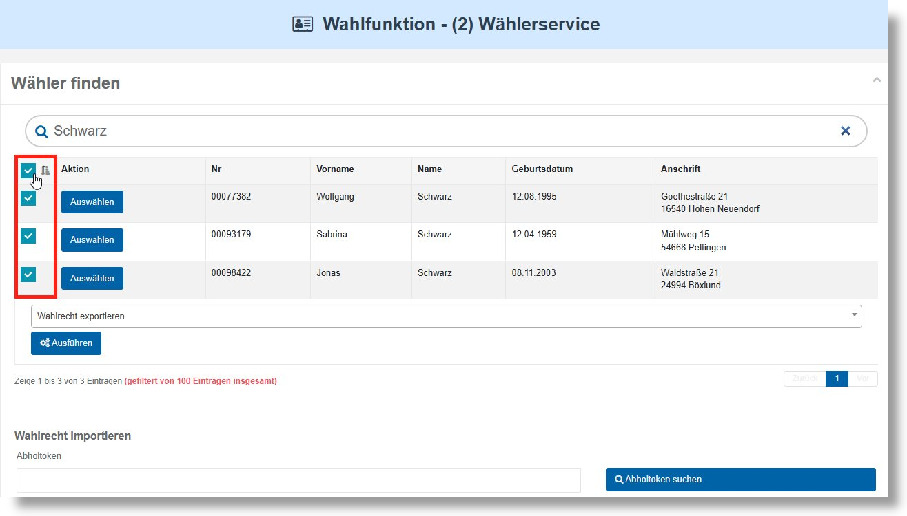
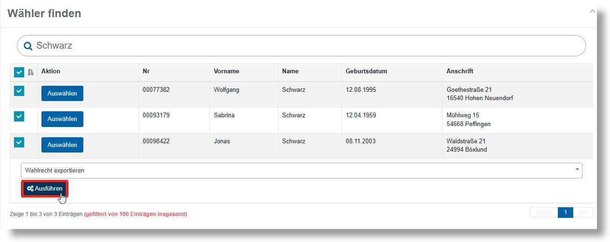
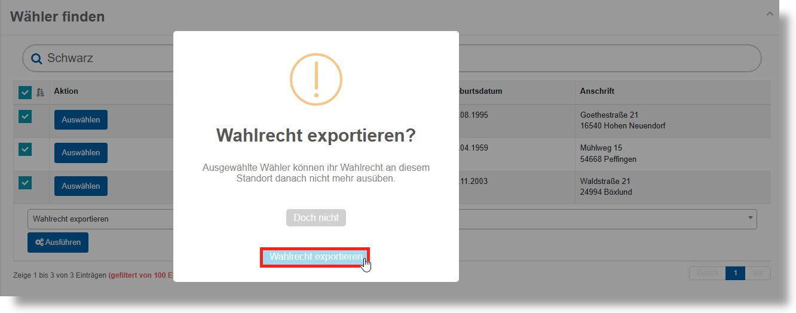
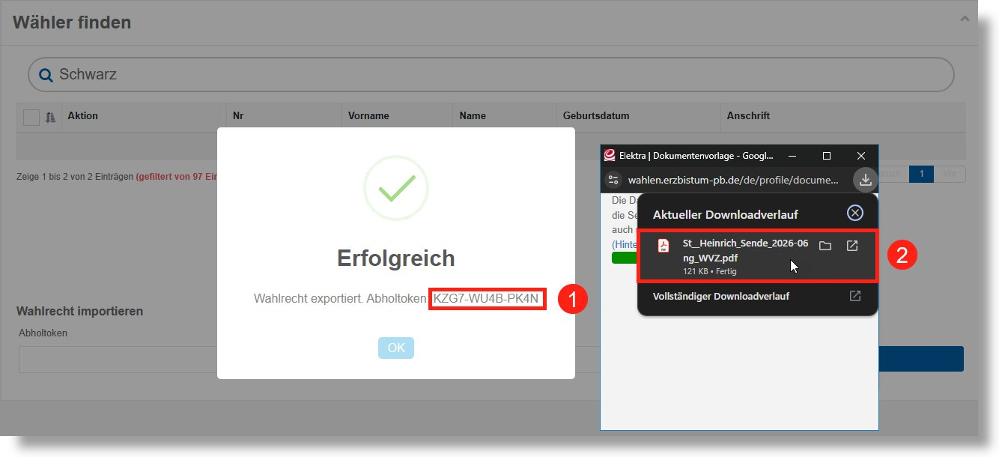

# Durchführung von Standortwechseln – Streichung

Wurde Ihnen der Antrag einer Person zugeleitet, dass diese ihr Wahlrecht nicht mehr an ihrem Ursprungsstandort wahrnehmen möchte, müssen Sie die Streichung innerhalb von **Elektra** vornehmen. Hierfür ist ein standardisierter Prozess vorgesehen, der im Folgenden erläutert wird.
Nachdem Sie die betroffene Person über die **Wählersuche** gefunden haben, wählen Sie diese über die Checkbox im linken Bereich der Tabelle aus.

*WFU2: Wahlrecht exportieren*

| **Hinweis**  |
| --- |
| Möchten mehrere Personen gleichzeitig gestrichen werden – beispielsweise mehrere Familienmitglieder – können Sie entweder mehrere Checkboxen einzeln setzen oder über die **Checkbox im Tabellenkopf** alle angezeigten Einträge auf einmal auswählen. |

*Wahlrecht exportieren Mehrfachauswahl*

Unterhalb der Tabelle ist die Aktion **„Wahlrecht exportieren“** vorausgewählt. Klicken Sie auf die Schaltfläche **Ausführen**.

*Ausführung des Wahlrechtsexports*

Es öffnet sich ein Bestätigungsdialog. Prüfen Sie, ob die richtigen Personen ausgewählt sind, und klicken Sie anschließend auf **„Wahlrecht exportieren“**.

*Übereilungsschutz Wahlrechtexport*

Nach der Bestätigung erscheinen zwei Fenster:

1. **Erfolgsmeldung:** Der Export wurde abgeschlossen. Notieren Sie das angezeigte **Abholtoken** – dieser wird benötigt, um die exportierten Wählenden an einem anderen Standort ins Wählendenverzeichnis aufzunehmen. Der Abholtoken ist ebenfalls in dem generierten Dokument vorhanden.
2. **Dokument-Download:** Automatisch wird ein Dokument generiert, das die Streichung aus dem Wählendenverzeichnis belegt. Speichern Sie dieses Dokument lokal und händigen Sie den betreffenden Personen die für sie vorgesehenen Seiten aus.

*Abholtoken*

Das erzeugte Dokument umfasst pro gestrichener Person im Regelfall **zwei Seiten**:

- Die **Dokumentation der Streichung** inklusive der persönlichen Daten der betreffenden Person.
- Den **Antrag zur Ausübung des Wahlrechts** an einer anderen Kirchengemeinde.

Händigen Sie die Unterlagen an die antragstellende Person aus.
