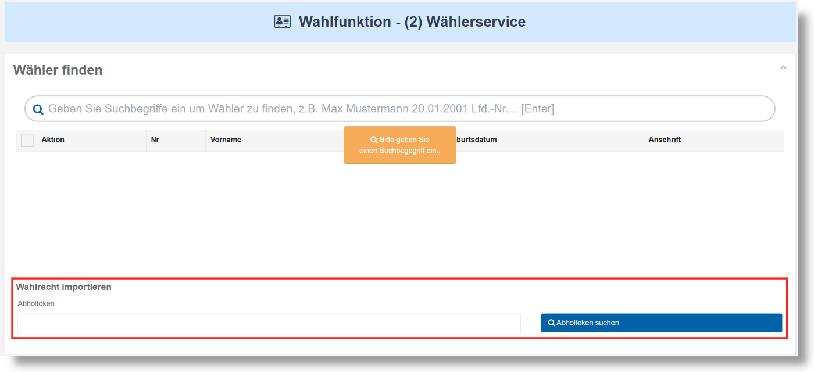
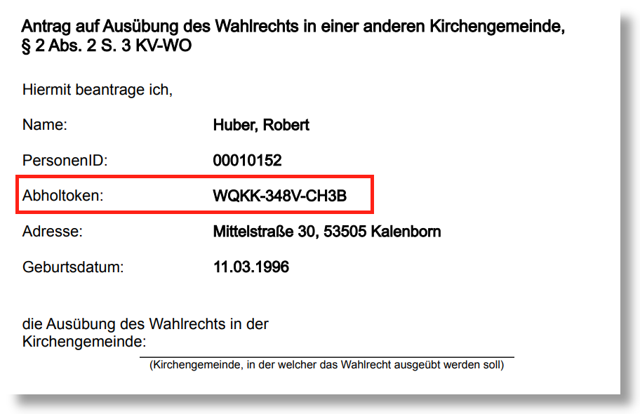
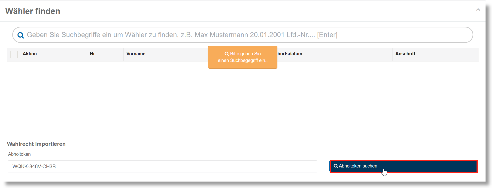
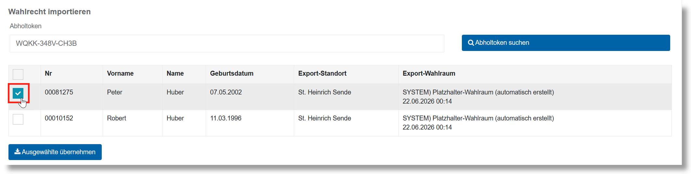
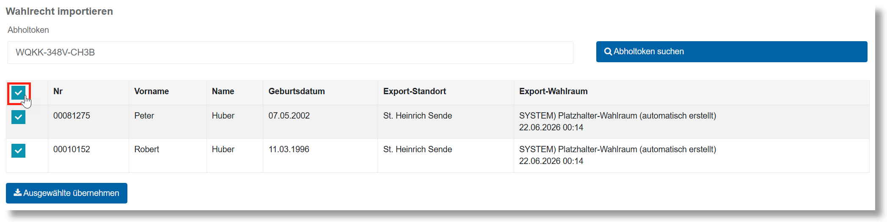
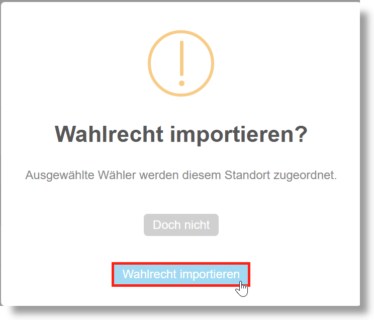

# Durchführung von Standortwechseln – Aufnahme

- Wurde dem Antrag eines Wählenden, das Wahlrecht an Ihrem Standort auszuüben, stattgegeben, muss die Person in das **Wählerverzeichnis** Ihres Standortes aufgenommen werden.
- Scrollen Sie innerhalb des **Wählerservices** nach unten, bis Sie den Abschnitt **Wahlrecht exportieren** sehen.

*Wahlrecht importieren*

Geben Sie in das darunterliegende Eingabefeld den **Abholtoken** der betreffenden Person ein, welcher beim vorherigen Export generiert wurde. Diesen finden Sie unter anderem auf dem Antrag auf Ausübung des Wahlrechts in einer anderen Kirchengemeinde.

*Nachweis der Streichung inklusive des Abholtokens*

Klicken Sie anschließend auf die Schaltfläche „**Abholtoken suchen**“.

*Abholtoken suchen*

Danach öffnet sich die Tabelle mit den Wahlberechtigten, die diesen Abholtoken haben. Bitte beachten Sie, dass sich mehrere Wahlberechtigte einen Abholtoken teilen können, falls sie gemeinsam aus dem vorherigen Wählerverzeichnis entfernt wurden.

In der Tabelle können Sie nun die Wählenden auswählen, die ihr Wahlrecht an Ihrem Standort ausüben möchten. Wählen Sie hierfür die Person(en) über die **Checkbox** im linken Bereich der Tabelle aus.

*Wahlrechtimport: Auswahl eines Wählers*

| **Hinweis**  |
| --- |
| Wenn Sie alle angezeigten Personen auf einmal auswählen möchten, klicken Sie auf die **Checkbox** im Kopfbereich der Tabelle. |

*Wahlrechtimport: Merhfachauswahl*

Daraufhin öffnet sich der Übereilungsschutz, welchen Sie mit der Schaltfläche „**Wahlrecht importieren**“ bestätigen können.

*Wahlrechtimport: Übereilungsschutz*
