# Statusänderungen von Wählern

- Wählen Sie die Person aus der Liste aus, indem Sie auf die Schaltfläche **Auswählen** klicken.

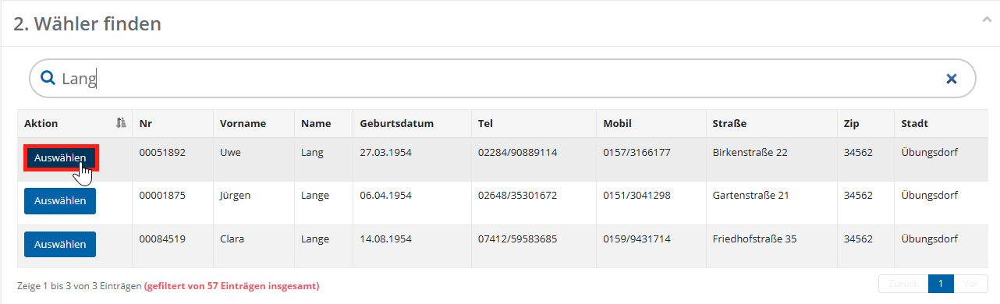
*WFU2: Person aus Trefferliste auswählen*

- Daraufhin öffnet sich die **Detailansicht** der ausgewählten Person. Bei Bedarf können Sie die Angaben erneut überprüfen. Links finden Sie die Adressdaten, rechts Informationen zu Standortwechsel oder Notizen.

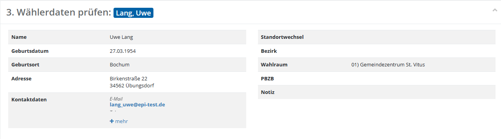
*WFU2: Detailansicht der Person*

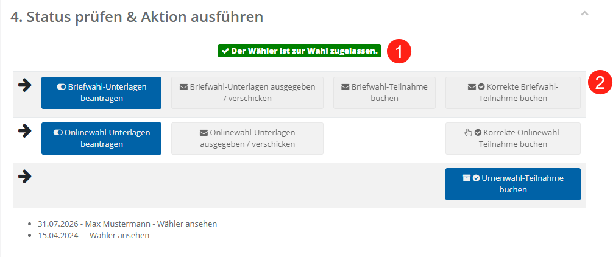

Unterhalb der Wählerdaten befindet sich der Abschnitt **Status prüfen & Aktion ausführen.**

*Übersicht Tabelle Status prüfen & Aktion ausführen*

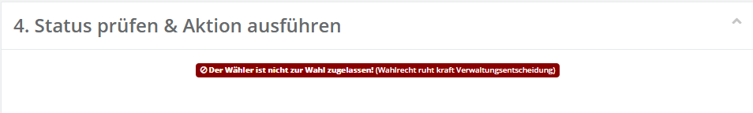

Im oberen Abschnitt (1) finden Sie eine Übersicht, ob der Wähler zur Wahl zugelassen ist und welche Wahlkanäle an dem aktuellen Standort erlaubt sind. Sollte ein Wähler nicht zur Wahl zugelassen sein, wird dies zusammen mit der entsprechenden Begründung aus dem Wählerverzeichnis angezeigt.

*Meldung nicht zur Wahl zugelassen*

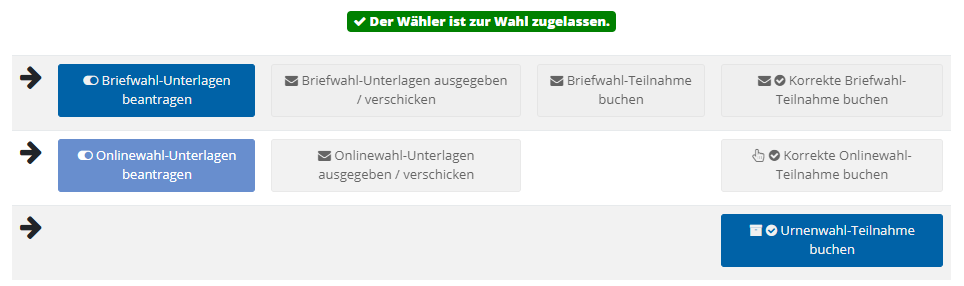

Darunter befinden sich die verfügbaren **Aktionen**, gegliedert nach Wahlkanälen (2). Die drei wesentlichen Kanäle werden in drei Zeilen hinter den Pfeilen angezeigt:  1. Zeile: Briefwahl  2. Zeile: Onlinewahl  3. Zeile: Urnenwahl / Wahl an Ort und Stelle  Die Schaltflächen werden **farblich unterschiedlich dargestellt** und visualisieren jeweils den **Status der zugehörigen Aktion**. Abhängig vom aktuellen Bearbeitungsstand erscheinen die Schaltflächen in **dunkelblau**, **hellblau**, **grau** oder **grün**.

*Aktionsschaltflächen*

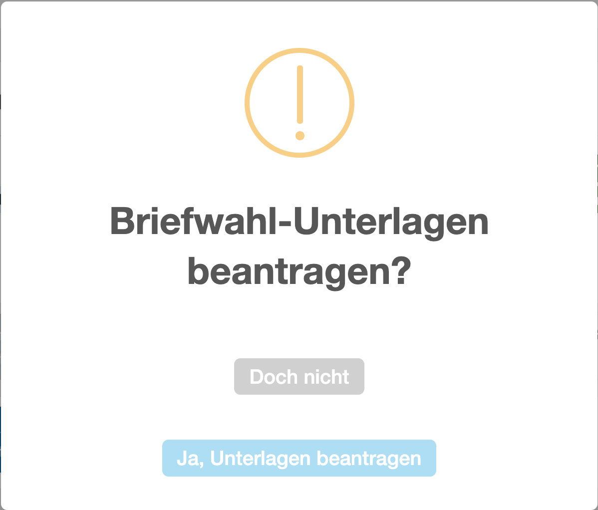

1. Dunkelblaue Schaltflächen, Lösen eine Aktion aus (z. B. Beantragung von Briefwahlunterlagen). Nach dem Anklicken erscheint stets eine Bestätigungsabfrage.

*Übereilungsschutz Briefwahlunterlagen beantragen*

| **Hinweis**  |
| --- |
| Ein einmal gesetzter Status kann nicht zurückgenommen werden. Prüfen Sie daher vor der Bestätigung sorgfältig, ob die richtige Person ausgewählt wurde. |

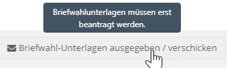

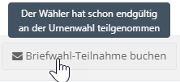

2. Graue Schaltflächen kennzeichnen aktuell nicht verfügbare Aktionen. Da die Aktionen der einzelnen Zeilen logisch aufeinander aufbauen (die Unterlagen müssen zunächst **beantragt**, bevor diese **verschickt** werden können), muss zunächst die vorherige Aktion durchgeführt werden, bevor die ausgegraute zur Verfügung steht. Nicht valide Optionen werden von der Logik automatisch ausgeblendet. Hat ein Wähler bereits an der Wahl teilgenommen, gibt es keine blauen Flächen mehr.   Tipp: Bewegen Sie den Mauszeiger über eine graue Schaltfläche, um per Tooltip den Grund für die Deaktivierung zu erfahren.

*Nicht verfügbare Schaltflächen*

3. Hellblaue Schaltflächen repräsentieren Wahlkanäle, die am Standort allgemein aktiv sind, jedoch nicht auf Antrag angeboten werden. Diese dienen ausschließlich zur Nachbearbeitung, z. B. bei glaubhaftem Verlust von Wahlunterlagen.

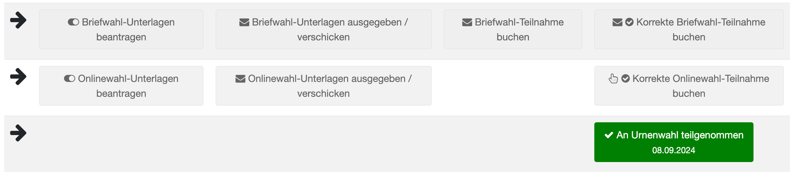

Grüne Schaltflächen zeigen bereits gesetzte Statusinformationen an.  *WFU2: Status prüfen und Aktionen ausführen*

- Alle bereits durchgeführten Aktionen werden im **Wähler-Log** dokumentiert und können dort nachvollzogen werden.Sehen Sie bereits erfolgten Aktivitäten im Wähler-Log:

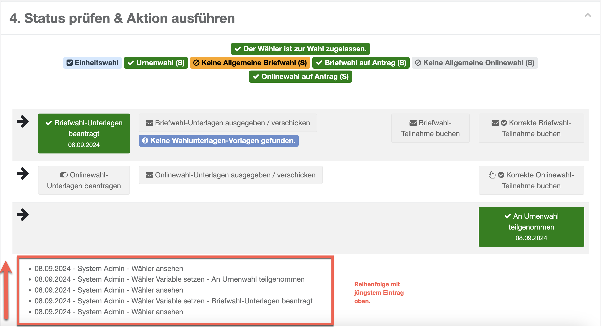
*WFU2: Wähler-Log*

| **Hinweis**  |
| --- |
| Die direkte Ausgabe einzelner Briefwahlunterlagen im Wählerservice ist nur möglich, wenn entsprechende Vorlagen im System hinterlegt sind und der Benutzer über die notwendigen Berechtigungen verfügt. In der Regel wird lediglich der Antrag erfasst. Die eigentliche Erstellung erfolgt später gesammelt über die Wahlfunktion **WFU3 „Briefwahlunterlagen generieren“**. |

- **Erstellung von einzelnen Wahlunterlagen**
- Im Folgenden wird erläutert, wie Wahlunterlagen für einzelne Wähler erstellt und deren Status korrekt verbucht werden. Die Beschreibung erfolgt beispielhaft anhand einer Briefwahlunterlage.

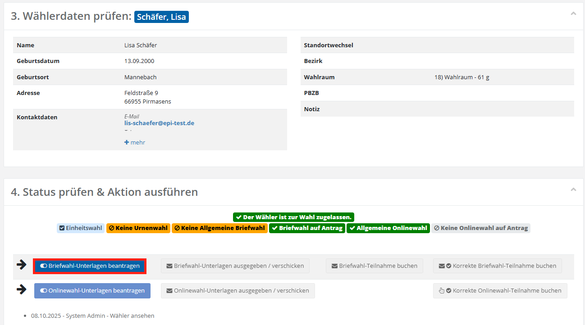

Klicken Sie auf **„Briefwahl-Unterlagen beantragen“** und bestätigen Sie den Vorgang im Dialog. Klicken Sie hier auf „**Ja, Unterlagen beantragen**“.

*Status setzen: Briefwahlunterlagen beantragen*

*Übereilungsschutz: Briefwahlantrag*

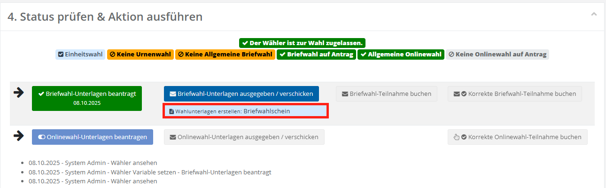

Nach Freischaltung des nächsten Schritts erstellen Sie die personalisierte Briefwahlunterlage, sofern eine entsprechende Vorlage hinterlegt ist.  *WFU2: Briefwahlunterlagen erzeugen*

- Im Anschluss öffnet sich erneut ein Bestätigungsdialog. Bestätigen Sie diesen ebenfalls mit der Schaltfläche **Wahlunterlagen** erstellen.
- Laden Sie das erzeugte Dokument herunter (**1**), prüfen Sie es sorgfältig und drucken Sie es aus. Händigen Sie danach den **Briefwahlschein** sowie die übrigen **Wahlunterlagen (z. B. Briefwahlstimmzettel)** der Person aus oder **versenden** Sie diese per Post. Setzen Sie anschließend den Status „**Briefwahl-Unterlagen ausgegeben / verschickt**“ (**2**).

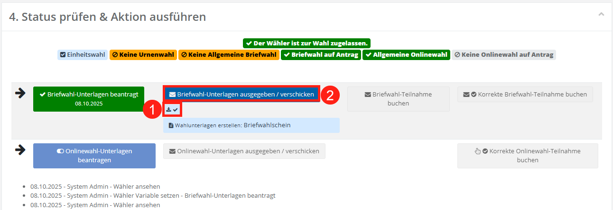
*WFU2: Dokument herunterladen und Status verbuchen*

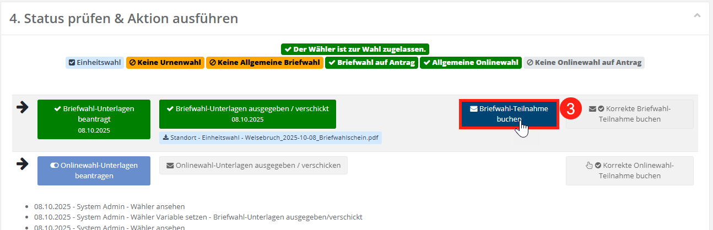

Nach Eingang der Rücksendung, suchen Sie den Wähler erneut und setzen den Status **„Briefwahl-Teilnahme buchen“.** Es erscheint erneut ein Bestätigungsdialog, den Sie mit der Schaltfläche „**Ja, Unterlagen wurden ausgegeben / verschickt**“ bestätigen. Dieser Status dient zu Dokumentationszwecken und hat keinen Einfluss auf die übrigen Wahlkanäle.

*WFU2: Status der Wahlunterlagen verbuchen*

Der letzte Status „**Korrekte Briefwahl-Teilnahme buchen**“ ist erst nach Abschluss der Wahlhandlungen während der Auszählungsphase verfügbar. In diesem Schritt muss die Rücksendung geöffnet und auf ihre Korrektheit sowie gegen Teilnahme über die anderen Wahlkanäle geprüft werden.
