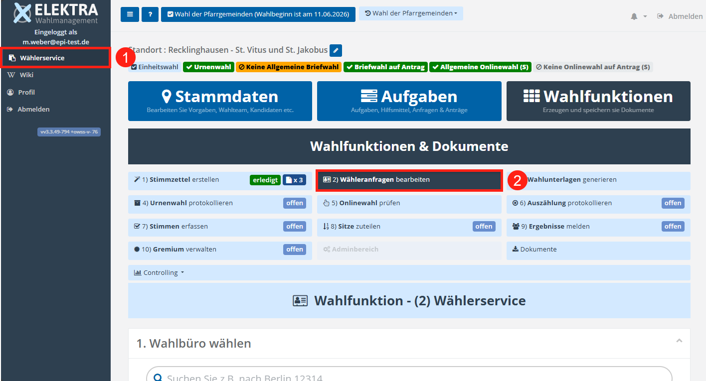

# WFU2 Wähleranfragen bearbeiten

Die Wahlfunktion **2) „Wähleranfragen bearbeiten“**, im Folgenden auch **Wählerservice** genannt, dient der strukturierten Bearbeitung von Anfragen von Wählern. Sie ist bewusst von der Verwaltung der Wählerstammdaten (Bereich **„Wähler“**) getrennt, so dass auch Wahlhelfer diese Aufgabe übernehmen können, ohne Zugriff auf sensible Stammdaten zu erhalten.

*WFU2: Wählerservice-Übersicht*

Der Wählerservice ist in der Benutzeroberfläche auf zwei Wegen erreichbar:

1. Über den Menüpunkt **Wählerservice** im Seitenmenü, werden **alle Wahlbüros angezeigt, auf die der Benutzer Zugriffsrechte besitzt**. Dies kann ebenfalls unterschiedliche Wahlprojekte umfassen. Auf diese Weise wird ein **schneller Wechsel zwischen Wahlbüros** ermöglicht, beispielsweise wenn mehrere Gremien zeitgleich gewählt werden.
2. Um den Wählerservice für Ihren aktuellen Standort aufzurufen, wechseln Sie in den Bereich der **Wahlfunktionen** und rufen hier **2) Wähleranfragen** bearbeiten auf. In diesem Fall werden **ausschließlich die Wahlbüros des aktuell ausgewählten Standorts** angezeigt.

Die Wahlfunktion **Wähleranfragen bearbeiten** bildet insbesondere folgende Anwendungssituationen ab:

- Durchführung von **Standortwechseln**.
- Auskünfte über das Wählerverzeichnis.
- Prüfung der Wahlberechtigung.
- Beantragung von Briefwahlunterlagen.
- Erstellung personalisierter Briefwahlunterlagen für einzelne Wähler.
- Beantragung von Online-Wahlunterlagen.
- Prüfung und Verbuchung von Briefwahl-Sendungen.
- Sicherstellung des korrekten Wahlkanals bei hybriden Wahlen (z. B. First-Vote-Counts, Online-First).
- Verbuchung der Stimmzettelausgabe bzw. Wahlteilnahme bei Urnenwahlen.

<!-- doccards:auto -->
## In diesem Kapitel

<DocCardList />
