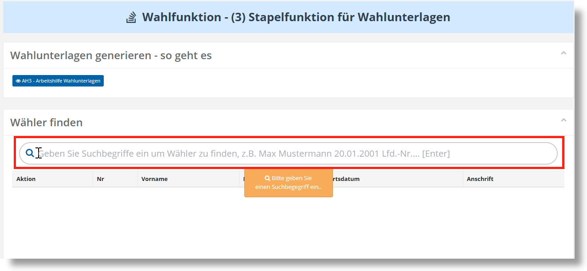
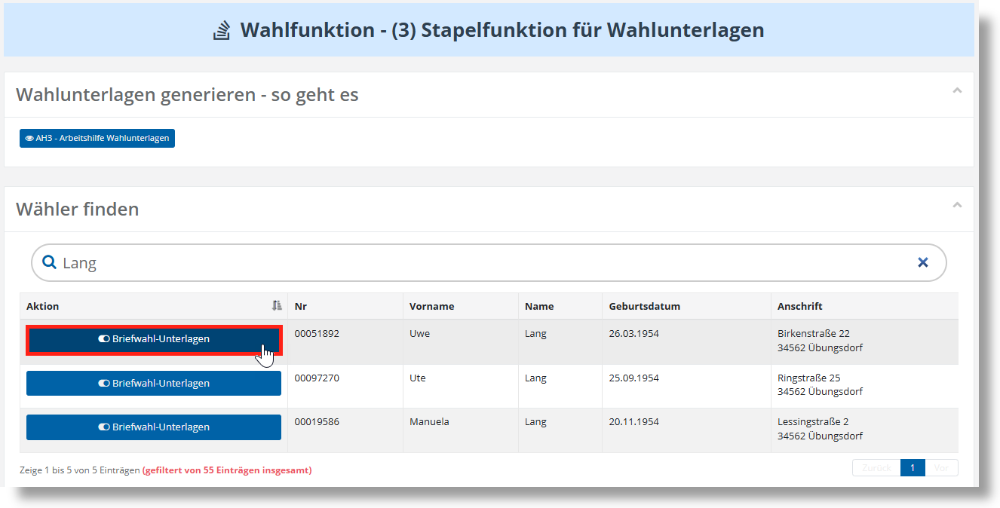
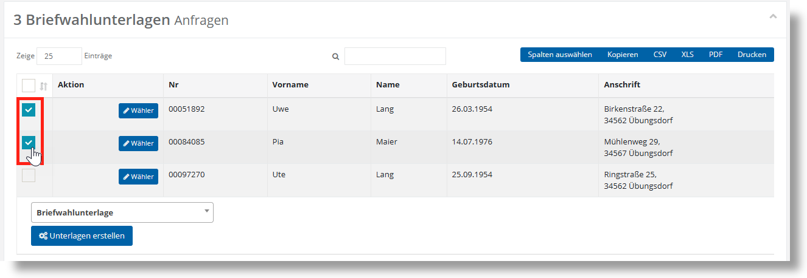
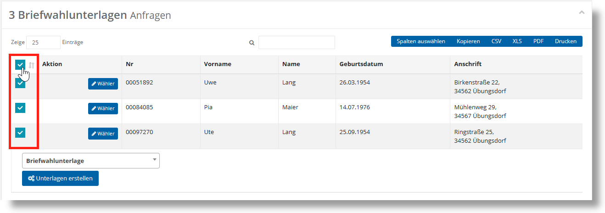
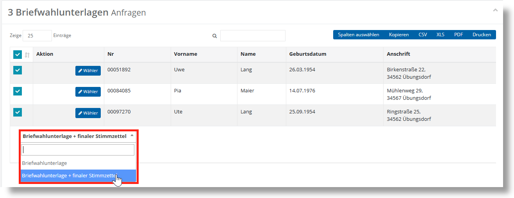
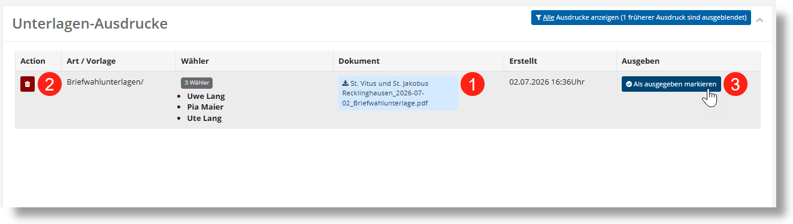
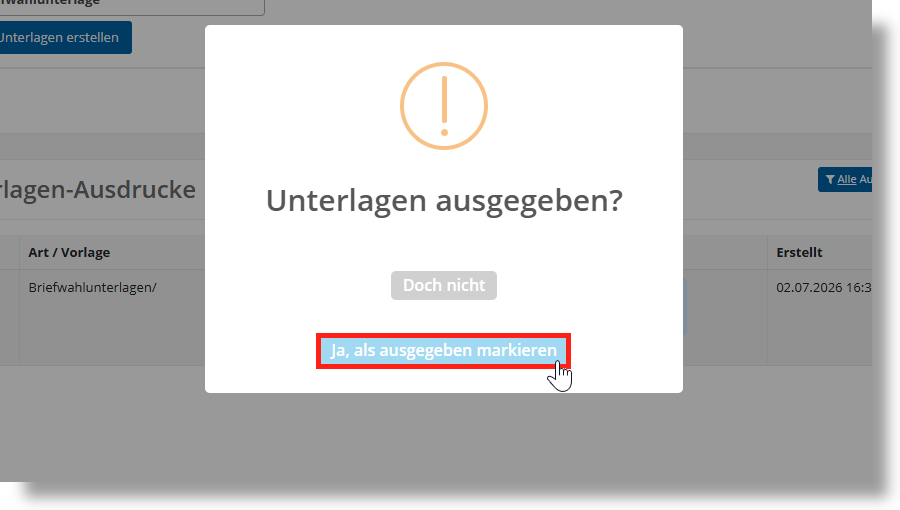
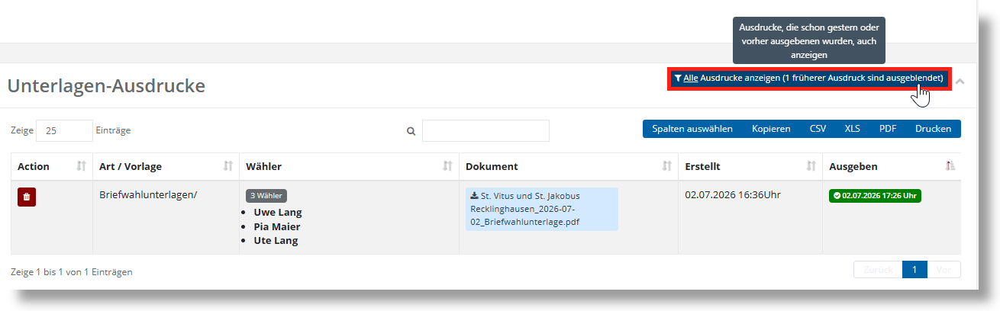

# WFU3 Wahlunterlagen generieren

Die Wahlfunktion 3) „**Briefwahlunterlagen generieren**“ dient der gebündelten Erstellung und Druckausgabe von Wahlunterlagen für antragsbasierte Wahlverfahren. Sie unterstützt einen strukturierten Stapelprozess und stellt sicher, dass ausschließlich **vollständig und korrekt zusammengestellte Unterlagen** an die Wahlberechtigten ausgegeben werden.

Die generierten Unterlagen umfassen in der Regel einen **Wahlbrief**, gegebenenfalls einen **Wahlschein**, einen **Stimmzettel** oder **Zugangsdaten für die Onlinewahl** sowie die erforderlichen **Briefhüllen** für Versand, Wahlbrief und Rücksendung.

Der Aufbau der Wahlfunktion beginnt wie die meisten Wahlfunktionen mit einer Arbeitshilfe und einer Wiedergabe Ergebnisse der Plausibilitätsprüfungen. Diese Elemente haben dienen nur der Information.

Nachdem Sie die Wahlfunktion 3) „**Briefwahlunterlagen generieren**“ aufgerufen haben, finden Sie im oberen Bereich die **Wählersuche**. Die Funktionsweise wurde bereits im Kapitel **6.3** **Wähleranfragen bearbeiten** erläutert.

*WFU3: Wählersuche*

Nachdem Sie eine Suche ausgelöst haben, werden die Treffer unterhalb der Suchleiste angezeigt. Anschließend können Sie hier eine Aktion für den Wähler auswählen.

*WFU 3: Wähler markieren*

| **Hinweis**  |
| --- |
| In der Spalte **Aktion** stehen nur Wahlkanäle zur Verfügung, die an Ihrem Standort **auf Antrag** durchgeführt werden. In dem oben aufgeführten Beispiel ist dies die **Briefwahl**. |

Anschließend können Sie weitere Personen auswählen, für die Ihnen ein Antrag vorliegt. Geben Sie dazu einfach weitere Namen ein und markieren Sie diese ebenfalls über die Schaltfläche.

Alle Personen, die Sie zuvor über die Schaltfläche **„Briefwahl-Unterlagen“** markiert haben, erhalten automatisch den Status **„Briefwahlunterlagen beantragt“** und werden in der darunterliegenden Tabelle **„Briefwahlunterlagen Anfragen“** angezeigt.

Über die Checkbox in der linken Spalte einer Person können Sie festlegen, für welche Personen die Briefwahlunterlagen generiert werden sollen.

*WFU3: Wähler zur Erzeugung der Wahlunterlagen auswählen*

| **Hinweis**  |
| --- |
| Möchten Sie mehrere Personen gleichzeitig auswählen – beispielsweise mehrere Familienmitglieder –, können Sie entweder mehrere Checkboxen einzeln setzen oder über die **Checkbox im Tabellenkopf** alle angezeigten Einträge auf einmal markieren. |

*WFU3: Mehrfachauswahl von Wählern*

Wählen Sie anschließend die Vorlage aus, die für die Erstellung der Briefwahlunterlage genutzt werden soll. Zur Auswahl stehen **„Briefwahlunterlage“** und **„Briefwahlunterlage + finaler Stimmzettel“**. Letztere Option enthält zusätzlich den Stimmzettel, der zuletzt innerhalb der Wahlfunktion **„1) Stimmzettel erstellen“** zum Druck freigegeben wurde, sodass Sie das vollständige Paket direkt an den Wähler ausgeben können.

*WFU3: Auswahl der Vorlage*

Klicken Sie auf die Schaltfläche **„Unterlage erstellen“**, um die Unterlagen für die ausgewählten Personen als PDF zu erzeugen. Dabei wird für jede ausgewählte Person eine eigene Seite im PDF angelegt.

In der darunterliegenden Tabelle **„Unterlagen-Ausdrucke“** finden Sie anschließend das generierte Paket. Hier können Sie die Unterlagen lokal auf Ihrem Gerät speichern (1). Sollten Sie einen Fehler entdeckt haben, können Sie den Eintrag löschen (2) – dabei wird der Status **„Briefwahlunterlagen beantragt“** wieder zurückgesetzt. Haben Sie die Unterlagen bereits an die Wähler ausgegeben, können Sie dies über die Schaltfläche **„Als ausgegeben markieren“** (3) verbuchen.

*WFU3: Tabelle Unterlagen-Ausdrucke*

Sobald Sie auf **„Als ausgegeben markieren“** geklickt haben, erscheint ein Übereilungsschutz. Bestätigen Sie in diesem Dialog mit **„Ja, als ausgegeben markieren“**, um den Status zu setzen.

*WFU3: Übereilungsschutz Unterlagen ausgegeben*

Bitte beachten Sie, dass in der Standardansicht der Tabelle **„Unterlagen-Ausdrucke“** nur noch nicht ausgegebene Unterlagen angezeigt werden. Als ausgegeben markierte Unterlagen werden nur für einen Tag nach der Ausgabe angezeigt. Nach Ablauf dieser Zeit können Sie über den Filter im Kopfbereich der Tabelle die Option **„Alle Ausdrucke anzeigen“** auswählen, um auch frühere Unterlagen einzusehen.

*WFU3: Ältere Ausdrucke anzeigen*
