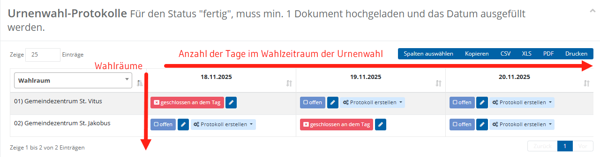
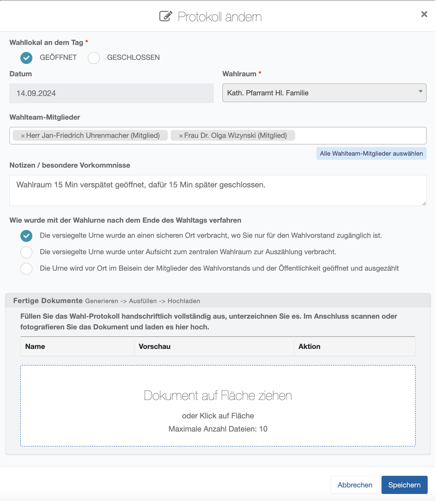
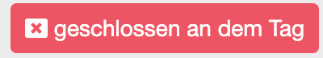
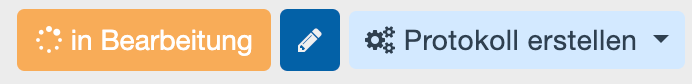
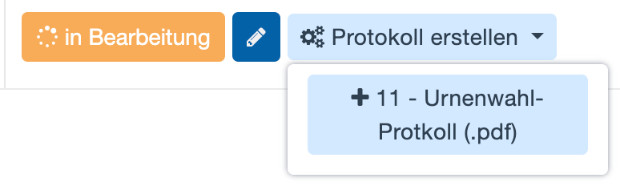
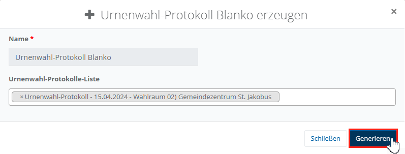
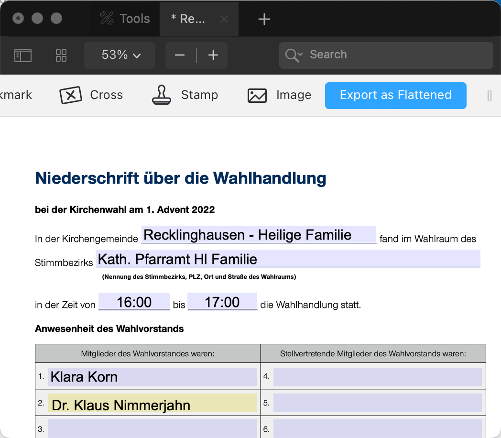
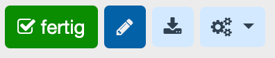
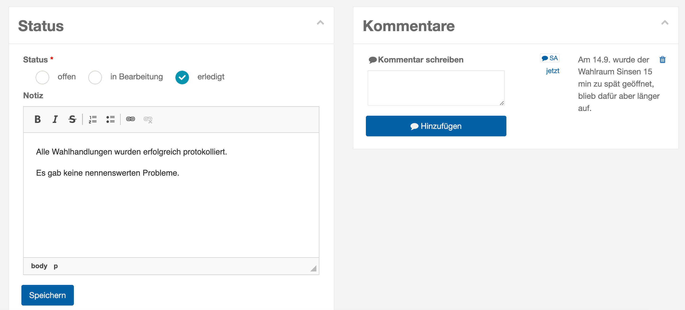

# WFU4 Urnenwahl protokollieren

Sofern eine Urnenwahl durchgeführt wird, muss dieser Vorgang dokumentiert werden. Um die Stimmabgabe für die Wähler möglichst flexibel und komfortabel zu gestalten, können Urnenwahlen über einen längeren Zeitraum stattfinden. Dabei können mehrere Wahlräume in unterschiedlichen Bezirken, zu verschiedenen Zeiten und durch verschiedene Mitglieder des Wahlteams betreut werden. In diesen Fällen unterstützt **Elektra** die strukturierte Erfassung und die lückenlose Nachvollziehbarkeit der Abläufe. Wie bei allen Wahlfunktionen stehen zu Beginn Arbeitshilfen im PDF-Format zur Verfügung. Diese enthalten können beispielsweise Checklisten enthalten, die zur Vorbereitung der Wahlhandlungen im Wahlbüro genutzt werden können. Ergänzend wird eine Übersicht über Fehler und Warnungen angezeigt, sofern das Plausibilitätsmodul mögliche Unstimmigkeiten erkannt hat.

Zentrales Element dieser Wahlfunktion ist die Liste der Urnenwahlprotokolle. Das System stellt diese in Form einer Matrix aus Urnenwahltagen und Wahlräumen dar.

.

*WFU4: Urnenwahl protokollieren (Übersicht)*

Wie immer gilt: Grün, Orange oder rot sind Status-Informationen. Dunkelblau sind die „**Stifte**“ zum Bearbeiten der Dialogbox mit den Angaben und Notizen.

**So erzeugen Sie ein Protokoll und speichern es im System:**

Wählen Sie einen Eintrag aus der Matrix, in dem Sie auf den blauen Stift klicken.

- Bearbeiten Sie den Inhalt im Dialog:

|  *WFU4: Protokoll-Dialog ausfüllen* | **Wahllokal an dem Tag:** Wählen Sie, ob für diesen Tag ein Protokoll entstehen soll, um die Wahlhandlung in diesem Wahlraum zu protokollieren.  **GESCHLOSSEN:**  Wählen Sie diesen Eintrag, wenn an diesem Tag keine Wahlhandlung stattfinden kann. **Wahlteam-Mitglieder:** Welche Vertreter des Wahlvorstands sind mit der Durchführung und Protokollierung beauftragt? **Notizen / besondere Vorkommnisse:** Hier haben Sie Raum zum Festhalten besonderer Begebenheiten. **Wie wurde mit der Wahlurne am Ende des Wahltags verfahren?** Dokumentieren Sie, wie mit der Wahlurne umgegangen wurde. **Fertige Dokumente:**  DROP-ZONE für das Hochladen von fertig unterzeichneten Protokollen. |
| --- | --- |

- Speichern Sie den Inhalt des Dialogs.

Schließen Sie den Bearbeitungsdialog, in dem Sie auf SPEICHERN klicken. Entsprechend Ihrer Angaben ändert sich der Eintrag in der Matrix:   oder

Erzeugen Sie das Protokoll Klicken Sie auf das Dropdown und wählen Sie die Protokollvorlage aus.    Es erscheint ein Dialog, der ggf. weitere Variablen abfragt, die in die Vorlage eingefügt werden sollen. Klicken Sie hier auf **Generieren**.

*WFU4: Protokoll erzeugen und hochladen*

- Ergänzen Sie das Protokoll – wo nötig und unterzeichnen Sie es. Notfalls fügen Sie Anlagen hinzu.
- Laden Sie das fertige Protokoll hoch Scannen oder fotografieren Sie das Protokoll. Klicken Sie erneut auf den Stift zur Bearbeitung und laden Sie das Dokument hoch. Speichern Sie die Eingaben.

Durch das Hochladen der Datei, stellt sich der Status des Feldes in der Matrix automatisch auf **fertig**.

*WFU4: Protokoll hochladen*

**Gesamt-Status, Notizen, Kommentare.**

Wie bei die meisten Wahlfunktionen können Sie den Status pflegen, Notizen eingeben und Kommentare mit Zeitstempel und Namenskennzeichen anlegen:

*WFU4: Status und Kommentare pflegen*
