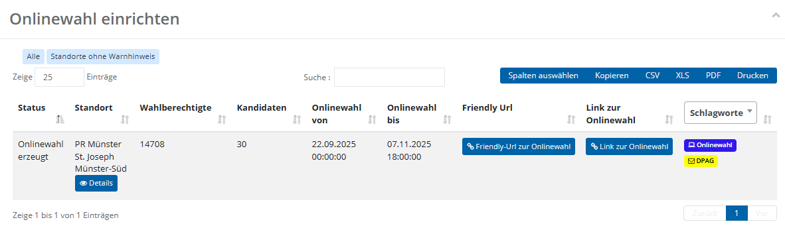
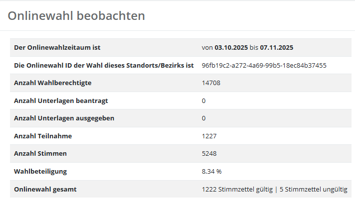
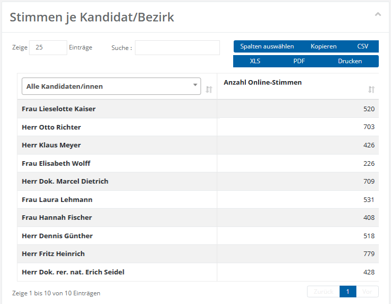

# WFU5 Onlinewahl prüfen

Onlinewahlen werden in **Elektra** zentralseitig bearbeitet. Standortverantwortliche können daher lediglich Einsicht nehmen. In diesem Abschnitt erhalten Sie eine **zusammenfassende Übersicht zur Onlinewahl am ausgewählten Standort**. Die dargestellten Tabellen zeigen sowohl den **aktuellen Status und die grundlegenden Rahmendaten** der Onlinewahl als auch, nach Abschluss der Online-Auszählung, **statistische Kennzahlen und Ergebnisse**. Die Übersicht dient der Kontrolle des Wahlverlaufs sowie der Nachvollziehbarkeit der Onlinewahl.

*Abb.  – WFU5: Onlinewahl-Übersicht*

| **Status** | Zeigt den aktuellen Status der Onlinewahl am Standort an. Mögliche Statuswerte sind: **Onlinewahl nicht initialisiert, Onlinewahl erzeugt, Onlinewahl beendet und Onlinewahl ausgewertet.** |
| --- | --- |
| **Standort** | Kurztitel des Standorts |
| **Wahlberechtigte** | Anzahl der Wahlberechtigten die an das Onlinewahlsystem übertragen wurden. |
| **Kandidaten** | Anzahl der Kandidaten am Standort |
| **Onlinewahl von** | Startzeitpunkt der Onlinewahl |
| **Onlinewahl bis** | Endzeitpunkt der Onlinewahl |
| **Friendly** **Url** | Enthält den auf den Wahlunterlagen abgedruckten Link zur Onlinewahl. Über diesen Link kann die Standortverantwortliche bzw. der Standortverantwortliche prüfen, ob die Onlinewahl erreichbar ist. **Hinweis:** Der Link ist erst ab dem Startzeitpunkt der Onlinewahl aufrufbar. |
| **Link zur Onlinewahl** | Technischer Systemlink zur Onlinewahl. Da sich dieser während der Vorbereitung der Onlinewahl noch ändern kann, sollte er **nicht weitergegeben** werden. |
| **Schlagworte** | Sofern für den Standort Schlagworte hinterlegt sind, werden diese in dieser Spalte angezeigt. |

- Unterhalb dessen finden Sie die Übersicht, in der Sie weitere Daten zu der Onlinewahl finden. Dieser Bereich ist vor allem relevant nachdem die Onlinewahl bereits ausgezählt wurde.

*Abb.  – WFU5: Detaildaten der Onlinewahl*

| **Onlinewahl ID** | Technische Kennung der Onlinewahlkabine zur eindeutigen Identifikation. Die Onlinewahl-ID dient ausschließlich **zu Informationszwecken** und hat keine unmittelbare praktische Relevanz für die Bedienung. |
| --- | --- |
| **Anzahl Unterlagen beantragt** | Anzahl der beantragten Onlinewahlunterlagen. Eine aussagekräftige Zahl wird hier nur angezeigt, wenn am Standort eine **Onlinewahl auf Antrag** durchgeführt wird. Bei einer **allgemeinen Onlinewahl** ist der Wert in der Regel **0**. |
| **Anzahl Unterlagen ausgegeben** | Anzahl der tatsächlich ausgegebenen Onlinewahlunterlagen. Es gelten die Hinweise zum vorherigen Punkt. |
| **Anzahl Teilnahme** | Anzahl der abgegebenen Online-Stimmzettel. |
| **Anzahl Stimmen** | Gesamtzahl der Online-Stimmen, die auf die einzelnen Kandidatinnen und Kandidaten verteilt wurden. |
| **Wahlbeteiligung** | Hier wird die Wahlbeteiligung an der Onlinewahl in Prozent dargestellt. |
| **Onlinewahl gesamt** | Zeigt eine Aufschlüsselung der abgegebenen Online-Stimmzettel nach **gültigen** und **ungültigen** Stimmen an. |

- Am Seitenende finden Sie eine Übersicht der auf die einzelnen Kandidaten verteilten Online-Stimmen.

*Abb.  – WFU5: Stimmenverteilung je Kandidat*
