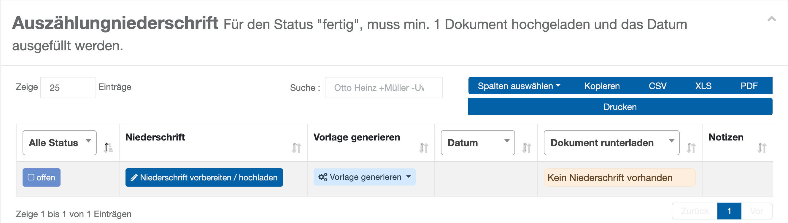
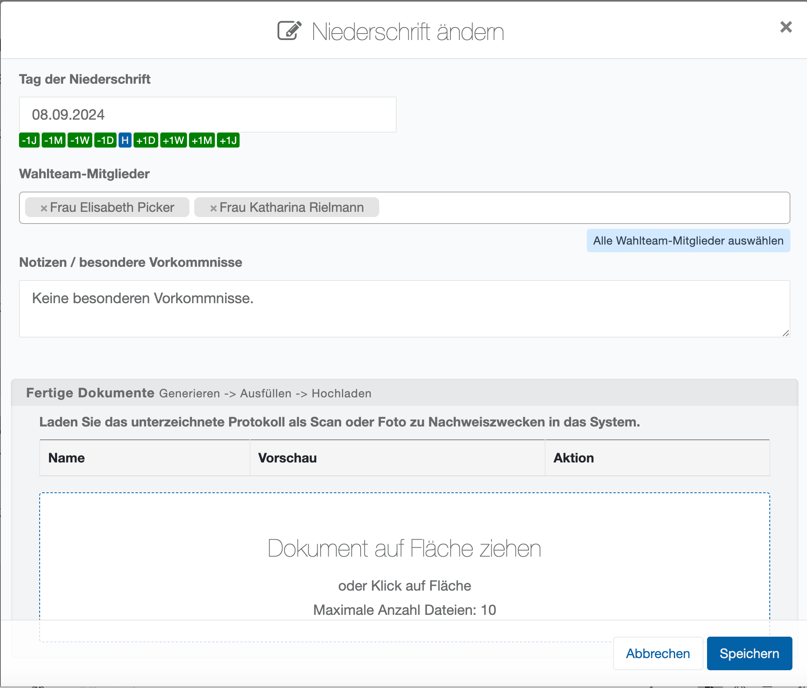
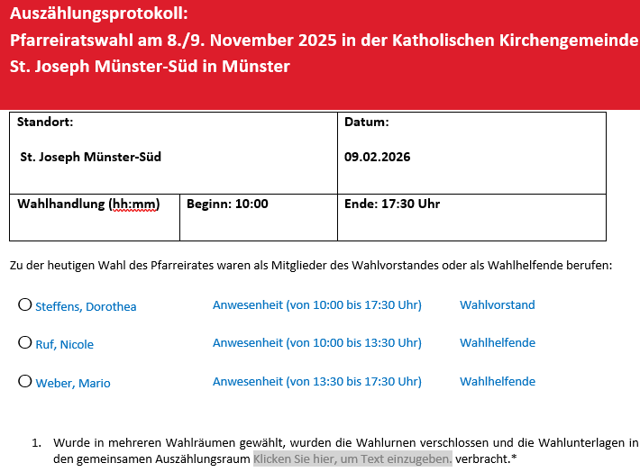
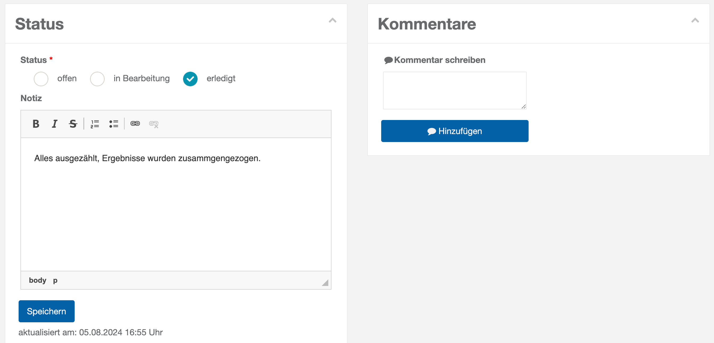
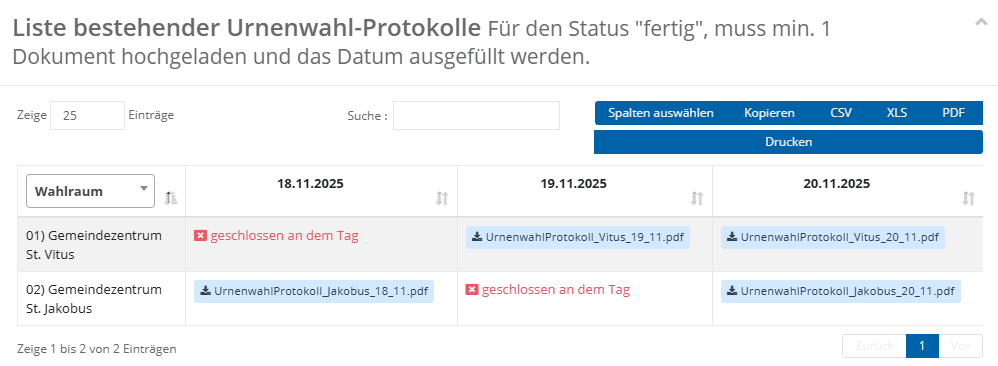

# WFU6 Auszählung protokollieren

Diese Wahlfunktion dokumentiert die Öffnung der Wahlurnen und den anschließenden Auszählungsprozess. Das System stellt dazu wie für alle Wahlfunktionen zunächst PDF-Dateien als Arbeitshilfen bereit, mit denen Sie den Arbeitsschritt vorbereiten können.

Es erfolgt wie immer eine Auflistung von Warnungen und Fehlern aus dem Plausibilitätsmodul.

Im Anschluss wird eine **Liste angezeigt**, über die die **Niederschriften**, gegebenenfalls **je Bezirk**, erstellt werden können. In der Regel stehen hierfür **mehrere Vorlagen** zur Verfügung. Dazu zählt unter anderem eine **Zählhilfe (Strichliste)** mit den Namen der Kandidatinnen und Kandidaten, die die Erfassung der Stimmen aus der Urnen- oder Briefwahl erleichtert. Darüber hinaus kann über diesen Bereich auch das **Auszählungsprotokoll** bzw. die **Auszählungsniederschrift** erstellt werden.

*WFU6: Niederschriften je Bezirk*

Um eine Auszählung zu protokollieren, gehen Sie wie folgt vor:

Wählen Sie den Standort bzw. den Bezirk aus. Kicken Sie auf  um den folgenden Dialog zu öffnen.

- Füllen Sie den Dialog aus:

|  *WFU6: Niederschrift-Dialog ausfüllen* | **Tag der Niederschrift:** Bestätigen Sie das Tagesdatum oder wählen Sie das korrekte Datum. **Wahlteam-Mitglieder**: Wählen Sie die Vertreter des Wahlvorstands aus, die anwesend sind. **Notizen/besondere Vorkommnisse:** Dokumentieren Sie ggf. besondere Begebenheiten, die bei der Auszählung entstanden sind. **Fertige Dokumente**: Dokumenten-Liste und Drop-Zone für die Dateiauswahl. |
| --- | --- |

Speichern Sie die Angaben. Der Status wechselt dadurch automatisch auf ‚In Bearbeitung‘

*WFU6: Dokumentenliste und Drop-Zone*

Nun wählen Sie ‚Vorlage generieren‘ um die Vorlage auszuwählen und ein personalisiertes Dokument zu erhalten:      *WFU6: Auszählungsprotokoll generieren*

- Bearbeiten Sie das Dokument entsprechend, drucken Sie es aus. Unterzeichnen Sie es.
- Laden Sie das gescannte oder fotografierte Dokument hoch.

Der Status in der Liste ändert sich dadurch automatisch auf

- Wiederholen Sie diesen Schritt ggf. für alle Bezirke – und ziehen Sie die Ergebnisse zusammen.

Wie für die meisten Wahlfunktionen, können **Status** und **Kommentare** gesetzt werden.

*WFU6: Ergebnisse aller Bezirke zusammenführen*

| **Hinweis**  |
| --- |
| Sofern an Ihrem Standort eine Urnenwahl durchgeführt wird, steht am Ende der Seite eine Übersicht der in Wahlfunktion 4 erzeugten Urnenwahlprotokolle zur Verfügung. Diese dient ausschließlich zu Informationszwecken und unterstützt dabei, relevante Angaben für das Auszählungsprotokoll der Wahlfunktion 6 zu übernehmen. |

*WFU6: Urnenwahlprotokolle aus WFU4*
