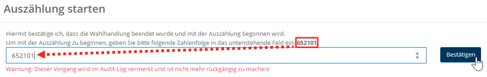
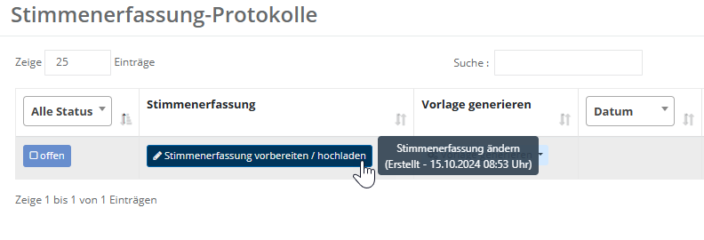
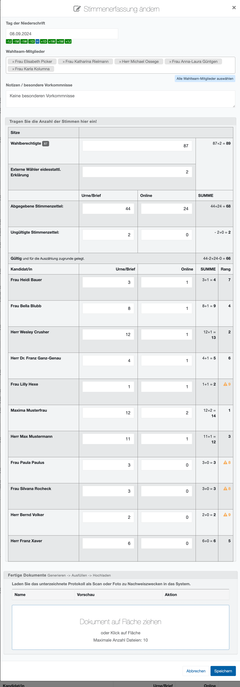
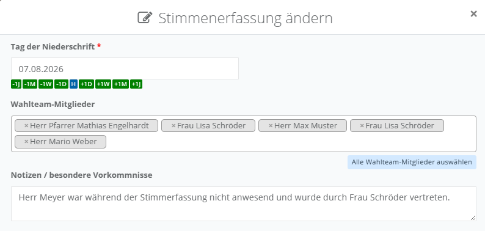
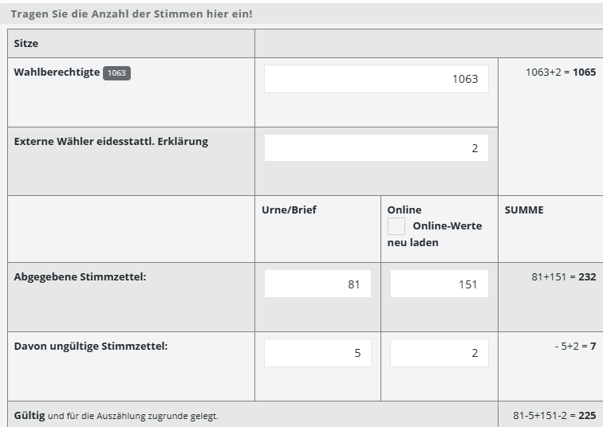
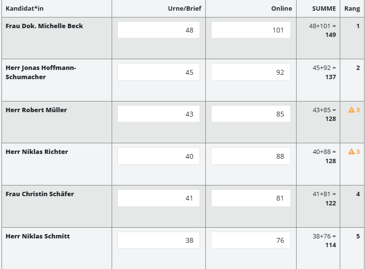
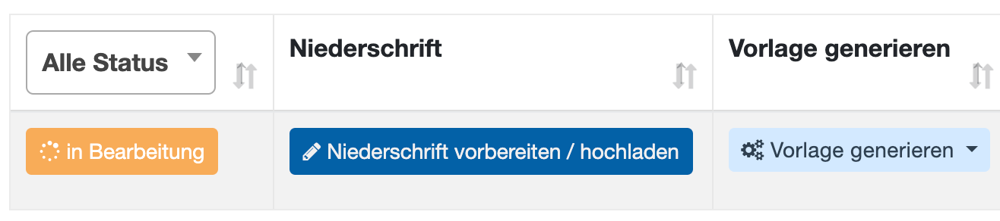
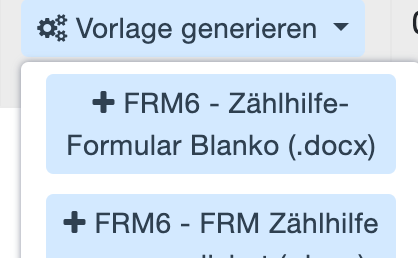
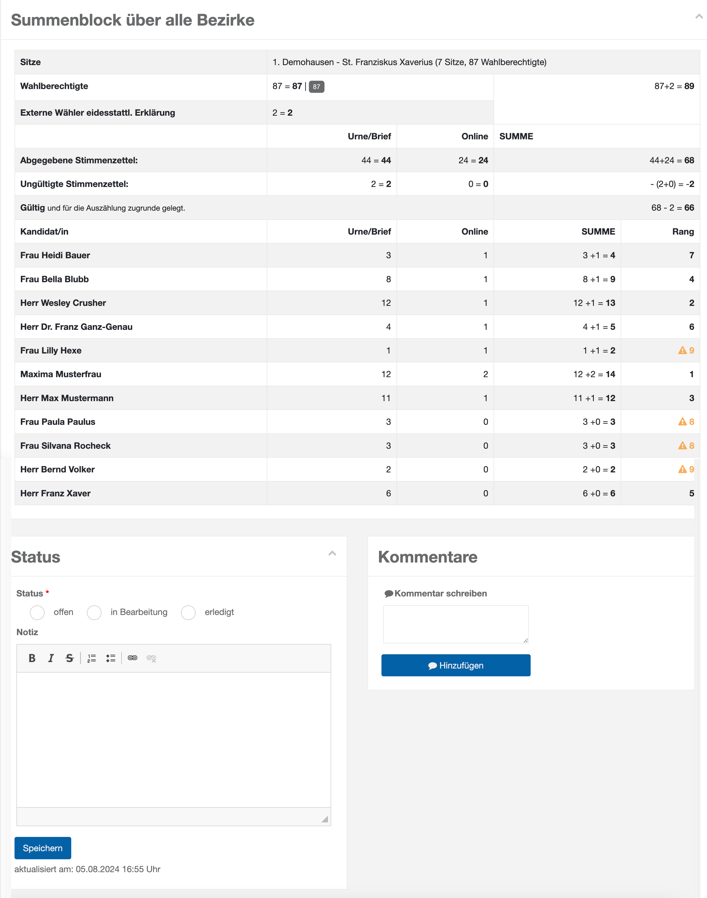

# WFU7 Stimmen erfassen

Die Wahlfunktion **WFU7 – Stimmen erfassen** trägt die Stimmen für den Standort bzw. für jeden Bezirk in einem Dialog zusammen. Die zentrale Liste umfasst einen Eintrag je Bezirk.

Wie alle dokumentarischen Wahlfunktionen beginnt WFU7 mit Arbeitshilfen und dem Plausibilitätsmodul; die allgemeine Bedienung ist im [Grundkonzept für dokumentarische Wahlfunktionen](./grundkonzept-fuer-dokumentarische-wahlfunktionen) beschrieben.

## Auszählung starten

Wenn Sie eine der Wahlfunktionen **7**, **8** oder **9** zum ersten Mal aufrufen, müssen Sie zunächst den Beginn der Auszählung bestätigen. Geben Sie dazu die angezeigte Zahlenfolge in das Eingabefeld ein und klicken Sie auf **Bestätigen**.

*WFU7: Auszählung starten*

Damit bestätigen Sie, dass die Wahlhandlung beendet ist und mit der Auszählung begonnen wird. Der Vorgang wird im **Audit-Log** vermerkt und kann von der Projektleitung eingesehen werden. Die Bestätigung ist nur einmal nötig: Sobald Sie sie bei einer der drei Wahlfunktionen eingegeben haben, sind auch die übrigen freigeschaltet.

## Stimmen erfassen

Wählen Sie in der Liste der Stimmenerfassungs-Protokolle den gewünschten Eintrag (Standort bzw. Bezirk) und klicken Sie auf **Stimmenerfassung vorbereiten / hochladen**, um den Dialog zu öffnen.

*WFU7: Stimmenerfassung-Protokolle (Übersicht)*

Füllen Sie den Dialog aus:

*WFU7: Bearbeitungsdialog Stimmenerfassung*

### Allgemeine Angaben

Im oberen Teil des Dialogs halten Sie fest, wann und durch wen die Stimmenerfassung erfolgt, und dokumentieren besondere Vorkommnisse.

*WFU7: Allgemeine Angaben im Bearbeitungsdialog*

| Feld | Bedeutung |
| --- | --- |
| Tag der Niederschrift | Wird mit dem Tagesdatum vorbelegt – bitte prüfen. |
| Wahlteam-Mitglieder | Wählen Sie aus den am Standort hinterlegten Mitgliedern diejenigen aus, die zum Zeitpunkt der Stimmenerfassung anwesend sind. |
| Notizen / besondere Vorkommnisse | Textblock, der in das Protokoll eingefügt wird. Zusätzlich können Sie das generierte Protokoll bearbeiten. |

### Stimmen-Block: Grundlage

Hier erfassen Sie die Grundlagen der Auszählung: die Zahl der Wahlberechtigten, die abgegebenen und die ungültigen Stimmzettel. Das System berechnet daraus automatisch die gültigen, für die Auszählung zugrunde gelegten Stimmen.

*WFU7: Stimmen-Block – Grundlage*

| Feld | Bedeutung |
| --- | --- |
| Sitze | Zunächst leer; später der Name des Standorts/Bezirks sowie die Anzahl der Gremiensitze. |
| Wahlberechtigte | Anzahl der Wahlberechtigten laut Wählerverzeichnis (abweichende Angaben möglich). |
| Externe Wähler mit eidesstattl. Erklärung | Sofern die Wahlordnung es erlaubt, können hier Wähler aufgenommen werden, die z. B. durch Umzug glaubhaft erklären, wahlberechtigt zu sein, und dazu eine eidesstattliche Erklärung unterschreiben. |
| Abgegebene Stimmzettel | Gezählte Anzahl der Stimmzettel (inklusive ungültiger) in der Spalte **Urne/Brief**. Die Spalte **Online** wird automatisch aus dem Online-Wahlsystem befüllt und kann nicht bearbeitet werden. |
| Ungültige Stimmzettel | Anzahl der ungültigen Stimmzettel. Bei großen Mengen ggf. einen Kommentar im Protokoll ergänzen. |
| Gültige Stimmzettel (Summe) | Für die Auszählung zugrunde gelegte Summe. |

### Stimmen-Block: Kandidaten

Hier tragen Sie je Kandidatin bzw. Kandidat die aus Urne und Briefwahl gezählten Stimmen ein. Die Online-Stimmen werden automatisch befüllt; Summe und Rang berechnet das System selbstständig.

*WFU7: Stimmen-Block – Kandidaten*

| Feld | Bedeutung |
| --- | --- |
| Kandidat | Name des Kandidaten. |
| Urne/Brief | Anzahl der per Strichliste erhobenen Stimmen aus Zählprotokoll/Zählhilfe. |
| Online | Wird automatisch befüllt. |
| Summe | Wird automatisch befüllt. |
| Rang | Wird automatisch berechnet. Stehen mehrere Kandidaten auf demselben natürlichen Rang (Stimmgleichheit), wird dies orange und mit einem Ausrufezeichen dargestellt – im Screenshot bei zwei Kandidaten auf **Rang 3**. Diese Stimmgleichheit wird in der Wahlfunktion **8 Sitze zuteilen** aufgelöst. |

Im unteren Bereich des Dialogs finden Sie außerdem **Fertige Dokumente** (Liste der hochgeladenen Dateien) und den **Dokument-Upload** (Dropzone).

*WFU7: Dokument-Upload (Dropzone)*

Speichern Sie die Angaben. Der Status wechselt dadurch automatisch auf **In Bearbeitung**.

Wählen Sie **Vorlage generieren**, um ein personalisiertes Protokoll zu erhalten, und laden Sie es anschließend hoch. Der Status ändert sich dadurch automatisch. Wiederholen Sie diesen Schritt ggf. für alle Bezirke; das System zieht die Ergebnisse zusammen.

*WFU7: Summenblock mit natürlichem Rang*

Der Summenblock zeigt eine Übersicht der Daten inklusive des natürlichen Rangs nach Stimmenzahl. Ein doppelt vergebener Rang wird hervorgehoben; er wird in der nächsten Wahlfunktion **WFU8 Sitze zuteilen** aufgelöst.

*WFU7: Übersicht der erfassten Stimmen*

Erfassen Sie mögliche **Notizen** und **Kommentare** und schließen Sie WFU7 ab, indem Sie den **Status** auf **Erledigt** setzen.
