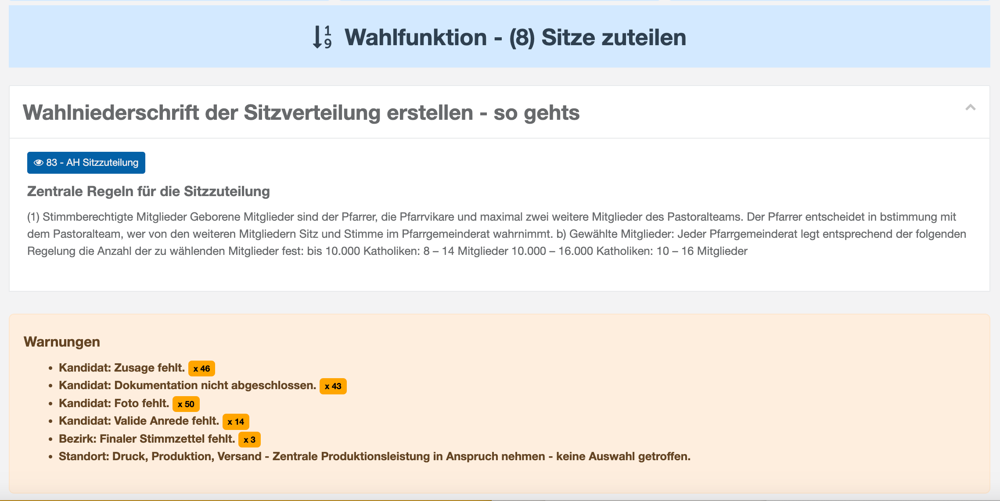
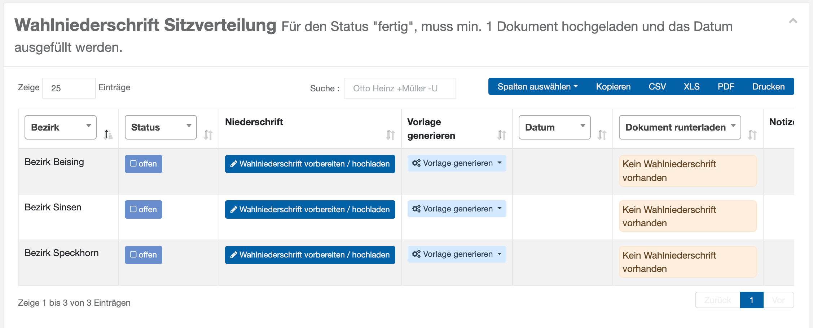
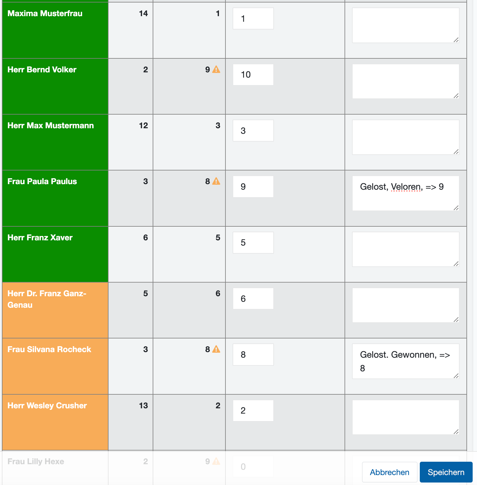
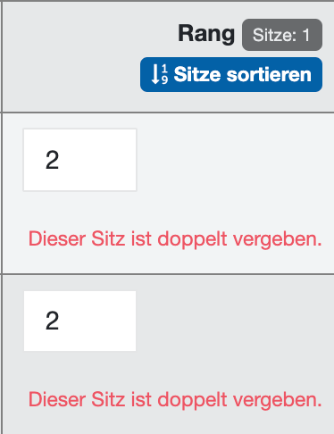
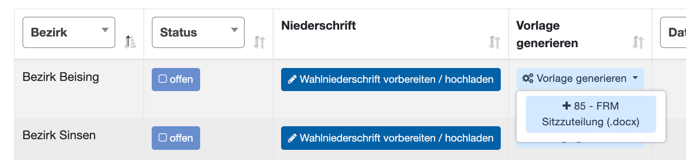
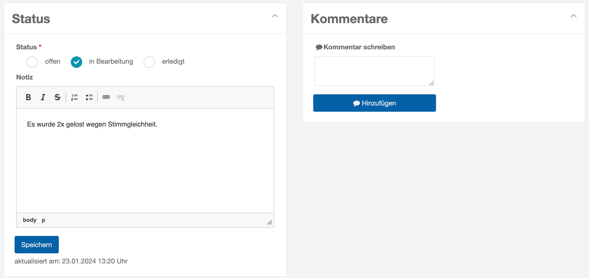

# WFU8 Sitze zuteilen

Die Wahlfunktion **WFU8 Sitze zuteilen** gibt Ihnen eine Übersicht über die natürliche Rangfolge der Kandidaten, hergeleitet aus der kumulierten Zahl der Stimmen. Sie haben hier die Möglichkeit, manuell Einfluss zu nehmen – beispielsweise, um Losentscheidungen bei Stimmgleichheit zu dokumentieren.

Auch diese Wahlfunktion beginnt mit Arbeitshilfen, die als PDF-Datei heruntergeladen werden können. Zentrale Regeln für die Sitzzuteilung oder andere textuelle Hinweise können von der Wahlleitung eingeblendet werden. Dann folgen Meldungen aus dem Plausibilitätsmodul.

*WFU8: Arbeitshilfen zur Sitzzuteilung*

Zentral für diesen Dialog ist die Liste der Standorte/Bezirke mit dem Status, der Möglichkeit zum Aufrufen des Dialogs und Mechanismus zum Generieren der Protokoll-Datei:

*WFU8: Standorte und Bezirke mit Status*

Wählen Sie den Standort / Bezirk Kicken Sie auf  um den folgenden Dialog zu öffnen.

- Füllen Sie den Dialog aus:

|  WFU8: Sitzzuteilung bearbeiten | **Tag der Niederschrift:** Bestätigen Sie das Tagesdatum oder wählen Sie das korrekte Datum. **Wahlteam-Mitglieder**: Wählen Sie die Vertreter des Wahlvorstands aus, die anwesend sind. **Notizen/besondere Vorkommnisse:** Dokumentieren Sie ggf. besondere Begebenheiten, die bei der Auszählung entstanden sind. **Fertige Dokumente**: Dokumenten-Liste und Drop-Zone für die Dateiauswahl. Wenn ein Sitz doppelt vergeben wurde, gibt es eine Fehlermeldung:  Bearbeiten Sie die den tatsächlichen Rang und vergeben sie Kommentare. |
| --- | --- |

Speichern Sie die Angaben. Der Status wechselt dadurch automatisch auf **In Bearbeitung**

*WFU8: Rang bearbeiten und kommentieren*

Nun wählen Sie ‚Vorlage generieren‘ um die Vorlage auszuwählen und um dann ein personalisiertes Dokument zu erhalten:

*WFU8: Sitzzuteilungsvorlage generieren*

- Bearbeiten Sie das Dokument entsprechend, drucken Sie es aus. Unterzeichnen Sie es.
- Laden Sie das gescannte oder fotografierte Dokument hoch.

Der Status in der Liste ändert sich dadurch automatisch auf

- Wiederholen Sie diesen Schritt ggf. für alle Bezirke – und ziehen Sie die Ergebnisse zusammen.

Das System fasst die Ergebnisse in einem Panel übersichtlich zusammen.

*WFU8: Zusammenfassung der Sitzzuteilung*

Wie für die meisten Wahlfunktionen, kann hier der **Gesamtstatus** für die Wahlfunktion sowie **Kommentare** gesetzt werden.

*WFU8: Gesamtstatus und Kommentare*
