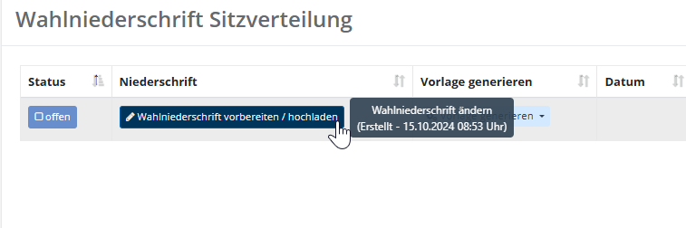

# WFU8 Sitze zuteilen

Die Wahlfunktion **WFU8 Sitze zuteilen** gibt Ihnen eine Übersicht über die natürliche Rangfolge der Kandidaten, hergeleitet aus der kumulierten Zahl der Stimmen. Sie können hier manuell Einfluss nehmen – beispielsweise, um Losentscheidungen bei Stimmgleichheit zu dokumentieren.

Wie alle dokumentarischen Wahlfunktionen beginnt WFU8 mit Arbeitshilfen und dem Plausibilitätsmodul; die allgemeine Bedienung ist im [Grundkonzept für dokumentarische Wahlfunktionen](./grundkonzept-fuer-dokumentarische-wahlfunktionen) beschrieben. Zentrale Regeln für die Sitzzuteilung kann die Wahlleitung als Arbeitshilfe einblenden.

*WFU8: Arbeitshilfen zur Sitzzuteilung*

Zentral ist die Liste der Standorte/Bezirke mit Status, dem Aufruf des Dialogs und dem Mechanismus zum Generieren der Protokoll-Datei.

*WFU8: Standorte und Bezirke mit Status*

## Sitze zuteilen

Wählen Sie in der Liste der Wahlniederschriften den Standort bzw. Bezirk und klicken Sie auf **Wahlniederschrift vorbereiten / hochladen**, um den Dialog zu öffnen.

*WFU8: Wahlniederschrift Sitzverteilung (Übersicht)*

Füllen Sie den Dialog aus:

*WFU8: Bearbeitungsdialog Sitzzuteilung*

| Feld | Bedeutung |
| --- | --- |
| Tag der Niederschrift | Bestätigen Sie das Tagesdatum oder wählen Sie das korrekte Datum. |
| Wahlteam-Mitglieder | Wählen Sie die anwesenden Vertreter des Wahlvorstands aus. |
| Notizen / besondere Vorkommnisse | Dokumentieren Sie ggf. besondere Begebenheiten. |
| Fertige Dokumente | Dokumenten-Liste und Drop-Zone für die Dateiauswahl. |

Wurde ein Sitz doppelt vergeben, erscheint eine Fehlermeldung. Bearbeiten Sie in diesem Fall den tatsächlichen Rang und hinterlegen Sie einen Kommentar.

*WFU8: Fehlermeldung bei doppelt vergebenem Rang*

Speichern Sie die Angaben. Der Status wechselt dadurch automatisch auf **In Bearbeitung**.

*WFU8: Rang bearbeiten und kommentieren*

Wählen Sie **Vorlage generieren**, um ein personalisiertes Dokument zu erhalten. Bearbeiten Sie es, drucken Sie es aus, unterzeichnen Sie es und laden Sie das gescannte oder fotografierte Dokument hoch.

*WFU8: Sitzzuteilungsvorlage generieren*

Der Status in der Liste ändert sich dadurch automatisch. Wiederholen Sie diesen Schritt ggf. für alle Bezirke; das System fasst die Ergebnisse in einem Panel zusammen.

*WFU8: Zusammenfassung der Sitzzuteilung*

Wie bei den meisten Wahlfunktionen können der **Gesamtstatus** und **Kommentare** gesetzt werden (siehe [Grundkonzept](./grundkonzept-fuer-dokumentarische-wahlfunktionen)).

*WFU8: Gesamtstatus und Kommentare*
