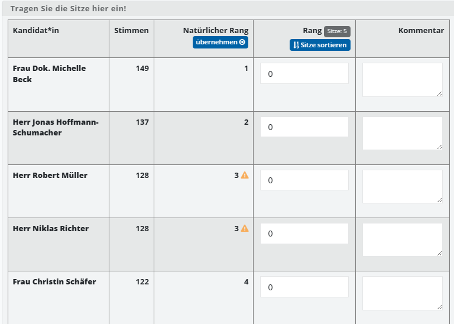
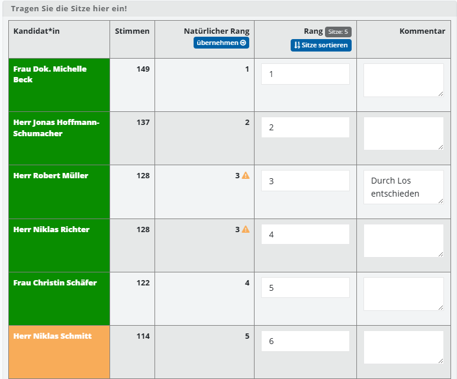

# WFU8 Sitze zuteilen

Die Wahlfunktion **WFU8 Sitze zuteilen** gibt Ihnen eine Übersicht über die natürliche Rangfolge der Kandidaten, hergeleitet aus der kumulierten Zahl der Stimmen. Sie können hier manuell Einfluss nehmen – beispielsweise, um Losentscheidungen bei Stimmgleichheit zu dokumentieren.

Wie alle dokumentarischen Wahlfunktionen beginnt WFU8 mit Arbeitshilfen und dem Plausibilitätsmodul; die allgemeine Bedienung ist im [Grundkonzept für dokumentarische Wahlfunktionen](./grundkonzept-fuer-dokumentarische-wahlfunktionen) beschrieben. Zentrale Regeln für die Sitzzuteilung kann die Wahlleitung als Arbeitshilfe einblenden.

Beim ersten Aufruf der Wahlfunktionen 7, 8 oder 9 muss der Beginn der Auszählung einmalig bestätigt werden (siehe [Auszählung starten](./wfu7-stimmen-erfassen#auszählung-starten) in WFU7). Ist dies bereits in einer der Wahlfunktionen erfolgt, entfällt der Schritt hier.

*WFU8: Arbeitshilfen zur Sitzzuteilung*

Zentral ist die Liste der Standorte/Bezirke mit Status, dem Aufruf des Dialogs und dem Mechanismus zum Generieren der Protokoll-Datei.

*WFU8: Standorte und Bezirke mit Status*

## Sitze zuteilen

Wählen Sie in der Liste der Wahlniederschriften den Standort bzw. Bezirk und klicken Sie auf **Wahlniederschrift vorbereiten / hochladen**, um den Dialog zu öffnen.

*WFU8: Wahlniederschrift Sitzverteilung (Übersicht)*

Füllen Sie den Dialog aus. Neben den Angaben zu beteiligten Personen und dem Notizfeld für besondere Vorkommnisse, finden Sie die Liste der Kandidaten. Für jeden Kandidaten ist bereits der **natürliche Rang** eingetragen, welcher sich aus den Stimmen der [WFU 7](./08-wfu7-stimmen-erfassen.md) ergibt.

*WFU8: Kandidatenliste mit natürlichem Rang*

*WFU8: Bearbeitungsdialog Sitzzuteilung*

| Spalte | Bedeutung |
| --- | --- |
| Kandidat*in | Name der Kandidatin bzw. des Kandidaten. |
| Stimmen | Gesamtzahl der auf die Person entfallenen Stimmen (aus WFU7). |
| Natürlicher Rang | Aus der Stimmenzahl abgeleitete Rangfolge. Über **übernehmen** wird sie in die Spalte **Rang** übertragen. Bei Stimmgleichheit erscheint ein orangefarbenes Warnsymbol. |
| Rang | Eingabefeld für den endgültigen Rang. Über **Sitze sortieren** ordnet das System nach den eingetragenen Rängen; oben wird die Zahl der zu vergebenden Sitze angezeigt (z. B. „Sitze: 5"). |
| Kommentar | Freitextfeld je Kandidat, z. B. zur Dokumentation eines Losentscheids bei Stimmgleichheit. |

Sobald die Sitze in die Spalte **Rang** übernommen wurden, kennzeichnet die Farbe der Zeile das Ergebnis: Hat eine Kandidatin bzw. ein Kandidat einen Sitz erhalten, wird die Zeile **grün** eingefärbt; wurde kein Sitz vergeben, ist sie **gelb**.

*WFU8: Kandidatenliste nach Übernahme der Sitze (grün = Sitz erhalten, gelb = kein Sitz)*

Speichern Sie die Angaben. Der Status wechselt dadurch automatisch auf **In Bearbeitung**.

*WFU8: Rang bearbeiten und kommentieren*

Wählen Sie **Vorlage generieren**, um ein personalisiertes Dokument zu erhalten. Bearbeiten Sie es, drucken Sie es aus, unterzeichnen Sie es und laden Sie das gescannte oder fotografierte Dokument hoch.

*WFU8: Sitzzuteilungsvorlage generieren*

Der Status in der Liste ändert sich dadurch automatisch. Wiederholen Sie diesen Schritt ggf. für alle Bezirke; das System fasst die Ergebnisse in einem Panel zusammen.

*WFU8: Zusammenfassung der Sitzzuteilung*

Wie bei den meisten Wahlfunktionen können der **Gesamtstatus** und **Kommentare** gesetzt werden (siehe [Grundkonzept](./grundkonzept-fuer-dokumentarische-wahlfunktionen)).

*WFU8: Gesamtstatus und Kommentare*
