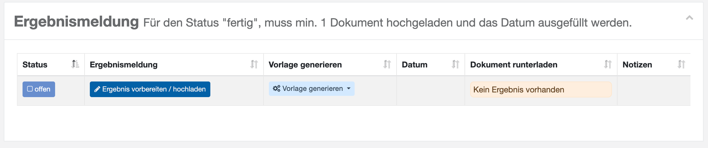
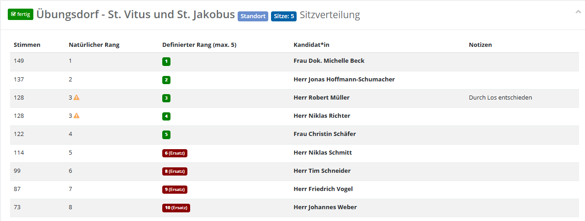
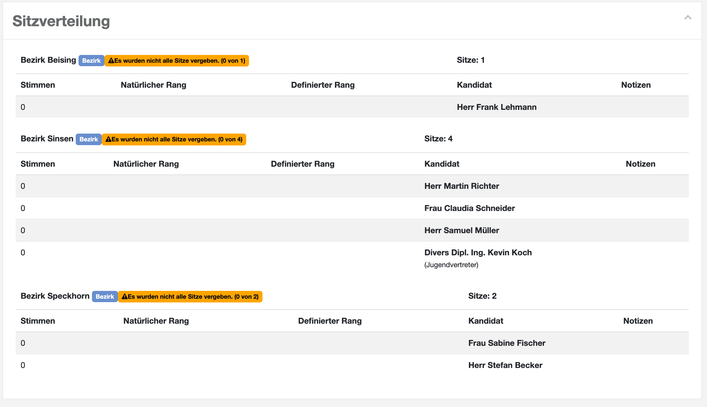
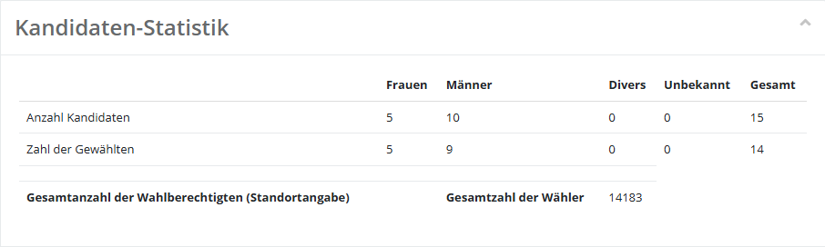
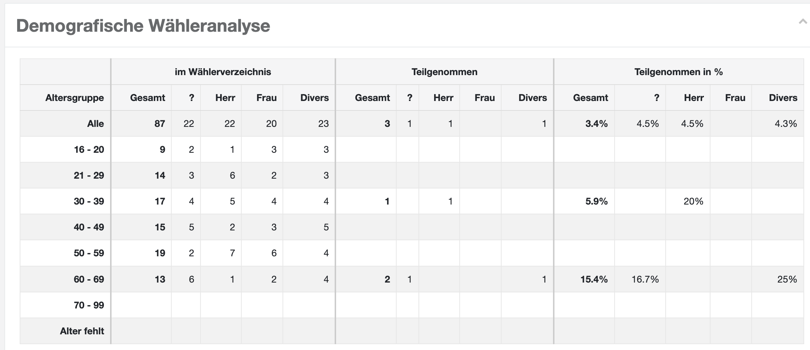
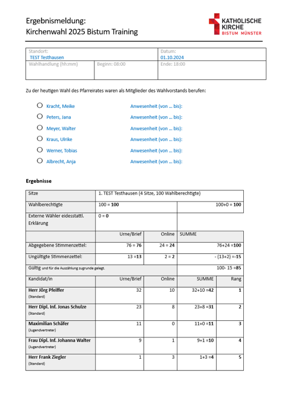
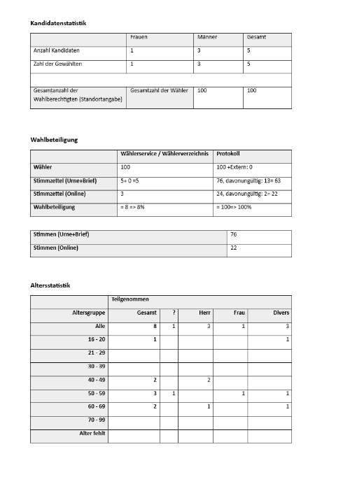
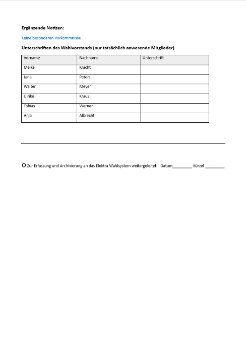
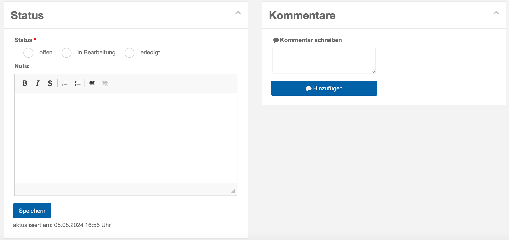

# WFU9 Ergebnisse melden

Die Wahl ist beendet. Nun müssen zusammenfassende Meldungen und die Wahlstatistik erstellt und abgegeben werden. Dazu erstellen Sie ein Ergebnisprotokoll. Wie bei allen Wahlfunktionen haben Sie im Kopf der Wahlfunktion das Angebot von Arbeitshilfen und Checkliste. Dann folgt die Liste der erstellten Protokolle – in der Regel nur eines.

- Mit dem Button ‚Ergebnis vorbereiten/hochladen‘ füllen Sie die Dialog box mit Angaben:
- Tag der Niederschrift
- Wahlteam-Mitglieder die anwesend sind und das Protokoll unterzeichnen
- Notizen/besondere Vorkommnisse.

*WFU9: Ergebnismeldung (Übersicht)*

- Dann rufen Sie die Funktion ‚Vorlage generieren‘ auf und laden das Word-Dokument.  Darin enthalten sind alle Angaben über die Sitzverteilung, die Kandidatenstatistik und eine demografische Wähleranalyse.  Sitzverteilung (Einheitswahl):

*WFU9: Ergebnis-Word-Dokument (Einheitswahl)*

Sitzverteilung (Bezirkswahl):

*WFU9: Ergebnis-Dokument (Bezirkswahl)*

Zusätzlich steht eine Kandidaten-Statistik zur Verfügung:

*WFU9: Kandidaten-Statistik*

Ergänzend liefert die demografische Wähleranalyse folgende Übersicht:

*WFU9: Demografische Wähleranalyse*

- Bearbeiten Sie das Word-Dokument nach Belieben.

|  WFU9: Ergebnisdokument bearbeiten (Seite 1) | Die zweite Seite des Ergebnisdokuments sieht wie folgt aus:  WFU9: Ergebnisdokument bearbeiten (Seite 2) | Die dritte Seite des Ergebnisdokuments sieht wie folgt aus:  WFU9: Ergebnisdokument bearbeiten (Seite 3) |
| --- | --- | --- |

- Drucken Sie es aus, unterzeichnen Sie es und laden Sie es in der Dialogbox ‚Ergebnis vorbereiten/hochladen‘ hoch.
- Abschließend können Sie wie immer Status und Kommentare setzen.

*WFU9: Status und Kommentare setzen*
