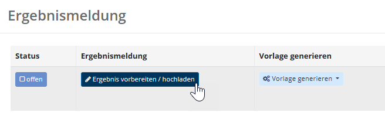

# WFU9 Ergebnisse melden

Die Wahl ist beendet. Nun müssen zusammenfassende Meldungen und die Wahlstatistik erstellt und abgegeben werden – dazu erstellen Sie ein Ergebnisprotokoll.

Wie alle dokumentarischen Wahlfunktionen beginnt WFU9 mit Arbeitshilfen und dem Plausibilitätsmodul; die allgemeine Bedienung ist im [Grundkonzept für dokumentarische Wahlfunktionen](./grundkonzept-fuer-dokumentarische-wahlfunktionen) beschrieben. Anschließend folgt die Liste der erstellten Protokolle – in der Regel nur eines.

Beim ersten Aufruf der Wahlfunktionen 7, 8 oder 9 muss der Beginn der Auszählung einmalig bestätigt werden (siehe [Auszählung starten](./wfu7-stimmen-erfassen#auszählung-starten) in WFU7). Ist dies bereits in einer der Wahlfunktionen erfolgt, entfällt der Schritt hier.

## Ergebnisprotokoll erstellen

Mit der Schaltfläche **Ergebnis vorbereiten/hochladen** öffnen Sie die Dialogbox, um die allgemeinen Daten des Protokolls festzuhalten.

*WFU9: Ergebnis vorbereiten / hochladen*

Rufen Sie anschließend **Vorlage generieren** auf und laden Sie das Word-Dokument. Es enthält alle Angaben zur Sitzverteilung, die Kandidaten- und Wähler-Statistik sowie eine demografische Wähleranalyse. Diese entsprechen den Daten, die Sie ebenfalls im weiteren Verlauf der Seite sehen.

*WFU9: Sitzverteilung – Sitzzuteilung*

*WFU9: Kandidaten-Statistik*

*WFU9: Wähler-Statistik*

*WFU9: Demografische Wähleranalyse*

Drucken Sie das Dokument aus, unterzeichnen Sie es und laden Sie es in der Dialogbox **Ergebnis vorbereiten/hochladen** hoch. Der Status in der Liste ändert sich dadurch automatisch. 

## Status und Kommentare

Abschließend können Sie wie immer **Status** und **Kommentare** setzen (siehe [Grundkonzept](./grundkonzept-fuer-dokumentarische-wahlfunktionen)).

*WFU9: Status und Kommentare setzen*
