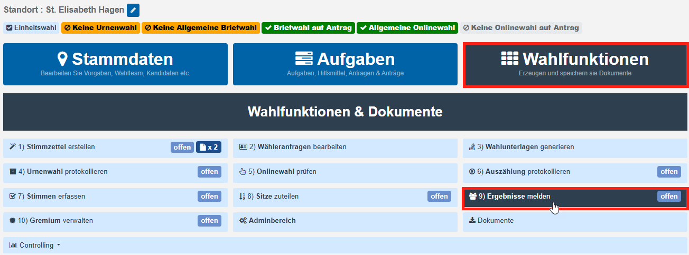
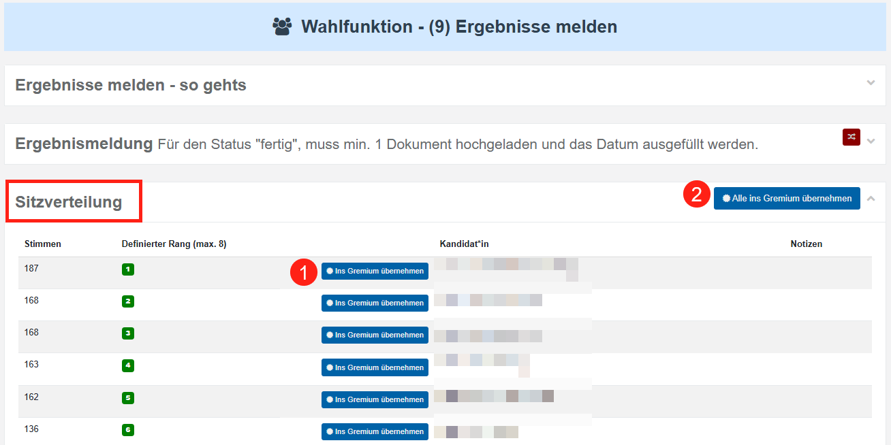
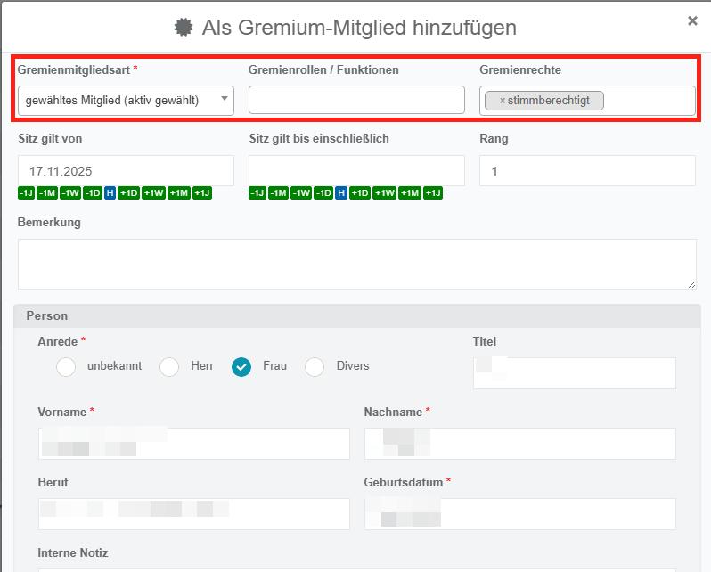
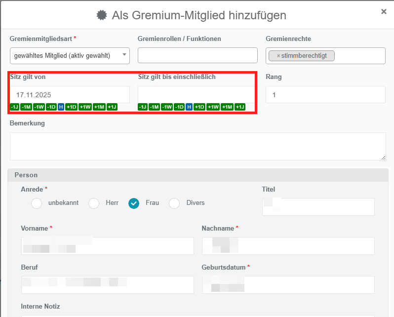
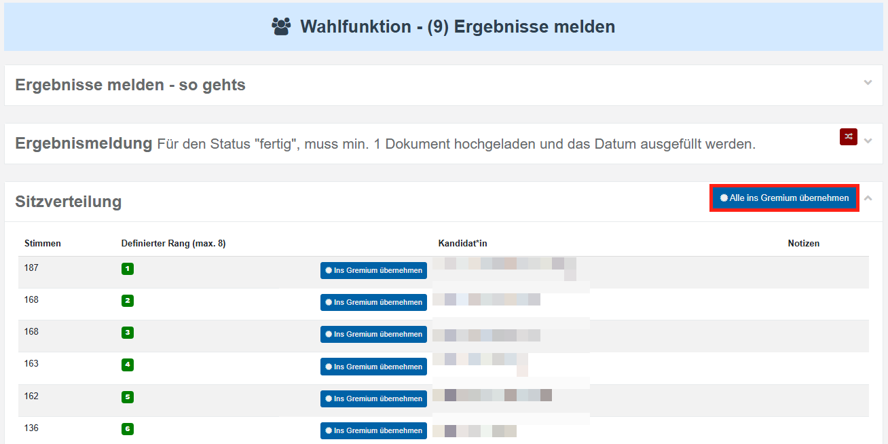
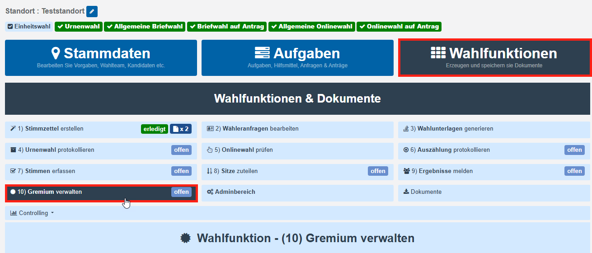
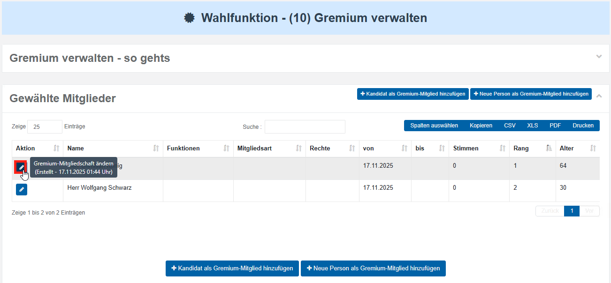
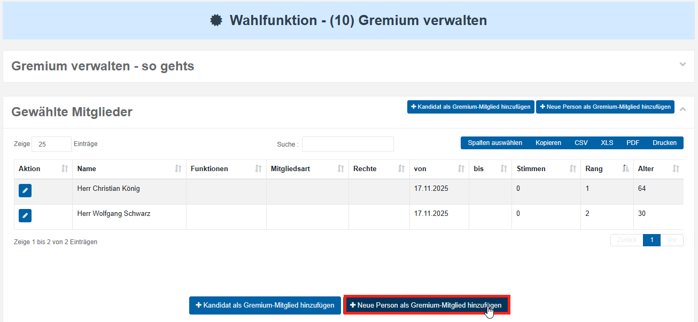

# WFU10 Gremium verwalten

Nach der konstituierenden Sitzung muss die Besetzung des Gremiums in **E****lektra** eingepflegt werden. Im Folgenden erfahren Sie, wie Sie die Gremienmitgliedschaften an Ihrem Standort anlegen.

Um Kandidierende nach der Wahl in eine Gremienmitgliedschaft zu übernehmen, rufen Sie zunächst die Wahlfunktion **9) Ergebnisse melden** auf.

*Übersicht der Wahlfunktionen*

Scrollen Sie anschließend nach unten, bis die **Sitzverteilungs-Tabelle** angezeigt wird.

*Kandidaten ins Gremium übernehmen*

Dort können Sie wählen, ob Sie **einzelne Kandidierende** (1) oder **alle Kandidierenden gleichzeitig** (2) in das Gremium übernehmen möchten.

**Übernahme von einzelnen Kandidaten**

Wählen Sie die Schaltfläche **„Ins Gremium übernehmen“** aus. Daraufhin öffnet sich ein Dialog, in dem Sie die Gremienmitgliedschaft detailliert festlegen können.

In der obersten Zeile (**Gremienmitgliedsart**, **Gremienrolle/Funktionen** und **Gremienrechte**) wählen Sie aus Listen die Eigenschaften aus, die die jeweilige Mitgliedschaft definieren.

- Unter **Gremienmitgliedsart** legen Sie fest, ob es sich beispielsweise um ein gewähltes Mitglied, ein Ersatzmitglied oder eine Entsendung handelt.
- Unter **Gremienrolle/Funktion** bestimmen Sie, welche Aufgabe oder Funktion das Mitglied innerhalb des Gremiums wahrnimmt.
- Unter **Gremienrechten** legen Sie fest, welche Befugnisse das Mitglied im Gremium besitzt.

*Modaldialog: Gremium-Mitglied hinzufügen*

Zusätzlich können Sie angeben, **ab wann die Mitgliedschaft gilt** („Sitz gilt von“) und **wann sie endet** („Sitz gilt bis einschließlich“).

*Gremium-Mitglied hinzufügen: Amtszeit*

**Übernahme von allen Kandidierenden**

Alternativ zur individuellen Übernahme einzelner Kandidierender können Sie auch alle Personen gleichzeitig in das Gremium übertragen. Wählen Sie dazu die Schaltfläche **„Alle ins Gremium übernehmen“**.

*Alle Kandidaten ins Gremium übernehmen*

Anschließend werden sämtliche Kandidierende übernommen. Personen, die einen Sitz im Gremium erhalten haben, werden automatisch mit der Gremienmitgliedsart „**gewähltes Mitglied**“ angelegt, während Personen ohne Sitz automatisch als **Ersatzmitglieder** erfasst werden.

**Verwaltung des Gremiums & Erfassung weiterer Mitglieder**

Um das angelegte Gremium zu verwalten, rufen Sie die Wahlfunktion **10) Gremium verwalten** auf..

*Aufruf WFU10*

Dort erhalten Sie eine Übersicht über alle bislang erfassten Gremienmitgliedschaften. Um eine bestehende Mitgliedschaft zu bearbeiten, wählen Sie das Stift-Symbol aus.

*Schaltfläche Gremium-Mitgliedschaft ändern*

Wenn Sie eine neue Mitgliedschaft für eine Person anlegen möchten, die in ELEKTRA nicht als Kandidierende erfasst wurde, wählen Sie die Schaltfläche **„Neue Person als Gremium-Mitglied hinzufügen“**.

*Neue Person in das Gremium aufnehmen*
