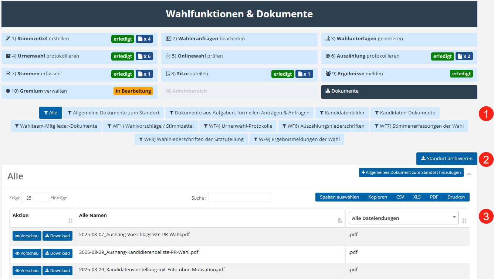

# Dokumente

Im Bereich Dokumente finden Sie sämtliche Dokumente, die am ausgewählten Standort hinterlegt wurden. Dazu gehören unter anderem im Rahmen von **Aufgaben oder Anträgen hochgeladene Dateien**, Bilder sowie persönliche Dokumente von **Kandidaten und Wahlteam-Mitgliedern** sowie **Dokumente aus den einzelnen Wahlfunktionen**.

*Abb.  – Dokumentenübersicht und Standortarchiv*

Über die **Filter-Funktion (1)** können Sie die angezeigten Dokumente gezielt auf einen bestimmten Kontext einschränken. Das Ergebnis wird in der **darunterliegenden Tabelle (3)** angezeigt.

Mit der Schaltfläche **„Standort archivieren“** (**3**) erstellen Sie ein **ZIP-Archiv**, das alle dem Standort zugeordneten Dokumente enthält. Dieses Archiv kann heruntergeladen und beispielsweise zu **Dokumentations- oder Nachweiszwecken** aufbewahrt werden.
